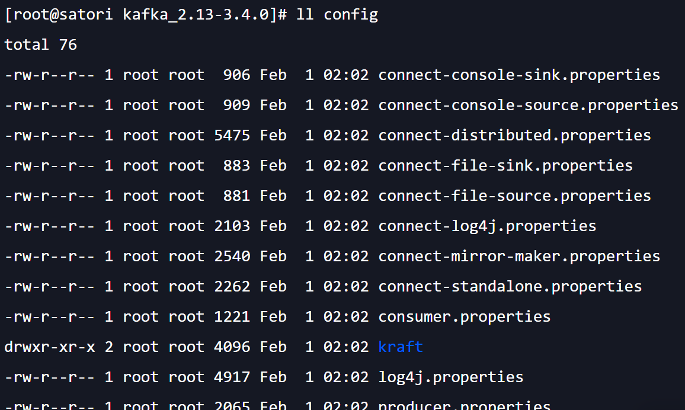
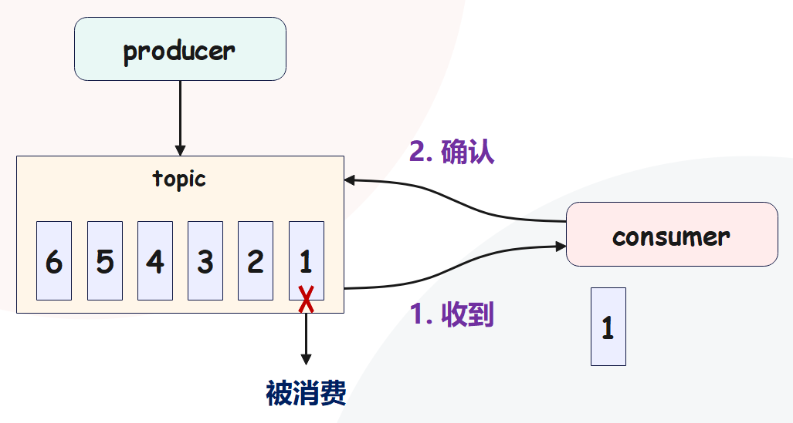
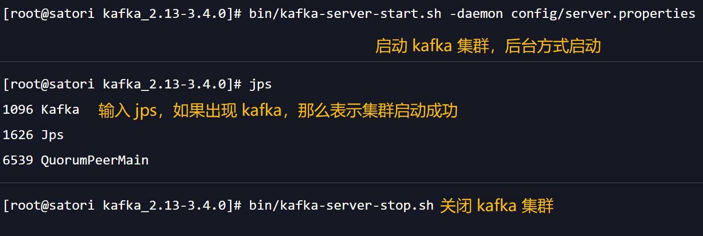
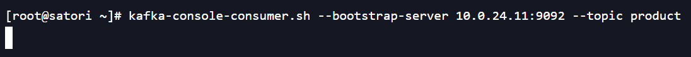
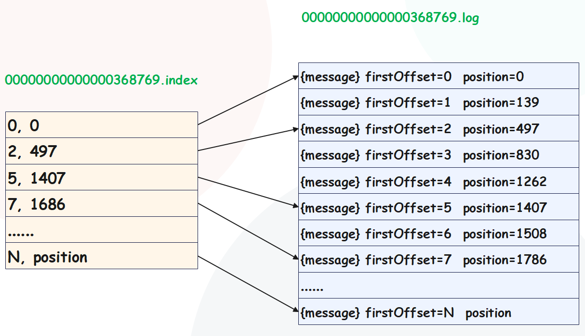
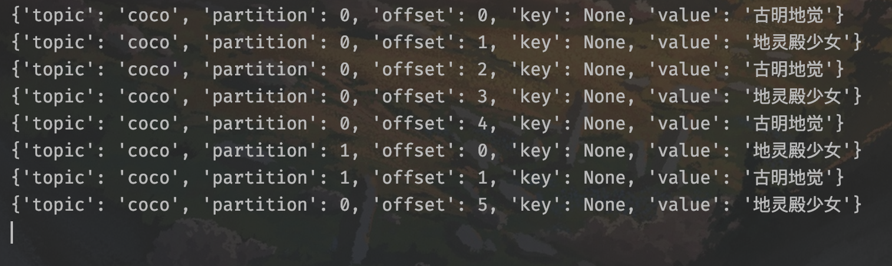
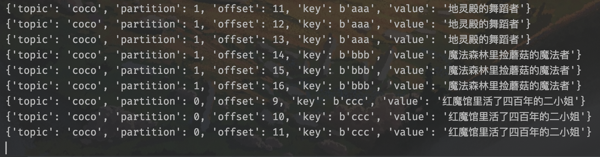
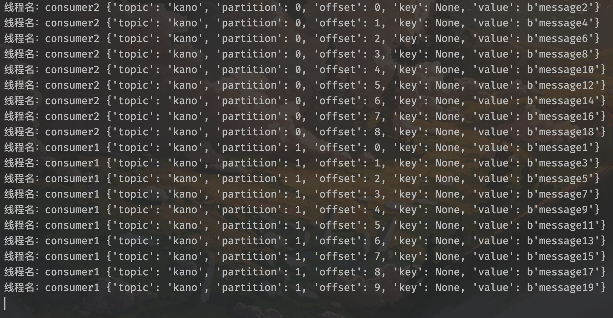

### 楔子

本次来聊一聊 kafka，相信大家都知道它是一个应用于大数据实时领域、基于发布/订阅模式的分布式消息中间件（或者说消息队列），能够和不同的进程进行通信，从而实现上下游之间的消息传递。有了消息队列之后，上游服务和下游服务就无需直接通信了，上游服务将消息发送到队列中，下游从队列中去取即可，从而实现上下游服务之间的 "逻辑解耦 + 物理解耦"。

但是实现解耦有什么好处呢？答案是可以实现异步处理，提高效率，举个栗子：

使用消息队列，可以把耗时任务扔到队列里面进行异步调用，从而提升效率，也就是我们所说的解耦。然而除了解耦，还有没有其他作用呢？答案显然是有的，用一个专业点的名词解释的话，就是削峰填谷。

削峰填谷，名字很形象，就是缓冲瞬时的突发流量，使其更平滑。特别是那种发送能力很强的上游系统，如果没有消息中间件的保护，脆弱的下游系统可能会直接被压垮导致全链路服务雪崩。但是，一旦有了消息中间件，它能够有效的对抗上游的流量冲击，真正做到将上游的 "峰" 填到 "谷" 中，避免了流量的震荡。当然我们这里说的解耦也是一个优点，因为在一定程度上简化了应用的开发，减少了系统间不必要的交互。

直接解释的话，可能没有直观的感受，我们来举一个实际的例子。比如在京东购买商品，当点击购买的时候，会调用订单系统生成对应的订单。然而要处理该订单则会依次调用下游系统的多个子服务，比如查询你的登录信息、验证商品信息、确认地址信息，调用银行等支付接口进行扣款等等。显然上游的订单操作比较简单，它的 TPS 要远高于处理订单的下游服务。因此如果上游和下游直接对接，势必会出现下游服务无法及时处理上游订单从而造成订单堆积的情况，特别是当出现双十一、双十二、类似秒杀这种业务的时候，上游订单流量会瞬间增加，可能出现的结果就是直接压垮下游子系统服务。

而解决此问题的一个常见的做法就是对上游系统进行限速、或者限制请求数量，但这种做法显然是不合理的，毕竟问题不是出现在它那里。况且你要是真这么做了，别人家网站双十一成交一千万笔单子，自家网站才成交一百万笔单子，这样钱送到嘴边都赚不到。

所以更常见的办法就是引入消息中间件来对抗这种上下游系统的 TPS 不一致以及瞬时的峰值流量，引入消息中间件之后，上游系统不再直接与下游系统进行交互。当新订单生成之后它仅仅是向队列中发送一条消息，而下游消费队列中的消息，从而实现上游订单服务和下游订单处理服务的解耦。这样当出现秒杀业务的时候，能够将瞬时增加的订单流量全部以消息的形式保存在队列中，既不影响上游服务的 TPS，同时也给下游服务流出了足够的时间去消费它们，这就是消息中间件存在的最大意义所在。

------

**那么问题来了，消息中间件、或者说消息队列都有哪些呢？它们的性能、应用场景、优缺点又如何呢？**

**1. ActiveMQ**

非常老的一个消息中间件了，单机吞吐量在万级，时效性在毫秒级，可用性高。基于主从架构实现高可用性，数据丢失的概率性低。

但是官网社区对 ActiveMQ 5.x 的维护越来越少，并且它的吞吐量和其它消息中间件相比其实是不高的，因此在高吞吐量场景下使用的比较少。

**2. Kafka**

大数据的杀手锏，谈到大数据领域的消息传输，必离不开 Kafka。这款为大数据而生的消息中间件，有着百分级 TPS 的吞吐量，在数据采集、传输、存储的过程中发挥至关重要的作用，任何的大公司、或者做大数据的公司都离不开 Kafka。

Kafka 的特点就是性能卓越，单机写入 TPS 在百万条每秒，时效性也在毫秒级；并且 Kafka 是分布式的，一个数据多个副本，少数的机器宕机也不会丢失数据；消费者采用 Pull 方式获取消息，消息有序、并且可以保证所有消息被消费且仅被消费一次；此外还有优秀的第三方 Kafka Web 管理界面 Kafka-Manager，在日志领域比较成熟，大数据领域的实时计算以及日志采集等场景中被大规模使用。

但是 Kafka 也有缺点，单机超过 64 个分区，CPU 使用率会发生明显的飙高现象，队列越多 CPU 使用率越高，发送消息响应时间变长；使用短轮询方式，实时性取决于轮询间隔时间，消费失败不支持重试；虽然支持消息有序，但如果某台机器宕机，就会产生消息乱序。

**3. RocketMQ**

阿里巴巴开源的一款消息中间件，用 Java 语言实现，在设计时参考了 Kafka，并做了一些改进。在阿里内部，广泛应用于订单、交易、重置、流计算、消息推送、日志流式处理、以及 binlog 分发等场景。

RocketMQ 支持单机吞吐量达到十万级，可用性非常高，分布式架构保证消息零丢失。MQ 功能较为完善，扩展性好，支持 10 亿级别的消息堆积，不会因为消息堆积导致性能下降。

但是支持的客户端语言不多，仅支持 Java 和 C++，其中 C++ 还不成熟。社区活跃度一般，没有在 MQ 核心中实现 JMS 等接口，说白了 RocketMQ 就是阿里开发出来给自己用的。

**4. RabbitMQ**

RabbitMQ 是一个在 AMQP（高级消息队列协议）基础上完成的可复用的企业消息系统，是当前最主流的消息中间件之一。

> AMQP: Advanced Message Queuing Protocl，即：高级消息队列协议。它是具有现代特征的二进制协议，是一个提供统一消息服务的应用层标准高级消息队列协议，是应用层协议的一个开放标准，为面向消息的中间件设计。

RabbitMQ 是采用 Erlang 语言编写，Erlang 语言最初用于交换机领域的架构模式，它有着和原生 socket 一样的延迟。因此性能较好，吞吐量在万级，并且时效性在微妙级；功能也很完善，健壮、稳定、易用、跨平台；最重要的是支持大部分主流语言，文档也丰富，此外还提供了管理界面，并拥有非常高的社区活跃度和更新频率。

但是它的商业版是需要收费的，学习成本高。

**目前主流的就是这几种消息中间件，那么我们要选择哪一种呢？**

首先是 Kafka，它主要特点是基于 Pull 的模式来处理消息消费，追求高吞吐量，一开始的目的就是用于日志收集和传输，高吞吐量是 Kakfka 的目标。因此如果要涉及大量数据的收集（比如日志采集），那么首选 Kafka。

然后是 RocketMQ，它天生为金融领域而生，对于可靠性要求很高的场景，尤其是电商里面的订单扣款、以及业务削峰。RocketMQ 在稳定性上绝对值得信赖，毕竟这些业务场景在阿里双十一已经经历了多次考验，如果你的业务也有类似场景，那么建议选择 RocketMQ。

最后是 RabbitMQ，结合 Erlang 语言的并发优势，性能好、时效性微妙级，社区活跃度也高，管理界面用起来非常方便。如果你的数据量没有那么大，那么建议选择 RabbitMQ，其实中小型公司选择 RabbitMQ 是一个非常好的选择。

**而本篇文章我们要学习的就是 Kafka，它目前是最主流的一种消息中间件。**

### Kafka 真的只是一个消息中间件吗

我们说 Kafka 是一个主流的消息中间件，这是没问题的，但 Kafka 又不仅仅是消息中间件。

要搞清楚这个问题，就要从 kafka 的发展历史说起，纵观 kafka 的发展历史，它确实是消息中间件起家的，但它不仅是一个消息中间件，同时也是一个分布式流处理平台（distributed stream processing platform），而 kafka 官方也是这么定义 kafka 的。

众所周知，kafka 是 LinkedIn 公司内部孵化的项目，LinkedIn 最开始有强烈的数据强实时处理方面的需求，其内部的诸多子系统要执行多种类型的数据处理与分析，主要包括业务系统和应用程序性能监控，以及用户行为数据处理等。当时他们碰到的主要问题包括：

- 数据正确性不足。因为数据的收集主要采用轮询（polling）的方式，如何确定轮询的时间间隔就变成了一个高度经验化的事情。虽然可以采用一些类似于启发式算法来帮助评估间隔时间，但一旦指定不当，必然会造成较大的数据偏差
- 系统高度定制化，维护成本高。各个业务子系统都需要对接数据收集模块，引入了大量的定制开销和人工成本

为了解决这些问题，LinkedIn 工程师尝试过使用 ActiveMQ 来解决这些问题，但效果并不理想。显然需要有一个 "大一统" 的系统来取代现有的工作方式，而这个系统就是 kafka。因此 kafka 自诞生伊始是以消息中间件的面目出现在大众视野的，如果翻看比较老的 kafka 对应的官网的话，你会发现 kafka 社区将其清晰地定位成 "一个分布式、分区化且带备份功能的提交日志（commit log）服务"。

因此，kafka 在设计之初就旨在提供三个方面的特性：

- `提供一套 API 实现生产者和消费者`
- `降低网络传输和磁盘存储开销`
- `实现高伸缩架构`

在现如今的大数据领域，Kafka 在承接上下游、串联数据流管道方面发挥了重要的作用：所有的数据几乎都要从一个系统流入 Kafka，然后再从 Kafka 流入下游的另一个系统中 。这样使用方式屡见不鲜以至于引发了 Kafka 社区的思考：与其我把数据从一个系统传递到下一个系统进行处理，我为何不自己实现一套流处理框架呢？基于这个考量，Kafka 社区在 0.10.0.0 版本推出了流处理组件 Kafka Streams，也正是从这个版本开始，Kafka 正式变身为分布式的流处理平台，而不再仅仅只是消息中间件了，到今天 Kafka 已经是和 Storm、Spark、Flink 同等级的实时流处理平台了。

-------

**那么作为流处理平台，kafka与其他大数据流式计算框架相比，优势在哪里呢？**

1）更容易实现端到端的正确性（correctness）。流处理要最终替代它的兄弟批处理需要具备两个核心优势：

+ 实现正确性；
+ 提供能够推导时间的工具；

实现正确性是流处理能够匹敌批处理的基石。

> 正确性一直是批处理的强项，而实现正确性的基石则是要求框架能提供 '精确一次语义处理'，即处理一条消息有且只有一次机会能够影响系统状态。目前主流的大数据流处理框架都宣称实现了 '精确一次语义处理'，但是这是有限定条件的，即它们只能实现框架内的精确一次语义处理，无法实现端到端的。这是为什么呢？因为当这些框架与外部消息中间件结合使用时，它们无法影响到外部系统的处理语义。
>
> 所以如果你搭建了一套环境使得 Spark 或 Flink 从 Kafka 读取消息之后进行有状态的数据计算，最后再写回 Kafka，那么你只能保证在 Spark 或者 Flink 内部，这条消息对于状态的影响只有一次，但计算结果却有可能多次写入 Kafka，因为它们不能控制 Kafka 的语义处理。相反地，Kafka 则不是这样，因为所有的数据流转和计算都在 Kafka 内部完成，故 Kafka 可以实现端到端的精确一次处理。

2）Kafka 自己对于流式计算的定位，官网上明确表示 Kafka Streams 是一个用于搭建实时流处理的客户端库而非是一个完整的功能系统。也就是说，你不能期望着 Kafka 提供类似于集群调度、弹性部署等开箱即用的运维特性，你需要自己选择合适的工具或者系统来帮助 Kafka 流处理应用实现这些功能。

> 可能有人觉得这怎么会是优点呢？坦率的说，这是一个双刃剑的设计，也是 Kafka 剑走偏锋不正面 pk 其他流计算框架的特意考量。大型公司的流处理平台一定是大规模部署的，因此具备集群调度功能以及灵活的部署方案是不可获取的要素。但毕竟世界上还存在着很多中小企业，它们的流处理数据量并不巨大，逻辑也不复杂，部署几台或者十几台机器足以应付。在这样的需求下，搭建重量级的完整性平台实在是 "杀鸡用宰牛刀"，而这正式 Kafka 流处理组件的用武之地。因此从这个角度来说，未来在流处理框架当中，Kafka 应该是有着一席之地的。

这里再来解释一下什么是精确一次语义处理。举个例子，如果我们使用 Kafka 计算某网页的 pv，那么每次网页访问都将作为一个消息发送给 Kafka，pv 的计算就是统计 kafka 总共接收了多少条这样的消息即可。精确一次语义处理表示每次网页访问都会产生、且只产生一条消息。

然后除了消息中间件和流处理平台，Kafka 还有别的用途吗？当然有，kafka 甚至能够被用作分布式存储系统，但是实际生产中，没有人会把 Kafka 当作分布式存储系统来用的。

总之 Kafka 从一个优秀的消息中间件起家，逐渐演变成现在的分布式的流处理平台。我们不仅要熟练掌握它作为消息中间件的非凡特性以及使用技巧，最好还要多了解下其流处理组件的设计与案例应用。

**不过说实话，虽然 Kafka 能做的事情有很多，但就目前来讲，大部分公司还是只把 Kafka 当做消息中间件来用。因此 Kafka 作为消息中间件的特性，我们必须要熟练掌握。**

### 应该选择哪种 Kafka?

前面我们谈了一下 kafka 当前的定位问题，kafka 不再是一个单纯的消息中间件，而是能够实现精确一次（exactly-once）语义处理的实时流平台。而我们到目前为止所说的 kafka 都是 Apache kafka，因为 kafka 是 Apache 社区的一个顶级项目，如果我们把视角从流处理平台扩展到流处理生态圈，kafka 其实还有很长的路要走，毕竟是半路出家转型成流处理平台的。前面我们提到过 kafka streams 组件，正是它提供了 kafka 实时处理流数据的能力，但是其实还有一个重要的组件没有提及，那就是 kafka connect。

我们在评估流处理平台的时候，框架本身的性能、所提供操作算子（operator）的丰富程度固然是重要的评判指标，但是框架与上下游交互的能力也是非常重要的。能够与之进行数据传输的外部系统越多，围绕它打造的生态圈就越牢固，因而也就有更多的人愿意去使用它，从而形成正向反馈，不断地促进该生态圈的发展。就 kafka 而言，kafka connect 通过一个个具体的连接器（connector），串联起上下游的外部系统。

说了这么多，可能会有人好奇这跟这一节的主题有什么关系呢？其实清晰地了解 kafka 的发展脉络和生态圈现状，对于我们选择合适种类的 kafka 版本大有裨益。下面我们就进入今天的主题：我们应该选择哪一种 kafka。

由于 kafka 分为好几种，当然这里的好几种是指存在多个组织或者公司发布的不同 kafka，就像 Linux 的发行版有 Ubuntu、Centos 等等。虽说 kafka 没有发行版的概念，但姑且可以这样的近似的认为市面上的确存在着多个 kafka "发行版"，下面我们就看看 kafka 都有哪些 "发行版"，以及我们应该如何选择。

**Apache kafka**

Apache kafka 是最 "正宗" 的 kafka，也应该是最熟悉的发行版了。自 kafka 开源伊始，它便在 Apache 基金会孵化并最终毕业成为顶级项目，也被称之为社区版 kafka，我们一会儿也是以这个版本的 kafka 进行介绍的。更重要的是，它是后面其他所有发行版的基础。也就是说，其他的发行版要么是原封不动的继承了 Apache kafka，要么是在其基础之上进行了扩展、添加了新功能，总之 Apache kafka 是我们学习和使用 kafka 的基础。

**Confluent kafka**

Confluent kafka 是 Confluent 公司发布的 kafka， 2014年 kafka 的 3 个创始人 Jay Kreps、Naha Narkhede 和饶军 离开 LinkedIn 创办了 Confluent 公司，专注于提供基于 kafka 的企业级流处理解决方案。2019 年 1 月，Confluent 公司成功融资 1.25 亿美元，估值也到了 25 亿美元，足见资本市场的青睐。

Confluent kafka 提供了 Apache kafka 没有的高级特性，比如跨数据中心备份、schema 注册中心以及集群监控工具等等。

**Cloudera/Hortonworks kafka**

Cloudera 提供的 CDH 和 Hortonworks 提供的 HDP 是非常著名的大数据平台，里面集成了目前主流的大数据框架，能够帮助用户实现从分布式存储、集群调度、流处理到机器学习、实时数据库等全方位的数据处理。很多创业公司在搭建数据平台时首选就是这两个产品。不管是 CDH 还是 HDP，里面都集成了 Apache kafka，因此就把这款产品中的 kafka 称之为 CDH kafka 和 HDP kafka。

当然在 2018 年 10 月两家公司宣布合并，共同打造世界领先的数据平台，也许以后 CDH 和 HDP 也会合并成一款产品，但能肯定的是 Apache kafka 依然会包含其中，并作为新数据平台的一部分对外提供服务。

--------

**okay，说完了目前市面上的这些 kafka，我们来对比一下它们的优势和劣势。**

**Apache kafka**

对于 Apache kafka 而言，它现在依旧是开发人数最多，版本迭代速度最快的 kafka。在 2018 年度 Apache 基金会邮件列表中开发者数量最多的 top5 排行榜中，kafka 社区邮件组排名第二位。如果你使用 Apache kafka 碰到任何问题并将问题提交到社区，社区都会比较及时的响应你，这对于我们 kafka 普通使用者来说无疑是非常友好的。

但是 Apache kafka 的劣势在于它仅仅提供最最基础的主组件，特别是对于前面提到的 kafka connect 而言，社区版 kafka 只提供一种连接器，即读写磁盘文件的连接器，而没有与其他外部系统交互的连接器，在实际使用过程中需要自行编写代码实现，这是它的一个劣势。另外 Apache kafka 没有提供任何监控框架或工具，而在线上环境不加监控肯定是不行的，你必然需要借助第三方的监控框架来对 kafka 进行监控。好消息是目前有一些开源的监控框架可以帮助用于监控kafka，比如 kafka manager。

总而言之，如果仅仅需要一个消息中间件亦或是简单的流处理应用场景，同时需要对系统有较大把控度，那么推荐使用 Apache kafka。

**Confluent kafka**

Confluent kafka 目前分为免费版和企业版两种，免费版和 Apache kafka 非常相像，除了常规的组件之外，免费版还包含 schema 注册中心和 rest proxy 两大功能。前者是帮助你集中管理 kafka 消息格式以实现数据向前/向后兼容；后者用开放的 HTTP 接口的方式允许你通过网络访问 kafka 的各种功能，这两个都是 Apache kafka 所没有的。除此之外，免费版还包含了更多的连接器，它们都是 Confluent 公司开发并认证过的，你可以免费使用它们。

至于企业版，它提供的功能就更多了，最有用的当属跨数据中心备份和集群监控两大功能了，多个数据中心之间数据的同步以及对集群的监控历来是 kafka 的痛点，Confluent kafka 企业版提供了强大的解决方案来帮助你干掉它们。不过 Confluent kafka 没有发展国内业务的计划，相关资料以及技术支持都很欠缺，很多国内的使用者都无法找到对应的中文文档，因此目前 Confluent kafka 在国内的普及率是比较低的。

一言以蔽之，如果你需要使用 kafka 的一些高级特性，那么推荐你使用 Confluent kafka。

**Cloudera/Hortonworks kafka**

最后说说大数据云公司发布的 kafka，这些大数据平台天然继承了 Apache kafka，通过便捷化的界面操作将 kafka 的安装、运维、管理、监控全部统一在控制台中。如果你是这些平台的用户一定觉得非常方便，因为所有的操作都可以在前端 UI 界面上完成，而不必执行复杂的 kafka 命令。另外这些平台的监控界面也非常友好，你通常不需要进行任何配置就能有效的监控 kafka。

但是凡事有利就有弊，这样做的结果就是直接降低了你对 kafka 集群的掌握程度。毕竟你对下层的 kafka 集群一无所知，你怎么能够做到心中有数呢？这种 kafka 的另一个弊端在于它的滞后性，由于它有自己的发布周期，因此是否能及时地包含最新版本的 kafka 就成为了一个问题。比如 CDH6.1.0版本发布时 Apache kafka 已经演进到了2.1.0版本，但 CDH 中的 kafka 仍然是 2.0.0版本，显然那些在 kafka2.1.0 中修复的 bug 只能等到 CDH 下次版本更新时才有可能被真正修复。

简单来说，如果你需要快速的搭建消息中间件，或者你需要搭建的是多框架构成的数据平台且 kafka 只是其中的一个组件，那么建议使用这些大数据云公司提供的 kafka。

**总结一下，kafka 有不同的 "发行版"，每种发行版都有自己的优缺点，根据这些优缺点，我们可以有针对性地根据实际需求选择合适的 kafka。**

+ Apache kafka，也称社区版 kafka。优势在于迭代速度快，社区响应度高，使用它可以让你有更高的把控度；缺陷在于仅提供最基础的核心组件，缺失一些高级的特性。
+ Confluent kafka，Confluent 公司提供的 kafka。优势在于集成了很多高级特性且由 kafka 原版人马打造，质量上有保证；缺陷在于相关资料不全，普及率较低，没有太多可供参考的范例。
+ CDH/HPD kafka，大数据云公司提供的 kafka，内嵌 Apache kafka。优势在于操作简单，节省运维成本；缺陷在于把控度低，演进速度较慢。

### 安装 Kafka

终于到了 kafka 的安装环节了，kafka 的安装非常简单，我们首先去[官网](https://kafka.apache.org/downloads)下载 Apache Kafka。

官网提供了源码版本和编译之后的二进制版本，这里我们选择二进制版本。但是里面的版本号有点意思，值得说一下。

首先 Kafka 服务端的代码完全由 Scala 语言编写，Scala 同时支持面向对象编程和函数式编程，用 Scala 写的源代码编译之后也是普通 ".class" 文件，因此我们说 Scala 是 JVM 系的语言，它的很多设计思想都是为人称道的。

事实上目前 Java 新推出的很多功能都是在不断地向 Scala 靠近，比如 lambda 表达式、函数式接口、val 变量等等。一个有意思的事情是，kafka 新版客户端代码完全由 Java 语言编写，于是有人展开了 Java vs Scala 的讨论，并从语言特性的角度尝试分析 kafka 社区为什么放弃 Scala 转而使用 Java 重写客户端代码。其实事情远没有那么复杂，仅仅是因为社区来了一批 Java 程序员而已，而以前老的 Scala 程序员隐退罢了。

扯得有点远了，回到版本号上面来。版本号里面的 2.12 和 2.13 表示编译 Kafka 源代码的 Scala 语言版本，真正的 Kafka 版本号是 3.4.0。其中 3 表示大版本号，即 major version，4 表示小版本号或次版本号，即 minor version，最后的 0 表示修订版本号，即 patch version。

这里我们下载  kafka_2.13-3.4.0.tgz，完了丢到服务器上面进行安装。不过在此之前，我们需要先安装 JDK，虽然那 kafka 的源代码虽然是 Scala 语言编写的，但是实际上我们不需要安装 Scala，只需要安装 JDK 即可，版本不建议低于 1.8。

~~~sh
export JAVA_HOME=/opt/jdk1.8.0_221
export PATH=$JAVA_HOME/bin:$PATH
~~~

接下来安装 zookeeper，因为要通过 zookeeper 来管理和协调 kafka 集群，zookeeper 可以去 zookeeper.apache.org 中下载。

~~~sh
export ZOOKEEPER_HOME=/opt/apache-zookeeper-3.5.10-bin
export PATH=$ZOOKEEPER_HOME/bin:$PATH
~~~

zookeeper 我们使用的是 3.5.10，配置环境变量之后我们还需要修改一下配置文件，将 /opt/zookeeper-3.5.10/conf 里面的 zoo_sample.cfg 拷贝一份，命名为 zoo.cfg，然后修改 zoo.cfg 即可。

这里修改 dataDir，也就是数据的存储位置，默认存在临时目录中，一旦重启数据就没了。所以这里我们在 zookeeper 的安装目录下创建一个 zkData 目录，让 zookeeper 把数据都存在这里面，当然你可以设置成别的目录。

然后在命令行直接输入 zkServer.sh start 即可启动 zookeeper，启动之后输入 jps 查看相关进程，如果出现 QuorumPeerMain 就代表启动成功了。

> 事实上在 kafka 3.x 版本中，已经可以不依赖 zookeeper 了，因为 zookeeper 已经成为了 kafka 的一个瓶颈。当然啦，这里先安装上，后续再来介绍如何不使用 zookeeper。

最后安装 kafka，这里我们使用的是最新版 3.4.0，当然你也可以选择别的版本。

~~~sh
export KAFKA_HOME=/opt/kafka_2.13-3.4.0/
export PATH=$KAFKA_HOME/bin:$PATH
~~~

配置完了之后别忘记 source 一下，然后我们来看看 kafka 的安装目录，里面都有哪些东西。

整个目录非常的简洁，其中 bin 目录负责存放启动脚本；config 负责存放配置文件；libs 存放依赖的 jar 包。

-------------

**来看一下 bin 目录。**

里面的 sh 脚本非常多，但有 5 个是最常用的。

+ kafka-console-producer.sh、kafka-console-consumer.sh：负责在控制台启动生产者和消费者，用于测试。
+ kafka-server-start.sh、kafka-server-stop.sh：负责启动和关闭 kafka 集群。
+ kafka-topics.sh：主题相的，可以对主题进行相关操作。

**再来看一下 config 目录：**

里面的配置文件也不少，作用如下：

+ 以 source、sink 结尾的配置文件和输入、输出相关，比如读取数据源、输出到指定位置；
+ 包含 consumer、producer 的配置文件则是和通过命令行启动的消费者、生产者相关，这个是做测试用的；
+ 里面还有一个 zookeeper.properties，用于 kafka 自带的 zookeeper 相关的一些配置，但这个我们不需要关心，因为我们会使用刚才下载的 zookeeper；
+ 而最重要的配置文件是 server.properties，它和 kafka 集群密切相关，用于配置 kafka 集群的 runtime；

以上我们就安装了 kafka，并了解它的目录结构。

### kafka 核心概念

在 kafka 的世界中有很多概念和术语是需要我们提前理解并且熟练掌握的，下面来盘点一下。

之前我们提到过，kafka 属于分布式的消息中间件，主要功能是提供一套完善的消息发布与订阅方案。在 kafka 中，发布订阅的对象是主题（topic），可以为每个业务、每个应用、甚至是每一类数据都创建专属的主题。

向主题发布消息的客户端应用程序叫做生产者（producer），生产者通常持续不断地向一个或多个主题发送消息，而订阅这些主题获取消息进行消费的客户端应用程序就是消费者（consumer）。和生产者类似，消费者也能同时订阅多个主题。

然后无论是生产者还是消费者，我们都可以称它们为客户端（client），你可以同时运行多个生产者和消费者实例，这些实例不断地向 kafka 集群中的多个主题生产消息和消费消息。

> 在其它消息中间件中，存放消息的地方叫做消息队列，在 kafka 中叫做主题。

因此这里就引出了 kafka 的消费模式，既然 kafka 内部传输的是消息，那么消息如何传递也是重要的一环，而在 kafka 内部支持两种传递模式。

**点对点模式**

生产者将生产的消息发送到 topic 中，然后消费者再从 topic 中取出消息进行消费。消息一旦被消费，那么 topic 中就不会再有存储，所以消费者不可能消费到已经被消费的信息。并且 topic 支持多个消费者同时消费，但是一个消息只能被一个消费者消费，不存在说多个消费者同时消费一个消息。日常生活中就好电话客服服务，同一个客户呼入电话，只能被一位客服人员处理，第二个客服人员不能再为该客户服务。

**发布订阅模式**

该模式也有发送方和接收方，只不过叫法不一样。发送方也被称为发布者（publisher），接收方被称为订阅者（subscriber）。和点对点模型不一样，这个模型可以存在多个发布者和多个订阅者，它们都能接收到相同主题的消息。好比微信公众号，一个公众号可以有多个订阅者，一个订阅者也可以订阅多个公众号。

有客户端自然也就有服务端，kafka 服务启动之后对应的服务进程被称之为 broker，所以一个 kafka 集群相当于由多个 broker 组成，broker 负责接收和处理客户端发来的请求，以及对消息进行持久化。虽然多个 broker 能够运行在同一台机器上，但更常见的做法是将不同的 broker 分散运行在不同的机器上。这样即便集群中的某一台机器宕机，运行在其之上的 broker 挂掉了，其他机器上的 broker 也依旧能对外提供服务，这其实就是 kafka 提供高可用的手段之一，当然任何一个分布式框架都应该具备这种手段。

而 kafka 实现高可用的另一个手段就是备份机制（replication），备份的思想很简单，就是把相同的数据拷贝到多台机器上，而这些相同的数据拷贝就叫做副本（replica）。副本的数量是可以配置的，这些副本保存着相同的数据，但却有不同的角色和作用。kafka 定义了两种副本，领导者副本（leader replica）和追随者副本（follower replica）。前者对外提供服务，这里的对外指的是与客户端进行交互；而后者只是被动地追随领导者副本而已，不与外界进行交互。

当然了，很多其他系统中追随者副本是可以对外提供服务的，比如 MySQL，从库是可以处理读操作的，也就是所谓的 "主写从读"。但是在 kafka 中追随者副本不会对外提供服务，生产者向主题写的消息总是往领导者那里，消费者向主题获取的消息也都是来自于领导者。也就是说，无论是读还是写，针对的都是领导者副本，至于追随者副本，它只做一件事情，那就是向领导者副本发送请求，请求领导者副本把最新生产的消息发送给它，这样便能够保持和领导者的同步，至于为什么做我们后面说。

> 对了，关于领导者和追随者，之前其实是叫做主（master）从（slave），但是不建议使用了，因为 slave 有奴隶的意思，政治上有点不合适，所以目前大部分的系统都改成 leader & follower 了。

虽然有了副本机制可以保证数据的持久化或者数据不丢失，但没有解决伸缩性的问题，伸缩性即所谓的 scalability，是分布式系统中非常重要且必须谨慎对待的问题。什么是伸缩性呢？我们拿副本来说，虽然现在有了领导者副本和追随者副本，但倘若领导者副本积累了太多的数据以至于单台 broker 都无法容纳了，此时应该怎么办？有个很自然的想法就是，能否把数据分割成多份保存在不同的 broker 上？没错，kafka 就是这么设计的。

这种机制就是所谓的分区（partition），如果了解其他的分布式系统，那么可能听说过分片、分区域等说法，比如 MongoDB 和 ElasticSearch 中的 sharding、Hbase 中的 region 等等，其实它们都是相同的原理，只是 partition 是最标准的名称。

kafka 中的分区机制指的是将每个主题划分为多个分区，每个分区都是一组有序的消息日志。生产者生产的每一条消息只会被发到一个分区中，也就是说如果往有两个分区的主题发送一条消息，那么这条消息要么在第一个分区中，要么在第二条分区中。而 kafka 的分区编号是从 0 开始的，如果某个 topic 有 100 个分区，那么它们的分区编号就是从 0 到 99。

到这里可能会有疑问，那就是刚才提到的副本如何与这里的分区联系在一起呢？实际上，副本是在分区这个层级定义的。每个分区下可以配置若干个副本，其中只能有 1 个领导者副本和 N-1 个追随者副本。生产者向分区写入消息，每条消息在分区中的位置由一个叫位移（offset）的数据来表征。分区位移总是从 0 开始，假设一个生产者向一个空分区写入了 10 条消息，那么这 10 条消息的位移依次是 0、1、2、...、9。

-------

**至此我们能完整地串联起 kafka 的三层消息架构：**

- `第一层是主题层，每个主题可以配置 M 个分区，每个分区又可以配置 N 个副本`
- `第二层是分区层，每个分区的 N 个副本中只能有一个副本来充当领导者角色，对外提供服务；其他的 N-1 个副本只是追随者副本，用来提供数据冗余之用。`
- `第三层是消息层，分区中包含若干条消息，每条消息的位移从 0 开始，依次递增。`
- `最后客户端程序只能与分区的领导者副本进行交互`

这里再重点说一下消费者，之前说过有两种消费模型，即点对点模型（peer to peer，p2p）和发布订阅模型。在点对点模型中我们说可以存在多个消费者，但是同一条消息只能被下游的一个消费者消费，其它消费者不能染指，而这些多个消费者在 kafka 中叫做消费者组（consumer group）。所谓的消费者组，指的是多个消费者实例共同组成一个组来消费一个主题，这个主题中的每个分区都只会被消费者组里面的一个消费者实例消费。至于为什么要引入消费者组，主要是为了提升消费者端的吞吐量，多个消费者实例同时消费，加速了整个消费端的吞吐量（TPS）。

关于消费者组的机制，后面会详细介绍，现在只需要知道消费者组就是多个消费者组成一个组来消费主题里面的消息、并且一条消息只会被组里面的一个消费者消费即可。

然后每个消费者在消费消息的过程中，必然需要有个字段记录它当前消费到了分区的哪个位置上，这个字段就是消费者位移（consumer offset）。注意，我们之前说一个主题可以有多个分区、每个分区也是用位移来表示消息的位置，但这两个位移完全不是一个概念。分区位移表示的是分区内的消息位置，它是不变的，一旦消息被成功写入到一个分区上，那么它的位置就是固定了的。而消费者位移则不同，它是消费者消费进度的指示器，记录消费者消费到了分区内的哪一条消息，显然这是一个随时变化的值。另外每个消费者都有着自己的消费者位移，因此一定要区分这两类位移的区别，一个是分区位移，另一个是消费者位移。

**目前出现的概念有些多，我们总结一下：**

+ 生产者（producer）：向主题发布新消息的应用程序；
+ 消费者（consumer）：从主题订阅新消息的应用程序；
+ 消息（record）：kafka 是消息中间件，这里的消息就是指 kafka 处理的主要对象；
+ 主题（topic）：主题是承载消息的逻辑容器，在实际使用中多用来区分具体的业务，即不同的业务对应不同的主题；
+ 分区（partition）：一个有序不变的消息序列，每个主题下可以有多个分区。分区编号从 0 开始单调递增，分布在不同的 broker 上面，实现发布订阅的负载均衡。生产者将消息发送到主题下的某个分区中，以分区位移（offset）来标识一条消息在一个分区当中的位置（唯一性），分区位移也是一个从 0 开始单调递增的值；
+ 分区位移（offset）：表示分区中每条消息的位置信息，是一个单调递增且不变的值；
+ 副本（replica）：kafka 中同一条数据能够被拷贝到多个地方以提供数据冗余，这便是所谓的副本。副本还分为领导者副本和追随者副本，各自有各自的功能职责。读写都是针对领导者副本来的，追随者副本只是用来和领导者副本进行数据同步、保证数据冗余、实现高可用；
+ 消费者位移（consumer offset）：表示消费者消费进度，即消费到了分区的哪一条消息，每个消费者都有自己的消费者位移；
+ 消费者组（consumer group）：多个消费者实例共同组成的一个组，同时消费多个分区以实现高吞吐；

我们用一张图来描述一下：

说白了就是：主题会被划分为多个分区，这些分区散落在不同的 broker 上面，生产者往主题写消息，最终会写到主题的某一个分区当中，而分区位移则记录了消息在该分区的位置。但还需要考虑到高可用，于是又引入了副本机制，每个分区下的消息会存在冗余。比如一个主题被划分为 3 个分区，存储在 3 台 broker 上，那么 broker0 可以存储分区 0 和分区 1，broker1 可以存储分区 1 和分区2，broker 可以存储分区 0 和分区 2。

所以分区消息会被存储多份，从而实现高可用。并且多个消息副本中，只能有一个副本对外提供服务，也就是领导者副本；至于其它的副本只是负责和领导者副本保持一致。

**思考：为什么 kafka 不像 MySQL 那样支持主写从读呢？**

因为 kafka 的主题已经被分为多个分区，分布在不同的 broker 上，而不同的 broker 又分布在不同的机器上，因此从某种角度来说，kafka 已经实现了负载均衡的效果。不像 MySQL，压力都在主上面，所以才要从读。

另外，kafka 保存的数据和数据库的数据有着实质性的差别，kafka 保存的数据是流数据，具有消费的概念，而且需要消费者位移。所以如果支持从读，那么消费端控制 offset 会更复杂，而且领导者副本同步到追随者副本需要时间的，会造成数据不一致的问题。

而且对于生产者来说，kafka 是可以通过配置来控制是否等待 follower 对消息确认的，如果支持从读的话，那么也需要所有的 follower 都确认了才可以回复生产者，造成性能下降，而且 follower 出现了问题也不好处理。

### 配置文件 server.properties 解析

介绍完了 kafka 核心概念之后，我们来看一下配置文件 server.properties，我们说它是和 kafka 集群 runtime 息息相关的。这个配置文件总共一百多行，但是包含了很多的注释，所以实际上配置并不是很多（因为有部分配置没有写在文件里），我们来逐一介绍。

**broker.id**

我们说 kafka 集群由多个 broker 组成，而每个 broker 都要有一个唯一整数作为 id，默认值为 0。如果还有一台 broker 的话，那么就配置成 broker.id=1。

**listeners、advertised.listeners**

这两个配置放在一起解释会更容易理解，首先说一下 kafka 支持的传输协议，有以下几种：

- `PLAINTEXT：消息采用明文传输`
- `SSL：消息采用使用 SSL 或 TLS 加密传输`
- `SASL_PLAINTEXT：自定义用户认证权限`
- `SASL_SSL：采用 SSL 根证书`

至于 listeners 和 advertised.listeners 都表示监听器，但 listeners 用于内网访问，advertised.listeners 用于外网访问。像我当前使用的机器是某云提供的 CentOS，有一个内网 IP 和一个外网 IP。

如果 kafka 集群只有一个 broker，并且客户端应用也在相同的节点上（一般只会发生在学习 kafka 的过程中），那么只需要配置 listeners 即可，IP 指定为 localhost 或者 127.0.0.1。

~~~sh
# 监听端口 9092，后续就采用明文传输。如果配置为 localhost（127.0.0.1）
# 那么客户端只能在 broker 所在的节点上通过 localhost（127.0.0.1）访问
# 该配置是被注释掉的，因为默认监听本机的 9092 端口
listeners=PLAINTEXT://localhost:9092
~~~

然后我们就可以在当前节点访问了，并且也只能在当前节点访问，比如使用 Python 充当客户端连接至 broker，但如果在其它机器上则不行。

如果客户端不在当前 broker 所在的节点上，但它们都在同一个内网中，那么仍然只需要配置 listeners，只不过此时需要将 IP 指定为内网 IP。

~~~sh
# 如果配置为内网 IP
# 那么客户端可以在同一内网网段的任意节点上使用内网 IP 进行访问
listeners=PLAINTEXT://内网IP:9092
~~~

此时客户端即可通过内网 IP 进行访问，另外，如果指定为内网 IP，那么即使是当前 broker 所在节点的客户端，也要通过内网 IP 访问，不能使用 localhost。

目前我们已经有办法连接至 kafka 了，但是这显然还不足以达到我们想要的，因为我们的目的是还希望能够在外界通过公网 IP 进行访问，而无需在服务器上操作。那么这个时候就需要 advertised.listeners 出马了，advertised.listeners 是专门用来控制外界访问的，所以它需要指定公网 IP。

~~~sh
listeners=PLAINTEXT://内网 IP:9092
advertised.listeners=PLAINTEXT://公网 IP:9092
~~~

所以此时即可以在服务器上通过内网访问，也可以在任意一台有网络的机器上访问。

> 注意：如果希望外界能够通过公网 IP 进行访问，那么要保证端口对外开放。

**num.network.threads**

broker 用于接收网络请求以及向网络发送响应的线程数，默认值为 3，一般不需要更改。

**num.io.threads**

broker 用于用于处理请求的线程数、会包含磁盘IO，值应该不小于磁盘的数目，默认值为 8。

**socket.send.buffer.bytes**

socket 服务端用于发送数据的缓冲区大小，意思是数据先放入缓冲区中，当缓冲区满了之后再发送，默认值为 102400。

**socket.receive.buffer.bytes**

socket 服务端用于接收数据的缓冲区大小，意思是数据先放入缓冲区中，当缓冲区满了之后再读取，默认值为 102400。

**socket.request.max.bytes**

socket 服务允许接收的请求的最大字节数，默认为 104857600。

**log.dirs**

用逗号分隔的一系列目录路径，用于存储日志文件，当然不止日志文件，还有暂存数据也会存在这里面。这个配置项必须要改，因为默认存储在临时目录中，这样当服务器重启，数据就没了。

不过强烈建议在有条件的情况下将目录挂载到不同的磁盘上，有以下两个好处：

+ 提升读写性能：比起单块磁盘，多块物理磁盘同时读写数据会有更高的吞吐量
+ 实现故障转移：即 failover，这是 kafka 在 1.1 版本中引入的强大功能，因为之前只要 broker 使用的任何一块磁盘挂掉了，那么整个 broker 进程都会关闭。但是从 1.1 开始这种情况被修正了，坏掉的磁盘上的数据会自动地转移到其它正常的磁盘上，而且 broker 还可以正常工作。正是因为这个改进，kafka 舍弃 raid，如果没有 failover 机制的话，那么我们只能依靠 raid 来提供保障了

**num.partitions**

每个主题对应的分区数，默认值为 1。

**num.recovery.threads.per.data.dir**

每个 data 目录（data 目录指的就是 log.dirs 配置的存储日志文件的目录）在启动时进行日志恢复、在关闭时进行刷新的线程数，默认为 1。由于该参数只会在 kafka 启动和关闭的时候使用，因此我们可以将值设置的大一些，比如设置为 8，表示每个目录会有 8 个线程进行处理。如果 log.dirs 配置了 5 个目录，那么总共会有 40 个线程。

**log.flush.interval.messages**

接收到多少条消息之后才将数据刷到磁盘，默认值为 10000。

**log.flush.interval.ms**

在强制刷新之前，消息可以在日志中停留的最大时间，默认值 1000 毫秒。

**log.retention.hours**

如果容量不够了，那么会删除一部分老的日志，默认值为 168，表示将存在时间超过 168 小时的日志判定为老日志。

**log.retention.bytes**

日志能存储的最大字节数，超过这个值会对部分日志进行删除，如果为 -1 则表示没有限制。一般生产上，我们都不会设置最大字节数，所以该配置默认是被注释掉的，因此不用管它。

**log.segment.bytes**

kafka 使用消息日志（log）来保存消息数据，一个日志就是磁盘上的一个只能追加写（append-only）的物理文件。因为只能追加写入，故避免了缓慢的随机 I/O 操作，改为性能较好的顺序 I/O 操作，这也是实现 kafka 高吞吐量特性的一个重要手段。不过如果不停地向一个日志写入消息，最终也会耗尽所有的磁盘空间，因此 kafka 必然要定期地删除消息以回收磁盘。怎么删除？简单来说就是通过日志段（log segment）机制。

在 kafka 底层，一个日志又进一步细分成多个日志段，消息被追加写到当前最新的日志段中。当写满了一个日志段后，kafka 会自动切分出一个新的日志段，并将老的日志段封存起来。kafka 在后台还有定时任务会定期地检查老的日志段是否能够被删除，从而实现回收磁盘的目的。

而该配置就表示每一个日志段文件的最大字节，默认值为 1073741824，换算之后是一个 G，当达到这个值时就会创建一个新的日志段，并将老的日志段封存起来。

**log.retention.check.interval.ms**

日志段文件的检查周期，查看它们是否达到了删除策略的设置（log.retention.hours 或 log.retention.bytes），默认值为 300000 毫秒。

**zookeeper.connect**

zookeeper 的连接地址，默认值为 localhost:2181，当然也可以指定多个 zookeeper，之间以逗号分割。

**zookeeper.connection.timeout.ms**

连接 zookeeper 的最大超时时间，默认为 18000 毫秒。

**group.initial.rebalance.delay.ms**

首先来解释一下什么是重平衡，消费者组里面的消费者不仅能一起瓜分订阅主题的数据，而且它们还能彼此协助。假设组内某个实例挂掉了，kafka 能够自动检测，然后把这个 Failed 实例之前负责的分区转移给其他活着的消费者，这个过程就是 "重平衡(rebalance)"。但是重平衡会引发各种各样的消费者问题，而且很多重平衡的 bug，整个社区都无力解决。

而当一个 consumer 实例加入到空消费组时会立即引发重平衡，但重平衡的代价又比较大，很多状态需要在重平衡之前被持久化、重平衡后被重新初始化。所以如果有大量的 consumer 实例加入的话，那么势必要重平衡多次，这显然不是我们想要的。所以就有了该参数，假设为 10000 毫秒，那么当第一个消费者成员加入直到之后的 10 秒内，再有消费者加入将不再引发重平衡。默认值为 0，表示当新的 consumer 实例加入时，立即引发重平衡。

------

以上就是 server.properies 里面的相关配置，这些配置先一个印象即可，后面遇到了会结合场景详细解释。

那么我们需要修改哪些配置呢？

~~~sh
# 当前只有一个节点，把内网 IP 10.0.24.11 改成 localhost 也是可以的
listeners=PLAINTEXT://10.0.24.11:9092 
# 为了让外界也能够连接上 kafka 集群，我们将 advertised.listeners 也配置一下
advertised.listeners=PLAINTEXT://82.157.146.194:9092
# 消息持久化路径
log.dirs=/opt/kafka_2.13-3.4.0/data
# 默认是 localhost:2181，kafka 集群数据会写在 zookeeper 的根节点当中
# 这里单独创建 kafka 节点，让数据都写在该节点下面
zookeeper.connect=localhost:2181/kafka
~~~

暂时修改以上几个配置即可。

### kafka 集群的启动与关闭

配置文件修改之后，我们来启动 kafka 集群，当然说是集群，其实只有一个节点，不过只有一个节点的集群也叫集群。

+ 启动 kafka 集群：bin/kafka-server-start.sh config/server.properties

启动的时候需要指定配置文件，就是我们上面说的 server.properties，因为它负责配置 kafka 集群的运行时。但是需要注意，这种启动方式是以前台方式启动的，如果以后台方式启动的话，那么需要加上 -daemon 参数。

+ 关闭 kafka 集群：bin/kafka-server-stop.sh config/server.properties

无论前台启动还是后台启动，关闭的时候都不需要指定 -daemon 参数。其实 server.properties 也不需要指定，因为是关闭，当然指定了也无所谓。

有一点需要注意，我们说 kafka 默认依赖于 zookeeper，因为它需要通过 zookeeper 来存储一些配置信息。所以我们要在 zookeeper 启动之后才能启动 kafka，否则就会导致连接 zookeeper 超时，从而导致启动失败。

### 主题（topic）相关操作

kafka 中的消息会保存在主题中，而在介绍 bin 目录的时候我们说里面有一个 kafka-topics.sh 是专门通过命令行来操作主题的，那么下面就来看看它支持哪些操作。

> kafka 集群已启动。

**查看当前都有哪些 topic**

`kafka-topics.sh --bootstrap-server 10.0.24.11:9092 --list `

显然当前还不存在任何的主题，需要注意的是：我们在配置文件中给 listeners 指定的 IP 是内网 IP，所以这里连接的时候也必须使用内网 IP。如果给 listeners 指定的是 localhost，那么这里就用 localhost 连接。

然后是 --bootstrap-server，它表示要连接的 broker 的地址，可以指定多个，之间用逗号分隔；--list 则是列出连接的 broker 下面都有哪些主题。

**创建 topic**

`kafka-topics.sh --bootstrap-server 10.0.24.11:9092 --topic 主题名 --create --partitions 分区数 --replication-factor 副本数`

创建主题的时候，需要同时指定分区数与副本数，不过副本数不能超过你 broker 的数量，因为我们只有一台机器，所以副本数是 1，但是分区在一台 broker 上是可以有多个的。

如果创建一个已存在的主题会报错：

提示我们主题 "topicA" 已存在。

除此之外，我们在创建的时候还可以指定主题的一些其它属性，比如消息的最大限制。kafka 默认允许的最大消息大小是 1M，但是对于视频或者图片信息来说，1M 显然达不到这个要求，所以我们可以通过 --config 进行指定。

`kafka-topics.sh --bootstrap-server 10.0.24.11:9092 --topic 主题名 --create --partitions 分区数 --replication-factor 副本数 --config max.message.bytes=允许每条消息占用的最大字节数`

max.message.bytes 表示消息的最大限制，这个参数可以直接配置在 server.properties 里面，但是我们之前在看这个文件的时候并没有看到这个配置啊。没错，kafka 有很多配置，并没有全部写在 server.properties 中（但都有默认值），而这些配置我们既可以在 server.properties 中指定，也可以在命令行中通过 --config 指定（或者使用编程语言操作的时候指定），都配置了则以后者为准。

> 注意：server.properties 里面出现的配置都是和 kafka 集群 runtime 相关的，至于主题、生产者、消费者也有很多配置，这些配置虽然没有在 server.properties 中出现，但它们确实存在并且有默认值，只不过没有写在 server.properties 文件里面，因为这些配置我们也可以在创建主题、或者使用生产者消费者进行发送和接收消息时单独指定。

**查看一个 topic 的详细信息**

我们使用 --list 只能查看当前有哪些 topic，如果想查看一个 topic 的详细信息该怎么做呢？

`kafka-topics.sh --bootstrap-server 10.0.24.11:9092 --topic 主题名 --describe`

topicC 是我为了演示，单独创建的，命令如下：

`kafka-topics.sh --bootstrap-server 10.0.24.11:9092 --topic topicC --create --partitions 2 --replication-factor 1 --config max.message.bytes=666666`

其中分区数为 2，并设置了 max.message.bytes 为 666666。

然后我们通过 --describe 即可查看一个主题的详细信息，解释一下输出的内容。

+ 第一行是对该主题的一个总结：
  + Topic 表示主题名；
  + TopicId 就是主题对应的 id，这个是 kafka 内部生成的；
  + PartitionCount 表示分区数；
  + ReplicationFactor 表示副本系数；
  + 然后 Configs 不需要解释了，我们设置的消息最大值也体现在上面了，如果没有设置那么就什么也没有。
+ 然后第二行和第三行是一样的，显然分别对应 topicC 的两个分区。
  + Leader 是当前 partition 中负责读写的节点（broker.id），因为每个分区可以有多个副本，散落在不同的 broker 上，所以我们要知道是哪个 broker 上的副本负责读写。另外，每个节点都有可能成为领导者副本，由于当前只有一个节点，所以每个分区的领导者副本所在的 broker 的 id 都是 0；
  + Replicas 是当前分区的副本数据所在的节点（broker.id），不管该节点是否是领导者副本或者是否存活。当前只有一个节点，所以还是 0，如果副本散落在多个节点上，那么 Replicas 就会显示多个 id，之间用逗号分隔；
  + Isr 则是当前 kafka 集群中可用的节点的 broker.id。当前只有一个节点，所以是 0，如果有多个可用节点，那么 Isr 就会显示多个 id，之间用逗号分隔；

**修改一个 topic**

`kafka-topics.sh --bootstrap-server 10.0.24.11:9092 --topic 主题名 --alter --partitions 分区数`

修改主题的话不能修改副本数，但分区数可以修改。

主题 topicA 之前的分区数是 1，现在改成了 2。但是注意：修改之后的分区数必须大于原来的分区数，否则报错。那么问题来了，为什么会有这个限制呢？

假设 kafka 的分区数可以减少，那么意味着要删除分区，但删除掉的分区中的消息要怎么办？肯定不能随着分区的删除一块烟消云散，那样消息就丢失了，必须要保留。但保留的话又要如何保留呢？如果直接追加到现有分区的尾部，那么消息的时间戳就不会递增，对于 Spark、Flink 这类需要消息时间戳（事件时间）的组件就会造成影响。如果插入到现有的分区中，那么在消息占用量很大的时候，数据的复制所占用的时间又是一个问题，最关键的是在数据复制期间，主题能不能正常对外提供服务又是一个问题。

从技术的角度上说，增加分区和减少分区本身没有太大区别，只是减少分区会带来一系列的麻烦，所以干脆 kafka 就不提供减少分区的功能了。

除了分区数之外，还可以修改 --config 指定的一些配置，比如消息的最大大小，但是 sh 脚本需要换成 kafka-configs.sh。

命令都是相似的，然后通过 --add-config 和 --delete-config 进行指定。

**删除一个 topic**

`kafka-topics.sh --bootstrap-server 10.0.24.11:9092 --topic 主题名 --delete`

我们看到分区已经被删除了。

另外 kafka 的分区元数据是存在 zookeeper 里面的，我们在配置文件中指定 zookeeper.connect 为 localhost:2181/kafka，那么所有的主题信息都位于 /kafka/brokers/topics 这个 ZNode 里面。我们将这个 ZNode 里面分区元数据删除，那么也等价于删除 kafka 的主题，不过不建议直接操作 zookeeper。

#### **思考：kafka 的分区越多越好吗？**

我们说为了实现负载均衡，kafka 将一个主题拆成了多个分区，每个分区散落在不同的 broker 上，让 producer 和 consumer 能够多线程去处理。所以分区的本质就是把数据量很大的一组队列拆分成多组队列，形成 producer 和 consumer 的分流和并行，分流和并行能有效提升数据流读写的吞吐力，并且让队列中的数据能及时得到处理。因此在 kafka 中，分区（partition）是 kafka 并行操作的最小单元，每个分区可以独立接收推送的消息以及被 consumer 消费。

再举个生活中的栗子，如果把主题（topic）比作高速公路，那么分区就是高速公路的一个车道，显然公路上可以只有一个车道、也可以有多个车道。每个车道的起点和终点相同，可以实现独立运输，只不过在 kafka 中不存在变道，每辆车从始至终只能走其中的一条道。

所以在资源足够的情况下，一个 topic 的分区越多，整个集群所能达到的吞吐量就越大。那么这是不是意味着分区就可以无限大了呢？答案显然不是的，虽然我们说分区越多，吞吐量就越大，但不要忽略一个前提，我们说这是在资源足够的情况下。

假设我们有三个 broker，那么至少就应该有 3 个分区，最小化保证每个 broker 都能参与到队列分流并行的过程中。当然 broker 所在节点的 CPU 的核数也要考虑在内，假设每个节点的 CPU 是 4 核，那么可以适当增加每个 broker 的分区。但很明显，受限于 broker 的数量，分区不可能无限制的增加，因为即使增加了也没有任何效果，反而还会起到反效果。比如：

**1.  分区越多，需要打开的文件句柄就越多**

在 kafka 的 broker 中，每个分区都对应底层文件系统的一个目录，也就是 "数据日志文件目录"。比如有一个主题叫 topic_user，分区数为 2，那么底层就会有两个目录：topic_user-0、topic_user-1，目录里面负责保存日志数据段，每个日志数据段都会分配两个文件：一个索引文件（.index）和一个数据文件（.log）。而 kafka 的 controller 和 ReplicaManager 会为每个 broker 都保存这两个文件句柄，因此随着分区的增多，需要的文件句柄数也会增多，不仅会带来资源管理上的消耗，还会突破 ulimit -n 的限制（必要时需要调整操作系统允许打开的文件句柄数）。

**2.  分区越多，端对端的延迟就越大**

kafka 端对端的延迟指的是生产者发送消息到消费者消费所需的时间，由于 kafka 在消息正确接收后才会暴露给消费者，也就是保证 in-sync 副本（后续解释这个概念）复制成功之后才会暴露，而这就造成了瓶颈。因为一个 broker 上的副本从其它 broker 的 leader 上复制数据的时候只会开启一个线程，所以 in-sync 操作完成所需的时间是随着分区数量线性增加的。如果分区数过多，那么完成副本同步所需的时间也会越多，而在完成副本同步之前数据又无法暴露给消费者，从而造成较大的端对端延迟。

**3.  分区越多，需要的内存就越多**

在新版的 kafka 中可以支持批量提交和批量消费，所以 producer 会为每个分区缓存消息，当缓存的消息达到了 batch.size（默认是 16 kb），再打包将消息批量发出。尽管这是个提升性能的设计，但很明显这个参数是分区级别的，而分区数越多，这部分缓存所需的内存占用也会更多；consumer 也是同理，并且分区数越多，消费者的线程数也会增加，而线程切换的开销也是需要考虑的。

**4.  分区越多，故障后 leader 重选所需的时间越长**

我们知道 kafka 通过副本（replica）机制来保证高可用，具体做法就是为每个分区保存若干个副本（replica_factor 指定副本数），每个副本保存在不同的 broker 上。其中的一个副本充当 leader 副本，负责处理 producer 和 consumer 请求，而其它副本则充当 follower 角色，由 kafka controller 负责保证与 leader 的同步。

但如果某个 broker 挂掉了，那么该 broker 上的领导者副本就无法对外提供服务了，那么 kafka controller 就会借助于 zookeeper 上存储的分区元信息进行 leader 选举，从而在其它的 broker 上选择一个作为领导者副本，并且每个分区都要有这个过程。假设有 10000 个分区，那么就需要为 10000 个分区进行 leader 选举，这显然会花费较长的时间，而在选举完成之前 kafka 是无法对外提供服务的。并且如果挂掉的 broker 恰好是 kafka controller 所在的节点，那么情况会更糟糕。

**因此分区数不是越大越好，极端的分区数不仅对提升性能无任何效果，还可能导致集群不稳定，总之 kafka 的分区规划是在性能与可靠性中找到一种平衡。**

#### Python 连接 kafka 操作 topic

下面我们就来看看如何使用 Python 操作 kafka 集群上的 topic，首先要想操作，那么必然要能够充当客户端连接到 kafka 集群。Python 连接 kafka 集群需要使用一个第三方包 kafka-python，直接 pip3 install kafka-python 即可。

~~~Python
from pprint import pprint
from kafka import KafkaAdminClient
from kafka.admin import NewTopic

# 类名中间带了一个 Admin，所以它是用来操作 kafka 集群的，比如对主题进行增删查
# 除此之外还有 KafkaProducer、KafkaConsumer，它们则是单纯的生产者和消费者，只能往主题里面发消息、收消息
# 并且我们注意到这里的参数名是 bootstrap_servers，结尾带了个 s，所以也可以指定多个地址
client = KafkaAdminClient(bootstrap_servers="82.157.146.194:9092")

# 查看所有的 topic，刚才我将主题全部删除了，所以当前是没有主题的
print(client.list_topics())  # []

# 创建 topic，可以同时创建多个
new_topics = [
    # 参数和使用命令行操作是类似的
    NewTopic("product", num_partitions=2, replication_factor=1,
             topic_configs={"max.message.bytes": 2048}),
    NewTopic("user", num_partitions=4, replication_factor=1),
    NewTopic("sales", num_partitions=1, replication_factor=1),
]
# 进行创建，参数 timeout_ms 表示在 kafka 集群将主题创建完毕并返回之前最多等待多长时间
client.create_topics(new_topics=new_topics,
                     timeout_ms=1000 * 3)
print(client.list_topics())  # ['sales', 'product', 'user']

# 查看 Topic 的详细信息，可以同时查看多个
# 会返回一个列表，列表里面是字典，每个字典就是对应主题的详细信息
pprint(client.describe_topics(["product"]))
"""
[{'error_code': 0,
  'is_internal': False,
  'partitions': [{'error_code': 0,
                  'isr': [0],
                  'leader': 0,
                  'offline_replicas': [],
                  'partition': 0,
                  'replicas': [0]},
                 {'error_code': 0,
                  'isr': [0],
                  'leader': 0,
                  'offline_replicas': [],
                  'partition': 1,
                  'replicas': [0]}],
  'topic': 'product'}]
"""
~~~

个人觉得使用 Python 操作要比使用 kafka-topics.sh 简单一些，以上就是 kafka 主题相关的操作，还是不难的。

### 消息的生产与接收

下面我们就来发送和接收消息了，首先在 bin 目录里面有两个 sh 文件：kafka-console-producer.sh 用于生产消息，kafka-console-consumer.sh 用于消费消息，然后看看用法。

**启动生产者**

`kafka-console-producer.sh --bootstrap-server 10.0.24.11:9092 --topic 主题`

程序阻塞在这里了，需要我们输入消息。当我们输入消息然后回车，那么消息就会被发送到 product 主题中。

**启动消费者**

`kafka-console-consumer.sh --bootstrap-server 10.0.24.11:9092 --topic 主题`

消费者也阻塞在这里了，它会一直监听相应的主题，一旦生产发送消息，消费者就能接收到。

我们用生产者发送几条消息：

然后再来看看消费者有没有收到消息：

我们看到消费者全部都接收到了，并且数据会默认保留 7 天，超过 7 天之后就会删除。

但是有一个问题，要是消费者启动之前，生产者就发消息了，怎么办？显然此时的消费者是接收不到的，而原因也很简单，假设某个分区有 N 条消息（最大分区位移是 N - 1），那么消费者启动之后默认会从分区位移为 N 的地方开始消费，所以消费者默认只能收到自己启动之后生产者发来的数据。但我们可以加上一个 --from-beginning 参数，这样的话就会从存在最早的消息开始消费，也就是能消费掉已存在（启动之前）的消息了。

生产者又生产了几条消息，然后我们先关闭消费者，再启动消费者。

关于这里的消费者，我们知道 kafka 中有一个消费者组，消费者组中可以有多个消费者，它们共同消费同一个主题，每个消费者对应主题下的一个分区。但这里我们并没有指定消费者组，如果没有指定，那么 kafka 会自动创建一个消费者组，然后将该消费者加入到组中，只不过此时组中只有这一个消费者。如果其它消费者也想加入该组，只需要在创建的时候指定相应的组 id 即可加入到指定的组中。

### kafka 的存储原理

我们知道 kafka 是将消息存储在文件系统之上的，高度依赖文件系统来存储和缓存消息，因此可能有人觉得这样做效率是不是很低呢？因为要和磁盘打交道，而且使用的还是机械硬盘。

首先机械硬盘不适合随机读写，但如果是顺序读写，那么吞吐量实际上是不差的，而 kafka 正是利用了这个特性，任何发布到分区的消息都会被追加到 "分区数据文件" 的尾部，这样的顺序写操作让 kafka 的效率非常高。

另外操作系统还会将主内存剩余的空闲空间用作磁盘文件缓存（page cache），所有的磁盘操作都会经过统一的磁盘缓存（除了直接 I/O 会绕过磁盘缓存）。

> page cache 是由 Linux 内核托管的，假设我们读取文件想只读取 1M，但是 Linux 实际读取的却并不止 1M，因为这样你后续再读取的时候就不需要从磁盘上加载了。因为从磁盘到内存的数据传输速度是很慢的，如果物理内存有空余，那么就可以多缓存一些内容，而这部分用作 "磁盘缓存文件" 的内存就叫做 page cache。

kafka 正是利用顺序 IO，以及 page cache 达到超高的吞吐量，当然还有零拷贝技术。

然后是数据的删除问题，既然 kafka 是将消息顺序追加到磁盘，那么你觉得 kafka 删除消息方便吗？显然是不方便的，并且这么做也很糟糕。因此 kafka 集群会保留所有的消息（message），不管这个消息有没有被消费过。但消息也不可能无限制地堆积，毕竟磁盘容量是有限的，因此 kafka 也提供了可配置的保留策略去删除旧数据，或者根据分区大小去删除旧数据。

> 例如将保留策略设置为两天，在 message 写入后的两天内，它可用于消费。而 kafka 的性能和存储的数据量的大小无关，所以将数据存储很长一段时间是没有问题的。

现在我们知道 kafka 吞吐量高的原因了，那么下面再来说一说 kafka 的日志文件，因为消息是要被写入到文件中的。假设我们现在 kafka 集群只有一个 broker，我们创建两个主题，名称分别为 topic1 和 topic2，topic1 有一个分区、topic2 有两个分区，那么在我们的文件系统上就会有三个目录。

~~~sh
| topic1-0
| topic2-0
| topic2-1
~~~

之前说过，在 kafka 的文件存储中，同一个 topic 下会有一个或多个分区，而每个分区都是一个目录，目录里面存储的就是 "日志数据段"。由于日志数据段的大小是有上限的，比如 512M，那么当存储的消息量很大的话，日志数据段肯定不止一个。所以 kafka 的策略就是当写满一个日志数据段之后，就会创建一个新的日志数据段，然后将消息追加到新的日志数据段里面。如果磁盘空间不够了，kafka 会定期删除老的日志数据段。

而日志数据段由两个文件组成，分别是索引文件（index file）和数据文件（data file），它们总是成对出现，也就是索引文件和数据文件具有相同的名称，只不过前者以 .index 结尾、后者以 .log 结尾。数据文件是真正用来存消息的，索引文件则是用来加速消息的寻找的。

~~~sh
| topic1-0
    | 00000000000000000000.index
    | 00000000000000000000.log
    | 00000000000000368769.index
    | 00000000000000368769.log
    | 00000000000000737337.index  
    | 00000000000000737337.log
    | 00000000000001105814.index        
    | 00000000000001105814.log    
| topic2-0
| topic2-1
~~~

以上是 topic1-0 目录下的文件结构，显然里面有四个日志数据段，然后我们再来解释一下索引文件和数据文件到底存了哪些东西，以及索引文件是如何加速消息的查找的。

我们以 00000000000000368769.index 和 00000000000000368769.log 为例，首先 00000000000000368769 表示数据文件里面的第一条消息（firstOffset 为 0）在当前分区里的分区位移是 368769。所以对于当前数据文件而言，内部 firstOffset 为 N 的消息在当前分区里的分区位移就是 368769 + N。

> 注意：我们这里说的分区指的是当前这一个分区，和其它分区无关（如果有多个分区的话），分区和分区之间是相互独立的，彼此不会相互影响。

同理 00000000000000737337.log 则表示该数据文件存储的第一条消息的分区位移是 737337，firstOffset 为 N 的消息的分区位移是 737337 + N。并且 kafka 是顺序写入的，所以我们还可以得出 00000000000000368769.log 中的最后一条消息的下一条，就是 00000000000000737337.log 中的第一条。

假设我们要找分区位移为 425314 的消息，那么 kafka 要如何快速定位到这条消息呢？此时索引文件就登场了。我们以索引文件的第二行为例，里面的内容是 `2, 497`，它表示如果想读取 firstOffset 为 2 的消息，那么只需要从数据文件的开头向后 seek 497 个字节，再进行读取即可；同理 `7, 1686` 表示从数据文件开头向后 seek 1686 个字节的话，那么会从 firstOffset 为 7 的消息开始读取；而第一行的 `0, 0` 表示 seek 0 字节即可读取 firstOffset 为 0 的消息（第一条消息）。

而对于当前的问题，要找分区位移为 425314 的消息，首先要判断它在哪一个文件中。由于 425314 大于 0 并且小于 737337，显然它位于 00000000000000368769.log 中，并且是 firstOffset 为 56545 的消息（425314 - 368769），然后直接去索引文件中查找该消息在数据文件中的偏移量即可。

因此索引文件记录的是消息在数据文件中的偏移量，但需要注意的是，索引文件不会为数据文件的每一条消息都记录偏移量。因为如果每条消息都记录的话，那么索引文件会非常大。所以为了减少索引文件的大小，kafka 采用的是建立稀疏索引的方式，如果查找的消息在索引文件中有记录，那么运气不错，直接根据偏移量到数据文件中查找即可；但如果不在，那么就找离当前消息最近的一条消息的偏移量，然后根据此偏移量在数据文件中再向后多进行几次查找，即可找到对应的消息（至于怎么查找，一会说），所以相当于采用了时间换空间的做法。不过虽说是时间换空间，但减少了索引文件的大小之后，可以把索引文件映射到内存，从而降低了查询索引文件时的磁盘 IO 开销，所以算下来并没有给查询带来太多的时间消耗。

> 实际上 kafka 建立的稀疏索引，其稀疏程度肯定比我们这里要高，比如每隔 100 条记录一次。

因此 kafka 在查找消息时会经历两次二分查找，第一次二分查找是负责找到消息位于哪一个日志数据段，第二次二分查找则是读取索引文件、找到离该消息最近的消息在数据文件中的偏移量。

假设索引文件记录了 firstOffset 为 0、80、120、200、...... 的消息在数据文件中的偏移量，那么如果我想读取 firstOffset 为 115 的消息，根据之前的逻辑，会先找到 firstOffset 为 80 的消息的偏移量，然后根据此偏移量在数据文件中再向后查找，直到找到 firstOffset 为 115 的消息在数据文件中的偏移量，然后读取出来。但这里就出现了一个问题，那就是 kafka 怎么知道要向后查找多少次、或者说向后 seek 多少个字节才能到达 firstOffset 为 115 的消息所在的位置呢？即使找到了，那么要读取多少个字节呢，因为读少了会读不完，读多了会把 firstOffset 为 116 的消息也读进来了。

所以不用想，kafka 的消息（message）中一定记录了自身的大小。我们的数据在发给 kafka 时会被包装成消息，具体做法是将消息头（字段数量固定、大小固定）和消息体（传输的数据，大小不固定）打包在一起，得到的就是消息。而 kafka 的消息头中有一个字段专门负责记录消息的大小，因此在找到 firstOffset 为 80 的消息时，根据该消息的大小，然后 seek 指定的字节找到 firstOffset 为 81 的消息；同理再根据 firstOffset 为 81 的消息所占的大小，然后 seek 到 firstOffset 为 82 的消息，依次往复，直到 seek 到 firstOffset 为 115 的消息所在的位置。最后再根据消息的大小读取指定的字节数，即可将这条消息取出来。

> 补充：我们说每个日志数据段都会对应一个 .index 文件和一个 .log 文件，但除了这两个文件之外，其实还有一个 .timeindex 文件，它们都有相同的名称。而这个 .timeindex 文件和 .index 文件的作用是类似的，只不过 .timeindex 是负责支持我们通过时间戳来找消息，并且两者的查找方式也是类似的。

### kafka 的分区机制

重点来了，通过设置多个分区可以实现负载均衡，那么当 producer 发送消息时，如果有多个分区，broker 会将消息放到哪一个分区中呢？

首先在发送消息时，如果我们显式指定了 partition，那么消息肯定就会进入指定的分区中。但如果我们没有指定 partition，那么 kafka broker 就需要亲自为我们挑选一个，因此 broker 需要有自己分区策略。所谓分区策略是决定生产者将消息发送到哪个分区的算法，如果分区策略设置的合理，则可以让所有的消息都均匀分布到不同的分区中，从而实现负载均衡。

那么分区策略都有哪些呢？

**1. 轮询策略**

也称 Round-Robin 策略，即顺序分配。比如一个主题下有 3 个分区，那么第一条消息被发送到分区 0，第二条被发送到分区 1，第三条被发送到分区 2，以此类推。当生产第 4 条消息时又会重新开始，将其分配到分区 0，就像下面这张图展示的那样。

轮询策略有非常优秀的负载均衡表现，它总是能保证消息最大限度地被平均分配到所有分区上。

**2. 随机策略**

也称 Randomness 策略。所谓随机就是我们随意地将消息放置到任意一个分区上，如下面这张图所示。

本质上看随机策略也是力求将数据均匀地打散到各个分区，但从实际表现来看，它要逊于轮询策略，所以如果追求数据的均匀分布，还是使用轮询策略比较好。

**3. 按 key 保序策略**

kafka 允许为每条消息定义消息键，简称为 key。这个 key 的作用非常大，它可以是一个有着明确业务含义的字符串，比如客户代码、部门编号或是业务 ID 等；也可以用来表征消息元数据。特别是在 kafka 不支持时间戳的年代，在一些场景中，工程师们都是直接将消息创建时间封装进 key 里面的。

一旦消息被定义了 key，那么就可以保证拥有相同 key 的所有消息都进入到同一个分区里面，具体做法就是计算 key 的哈希值并对分区数取余，然后根据结果决定消息要进入哪一个分区。并且由于每个分区下的消息处理都是有顺序的，故这个策略被称为按 key 保序策略。

不指定 partition、而是通过 key 来确定分区是非常常见的，因为 key 相同的消息肯定会进入相同的分区中。我举个例子，很多公司为了保证消息的顺序只给主题设置了一个分区，原因是多个分区之间是相互独立的，每个分区的分区位移也都是从 0 开始的，如果两个分区都有消息，那么就无法得知哪个在前、哪个在后。而只设置一个分区的话，那么所有的消息就都会在一个分区内读写，所以此时是可以保证消息的顺序性。

虽然这种做法无法利用多分区带来的高吞吐量和负载均衡的优势，但至少可以保证消费的消息是有序的，那有没有即能保证消息有序、又能使用多分区呢？那就看你的业务是不是要求消息全局有序。因为发送到同一主题的消息也是有不同种类的，而如果业务真正需要的是同一种类的消息是有序的，那么这个时候就可以通过 key，只要保证同一类具有因果依赖的消息发送到同一分区即可。

**以上就是分区策略，分区策略还是非常重要的，如果我们在发送消息时 partition 或 key 没有指定好，那么可能会导致大量的数据进入到同一个分区中，从而造成分区的倾斜，最终影响 kafka 的吞吐量。**

> 补充：生产者所在的客户端在分区级别维护一个缓冲区，当发送消息时会先写到缓冲区当中，当缓冲区存储的消息大小达到了 batch.size，那么一次性批量发出。但如果一直没有达到呢？所以还有一个参数 linger.ms，该参数表示即使缓冲区的消息大小没有达到 batch.size，但如果延迟超过了 linger.ms，那么同样会将消息发给 broker。
>
> 所以 batch.size 和 linger.ms，无论哪个条件满足，都会将消息发送出去。

#### 关于消息顺序错乱的问题

生产者如果往拥有多个分区的主题发消息的话，那么消费者在消费的时候，消息的顺序有可能会发生错乱，这是为什么呢？

假设我们按照顺序依次写入 10 条消息，分别是 1、2、3、4、5、6、7、8、9、10，那么最终的结果可能是而 1、3、5、9、10 在分区 0 中，2、4、6、7、8 在分区 1 中。那么消费者在从头读取时，会先读完一个分区，再读下一个分区，所以消息就乱掉了。

因此多个分区的话，消息无法保持全局有序。但如果一个主题下的消息都多个种类，而我们只需要相同种类的消息有序，那么会给需要保证顺序的消息都设置一个相同的 key，让它们进入同一个分区。

### Python 充当生产者、消费者

下面就来看看如何使用 Python 来连接至 kafka 集群进行消息的生产和消费，这里我们新创建一个主题。

`kafka-topics.sh --bootstrap-server 10.0.24.11:9092 --topic coco --create --partitions 2 --replication-factor 1`

**先来看看消费者：**

~~~python
from kafka import KafkaConsumer
# 实例化一个消费者，或者说启动一个消费者线程
consumer = KafkaConsumer('coco',  # 消费的主题
                         bootstrap_servers=['82.157.146.194:9092'])

# 获取消息的逻辑位于 consumer.poll 方法中
# 而 KafkaConsumer 内部实现了迭代器协议，会在 __next__ 中调用 poll
for message in consumer:
    info = {"topic": message.topic, 
            "partition": message.partition, 
            "offset": message.offset,
            "key": message.key,
            "value": message.value.decode("utf-8")}
    print(info)
~~~

以上就是消费者的逻辑，非常的简单，在 for 循环内部会不断调用 poll 拉取消息。一旦获取到消息，就会交给 message，如果没有消息，那么程序会阻塞在内部的 \_\_next\_\_ 方法中。

然后是 message，在 kafka-python 里面是一个 ConsumerRecord 对象（ namedtuple 实例）。

可以看到属性还是比较多的，其中 topic 就是消息所在的主题、partition 是消息所在的分区、offset 是消息在分区中的偏移量、key 用于分区策略、value 显然就是我们消息的内容（生产者需要发送一个字节串，消费者收到的也是字节串）。以上几个比较重要，也是最常用的，至于其余的后面再说。

**消费启动之后，再来看看生产者：**

~~~Python
from kafka import KafkaProducer

# 创建一个生产者
producer = KafkaProducer(bootstrap_servers=['82.157.146.194:9092'])
# 往主题里面发送消息，参数一：主题名，参数二：传递的 value，当然还有其它参数我们后面说
# send 方法会返回一个 FutureRecordMetadata 对象
# 但是注意：此时消息还没有发送，而是写到了缓冲区中
future = producer.send("coco", "古明地觉".encode("utf-8"))
print(future)  # <kafka.producer.future.FutureRecordMetadata object at 0x000001E02950EC40>
# 我们需要调用 future.get 方法，然后消息才会发送给 broker
# 里面的参数表示超时时间，这里最多等待 5 秒，消息必须在 5 秒内进入主题（分区）
record = future.get(5)
# 返回的 record 是一个 RecordMetadata 对象
# 我们可以用它来获取相关信息，比如消息写入了哪一个主题、哪一个分区、以及偏移量是多少
print(record.topic)  # coco
print(record.partition)  # 0
print(record.offset)  # 0

# 除了上面的做法之外，kafka-python 还提供了一种更优雅的方式，那就是通过回调
def on_send_success(record):
    print(record.topic)
    print(record.partition)
    print(record.offset)

def on_send_error(exc):
    print(f"出错了：{exc}")

# 添加两个回调函数
future = producer.send(
    "coco", "地灵殿少女".encode("utf-8")
).add_callback(on_send_success).add_errback(on_send_error)
# 返回的 future 还是 FutureRecordMetadata 对象
# 注意：此时消息仍然没有发送，我们依旧需要调用 future.get 方法，只不过此时就不需要使用 record 变量接收了
# 当消息发送成功时会自动触发回调，函数中 record 参数就是 future.get 的返回值，即 RecordMetadata 对象
future.get(5)
# 以下是 on_send_success 函数中的输出
"""
coco
0
1
"""

# 可能有人发现了，每次都要 future.get 方法有点不方便，因为消息是先写入到缓冲区中
# 如果你不需要查看生产者将消息发送之后，会进入哪一个分区，以及偏移量是多少，只是希望把消息发出去
# 那么可以只调用 producer.send，而无需调用 future.get
# 只需要在最后再调用一次 producer.flush() 即可将缓冲区中所有的消息都发送出去（后面举例说明）
# 因此可以调用 future.get 写一条发一条，也可以先往缓冲区中写，最后调用 producer.flush 一次性全发出去
~~~

执行生产者代码之后会发现两条消息都写入到主题中了，并且都写到了分区0 当中，一个偏移量为 0、另一个偏移量为 1。然后再来看看消费者有没有输出：

可以看到消费者已经接收到消息了，然后我们将生产者再多执行几次。

总共有 6 条消息写到了分区0 当中，分区位移（offset）为 0、1、2、3、4、5，两条消息写到了分区1 当中，分区位移为 0、1。

然后我们还可以将消息发送到指定的分区：

我们看到消息确实进入了相应分区，如果你发现顺序不对劲，比如生产者明明是先往分区0 里面发的，但分区1 的消息却先消费，出现这种情况也无需诧异。还是之前的问题，producer.send 并没有真正将消息发出去，而是写入了缓冲区中，当我们调用 producer.flush 之后才开始发送，并且是一次性发送，因此我们就无法得知到底是哪一个分区先得到消息。而消费者则是监控主题下的所有分区，哪个分区先有消息，哪个分区里面的消息就先被消费。

当然我们说发消息的时候还可以指定 key，key 相同的消息会进入同一个分区，因为此时是将 key 的哈希值对分区数取模来决定消息进入哪一个分区的，下面来测试一下。

~~~Python
from kafka import KafkaProducer

producer = KafkaProducer(bootstrap_servers=['82.157.146.194:9092'])

producer.send("coco", "地灵殿的舞蹈者".encode("utf-8"), key=b"aaa")
producer.send("coco", "地灵殿的舞蹈者".encode("utf-8"), key=b"aaa")
producer.send("coco", "地灵殿的舞蹈者".encode("utf-8"), key=b"aaa")

producer.send("coco", "魔法森林里捡蘑菇的魔法者".encode("utf-8"), key=b"bbb")
producer.send("coco", "魔法森林里捡蘑菇的魔法者".encode("utf-8"), key=b"bbb")
producer.send("coco", "魔法森林里捡蘑菇的魔法者".encode("utf-8"), key=b"bbb")

producer.send("coco", "红魔馆里活了四百年的二小姐".encode("utf-8"), key=b"ccc")
producer.send("coco", "红魔馆里活了四百年的二小姐".encode("utf-8"), key=b"ccc")
producer.send("coco", "红魔馆里活了四百年的二小姐".encode("utf-8"), key=b"ccc")

producer.flush(5)
~~~

key 相同的消息发送到同一个分区中，当然如果分区数比较少，那么由于哈希值的随机性，可能会出现拥有不同的 key 的消息进入同一个分区。key 也是一个 bytes 对象，只不过这里我们没有解码。

> 如果你执行时，发现显示的 offset 和我这里不一样，那么是正常的，因为我刚才为了测试单独执行了几次生产者。

#### 消费者从头开始消费

这里创建一个新的主题，主题名叫 kano。

`kafka-topics.sh --bootstrap-server 10.0.24.11:9092 --topic kano --create --partitions 2 --replication-factor 1`

然后生产者直接发消息：

~~~Python
from kafka import KafkaProducer

producer = KafkaProducer(
    bootstrap_servers=['82.157.146.194:9092'],
    # 我们在指定 value 的时候，需要传递字节串，但每次都手动编码就很不方便
    # 因此可以在创建生产者的时候指定 value_serializer，该参数接收一个可调用对象
    # 会自动将 value 传递进来进行调用，所以我们后续就不需要手动 encode 了
    value_serializer=lambda x: bytes(x, encoding="utf-8") if isinstance(x, str) else x
    # 同理还有 key_serializer，和 value_serializer 的作用以及用法都相同
    # 但针对的 key，因为 key 在传递的时候也要求是字节串（或 None）
)

for i in range(1, 20):
    if i % 2 == 0:
        # 发送到分区 0
        producer.send("kano", f"message{i}", partition=0)
    else:
        # 发送到分区 1
        producer.send("kano", f"message{i}", partition=1)

# 消息积压在缓冲区，刷新、全部发给 broker
# 不传递超时时间，会一直等待，直到 broker 全部接收
producer.flush()
~~~

启动生产者之后将消息发给 broker、进入主题，但是注意：这里我们还没有启动消费者，如果现在启动消费者的话，那么是什么也收不到的。我们需要指定从头开始消费：

~~~python
from kafka import KafkaConsumer

consumer = KafkaConsumer(
    'kano',
    bootstrap_servers=['82.157.146.194:9092'],
    # 和生产者的 value_serializer 作用相反，由于得到的是字节串
    # 那么当指定了 value_deserializer 之后，会自动调用进行转化
    # 同理还有 key_deserializer，功能和 value_deserializer 类似，但针对于 key
    value_deserializer=lambda x: str(x, encoding="utf-8") if isinstance(x, bytes) else x,
    # 等价于 --from-beginning，表示从最早的消息（分区位移最小）开始消费
    auto_offset_reset="earliest"
    # auto_offset_reset 的默认值为 "latest"
    # 表示从最新的位置（第一个没有消息的位置，比如分区里面有 5 条消息，那么就是分区位移为 5 的位置）开始消费
    # 显然这么做，消费者就只能接收之后生产者新发送的消息，启动之前发的消息就收不到了
)

for message in consumer:
    info = {"topic": message.topic,
            "partition": message.partition,
            "offset": message.offset,
            "key": message.key,
            # 我们指定了 value_deserializer 会自动解码，所以这里就不需要再 decode 了
            "value": message.value}
    print(info)

~~~

然后启动消费者，来看一下打印的结果：

结果正常，消费者可以消费所有的分区，在消费者启动的时候生产者发送消息，那么哪个分区先有消息，消费者就先消费哪个分区。如果是消费者重新启动，从头消费，此时所有分区都有消息，那么就会先读完一个分区，再读下一个分区，直到所有分区都读取完毕。

然后我们再看看控制台：

Python 启动的消费者是先读完分区0 的数据之后，再读分区1 的数据；而控制台启动的消费者是先读完分区1 的数据之后，再读分区0 的数据。所以消费者从头消费时，分区的读取顺序是随机的，但一定是先读完一个分区，再读下一个分区。

#### 消费者组

当然我们说还有消费者组的概念，就是多个消费者组成一个组去监听相同主题，实现负载均衡的效果。我们之前没有指定消费者组，那么 kafka 默认会创建一个不重名的消费者组，然后将消费者加入到该组中，当然我们也可以手动指定。

~~~Python
import threading
from kafka import KafkaConsumer

def consume_message():
    consumer = KafkaConsumer(
        'kano',
        # 指定消费者组
        group_id="my_group",
        bootstrap_servers=['82.157.146.194:9092'],
        auto_offset_reset="earliest"
    )

    for message in consumer:
        info = {"topic": message.topic,
                "partition": message.partition,
                "offset": message.offset,
                "key": message.key,
                "value": message.value}
        print(f"线程名：{threading.current_thread().name}", info)

# 创建 4 个消费者线程
threads = [threading.Thread(target=consume_message, name=f"consumer{i}")
           for i in range(1, 5)]
for thread in threads:
    # 启动
    thread.start()

# 主线程阻塞
for thread in threads:
    thread.join()
~~~

刚才创建一个主题 kano，我们继续来从头消费它，然后在消费的时候指定了消费者组，并启动了 4 个消费者线程。但是分区只有两个，所以会有两个线程处于空闲状态。因此同一个消费者组里面的消费者线程数不要超过分区数，因为会有资源浪费，两者相等才是最佳的选择；当然如果分区过多的话，为避免消费者的压力，也可以适当减少线程数，让一个线程消费多个分区，但我们说不会出现一个分区被多个消费者（同一个消费者组中的）消费。

我们启动消费者，观察一下输出：

我们看到确实是一个线程消费一个分区，并且每个线程都是从头开始消费的，只不过分区数为 2，所以我们只用了两个线程，剩余的两个没用上。

然后再看一下打印，我们发现是 consumer2 先打印、consumer1 后打印，不过这就不是我们需要关心的了，因为默认情况下（不使用锁之类的操作）多个线程之间是随机的，无法得知谁先输出。

如果我们将上面的 group_id 给去掉，那么会发生什么呢？我们说不指定 consumer group 的时候，会默认创建一个不重名的 consumer group，所以最终会创建 4 个消费者组。虽然分区只能同时被多个消费者中的一个消费者消费，但这前提是多个消费者位于同一个消费者组，如果是位于不同的消费者组，那么是可以消费同一个分区的，并且每个消费者都有自己的消费者唯一。所以我们将 group_id 去掉之后启动，终端会打印 76 条消息，因为总共 19 条消息，4 个消费者都打印，可以自己尝试一下。

**以上我们就了解生产者、消费者的机制，并且还介绍了消费者组，但是显然这还没完，还有一些问题等着我们去挖掘。这里先把问题抛出来：如果将上面的消费者代码重新执行一下（代码完全不变），会发现终端没有任何输出。但如果换一个新的消费者组（将 group_id 修改一下、随便改成什么值），那么执行的时候会发现又有输出了。**

换一个消费者组进行消费，此时是 consumer2 消费了分区 0，consumer4 消费了分区 1，因为我们说多个线程之间是随机的。当然这不是关键，问题的关键是为什么换一个消费者组，就能从头消费，而用之前的消费者组（消费过一次）就不可以呢。

要搞清楚这一点，我们需要了解和 kafka 消息的提交与确认相关的内容。

### kafka 中的消费者位移提交

我们上面用 Python 创建消费者的时候指定了消费者组，并重头开始消费消息。然而第一次确实可以将消息从头进行消费，但第二次就不行了，除非我们换一个消费者组。这是为啥呢？接下来就解释这个原因。

之前我们说过，consumer 有个位移的概念，叫消费者位移，它和消息在分区中的位移不是一回事儿，虽然它们的英文都是 offset。并且消费者位移记录的是消费者即将要消费的下一条消息的分区位移，不是最新消费的消息的分区位移。

举个栗子，假设一个分区中有 10 条消息，那么分区位移就分别是 0 到 9。某个 consumer 消费了 5 条消息，这就说明该 consumer 消费了分区位移为 0 到 4 的 5 条消息，那么此时消费者位移就是 5，指向了下一条消息（将要消费）的分区位移。

而消费者需要向 broker 汇报自己的位移数据，这个汇报过程被称为提交位移（committing offsets），就是告诉 broker 自己消费进度。并且，因为消费者能够同时消费多个分区的数据，分区之间又是相互独立的，所以位移的提交实际上是在分区粒度上进行的，即消费者需要为分配给它的每个分区提交各自的位移数据。

然后重点来了，消费者一旦将自己的位移数据提交，那么以后就不可以再消费了。比如 10 条消息，你消费完 6 条之后提交了，那么即使你后续从头消费，前 6 条的数据也消费不了。所以在了解位移提交之后，会发现我们之前说指定 "earliest" 表示从头消费实际上不是很准确，应该是从 " 最近一次提交的位移 " 处开始消费。假设在消费者在消费者位移为 N 的时候提交了，那么不好意思，kafka 会认为所有分区位移小于 N 的消息你都已经成功消费了，那么后续从头消费的 "这个头" 就是 N。

> 提交方式有手动提交和自动提交， Python 的消费者默认是自动提交的，每隔 5 秒自动提交一次。

所以当消费者从头消费一次之后，就再也消费不到了，因为位移数据已经提交了，那么之前的消息就无法再消费了。

因此我们之前的问题就算解释清楚了，但只解释了一半，因为我们换一个消费者组就又能消费了，这又是为啥呢。很明显，提交位移数据是针对消费者组而言的，因为一个分区可以被多个消费者组消费，消费者组 A 提交位移数据和消费者组 B 没有任何关系。

组 A 里面的消费者提交之后，broker 就会记住该组针对每个分区提交的位移数据（commit_offset），后续再消费的时候，如果消费者是组 A 里面的，那么会从上一次提交的位置开始消费。但这是组 A，和组 B 没有关系，组 B 里面的消费者如果没有提交位移数据，那么无论何时都可以从头消费。

问题来了，kafka 为什么要设置为位移提交呢？不难想象，首先 kafka 就是为大数据而生的，一个分区的数据量高达几百万都是非常常见的。如果在消费的时候消费者挂掉了，难道要从头再来消费一遍吗？所以通过位移提交，消费者就能从中断的位置继续消费。只不过消息什么时候提交也是有学问的，我们说提交方式有两种：自动提交和手动提交。

- `自动提交：Kafka Consumer 在后台默默地为你提交位移，作为用户的你完全不必操心这些事`
- `手动提交：自己提交位移，Kafka Consumer 压根不管`

