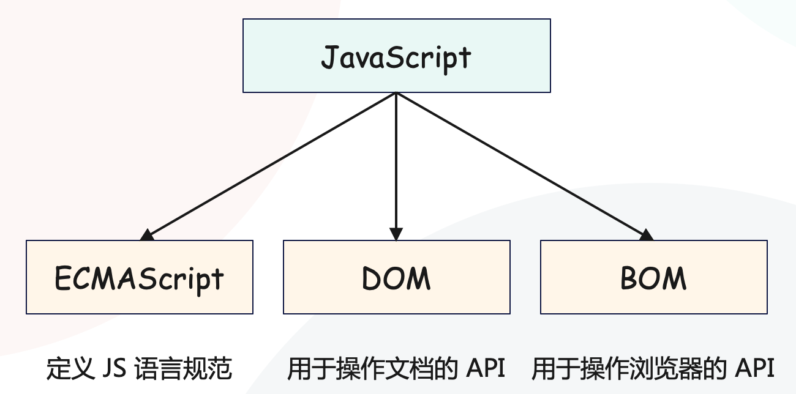
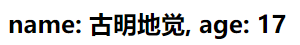
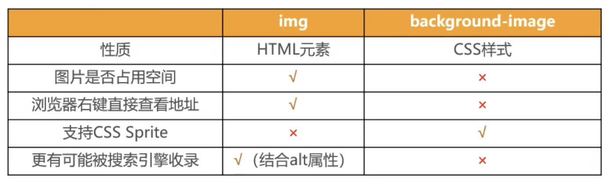
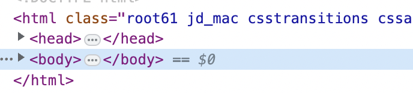
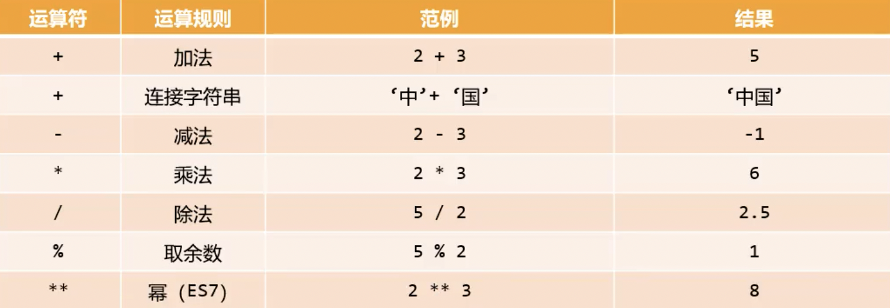
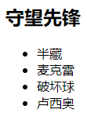

### 组件通信

在开发的时候，可以只创建一个 App.vue，也就是根组件，然后将所有逻辑都放到根组件中，但这样做的话代码就会变得非常臃肿。所以组件化的核心思想就是对组件进行拆分，拆分成一个个小的组件。然后在 App.vue 中将这些小的组件组合嵌套在一起，最终形成我们的应用程序。

举个例子：

App 组件是根组件，它是 Header、Main、Footer 的父组件，Main 是 Banner 和 ProductList 的父组件，按照这种方式拆分之后，我们开发对应的逻辑只需要去对应组件中编写即可。

而在开发过程中，我们经常会遇到组件之间相互通信的需求。

+ 比如 App 可能使用了多个 Header，每个地方的 Header 展示的内容不同，那么就需要使用者给 Header 传递一些数据，让其进行展示；
+ 又比如我们在 Main 当中一次性请求了 Banner 数据和 ProductList 数据，那么就需要传递给它们进行展示；
+ 也可能是子组件中发生了事件，但是要由父组件来完成某些操作，那么就需要子组件向父组件传递事件；

总之在一个 Vue 项目中，组件之间的通信是非常重要的环节，下面我们就来了解一下组件之间是如何进行通信的。

直接说结论：

+ 父组件传递给子组件：通过 props 属性；
+ 子组件传递给父组件：通过 $emit 触发事件；

#### 父组件传递数据给子组件

先来看看父组件将数据传递给子组件。

~~~html
<!-- components/ProductItem.vue -->
<template>
  

    
商品名称: {{ name }}

    
商品价格: {{ price }}

    
商品数量: {{ count }}

  

</template>

<!-- App.vue -->
<template>
  <h2>商品信息</h2>
  <!-- 使用子组件的时候，同时传递数据 -->  
  <product-item name="香蕉" price="2/个" count="6"></product-item>
  <product-item name="苹果" price="5/个" count="3"></product-item>
</template>

~~~

我们来看一下效果：

此时我们就是实现了父组件往子组件传递数据。

但是这样做有一个弊端，就是我们无法验证数据是否符合类型，比如子组件的 name 必须是字符串、price 和 count 必须是数值，那么该怎么办呢？

~~~html
<!-- components/ProductItem.vue -->
<template>
  

    
商品名称: {{ name }}

    
商品价格: {{ price }}

    
商品数量: {{ count }}

  

</template>

<!-- App.vue -->
<template>
  <h2>商品信息</h2>
  <!-- 如果是 price="2"，那么 price 就是个字符串，但是会自动转化 -->
  <!-- 如果是 :price="2"，那么会把引号里面的内容单独拿出来，此时就是数值 2 -->
  <!-- 如果是 :name="香蕉"，那么会把引号里面的内容单独拿出来，但没有名为 香蕉 这个属性-->
  <!-- 所以希望通过 :name 指定字符串，那么应该指定 :name="'香蕉'" -->
  <product-item name="香蕉" price="2" count="6"></product-item>
  <product-item name="苹果" price="5" count="3"></product-item>
</template>

~~~

此时就对类型进行了限制，除了 type 和 default，还可以指定 required，值为布尔类型，表示是否为必传参数。

type 表示限制指定类型，那么类型都可以有哪些呢？ 

+ String
+ Number
+ Boolean
+ Array
+ Object
+ Date
+ Function
+ Symbol

然后有一个比较特殊的地方，如果类型为 Object，那么当指定默认值的时候，默认值必须是函数，然后函数返回一个对象。之所以这么做，是为了避免共享数据被其它人修改，所以直接指定 default: () => ({})。当然，除了对象，数组也是如此。然后是 props 中属性的名称，应该遵循小驼峰，然后父组件在传值的时候，可以使用小驼峰也可以使用连字符。

这里再补充一点：子组件中的数据可以来自于自己（通过 data 函数返回的对象指定），也可以来自于父组件（通过 props 指定来自父组件的属性），我们已经说过了。但如果父组件传了一个属性，而该属性在创建子组件时的 props 里面没有，会发生什么情况呢？

当我们传递一个属性给某个子组件，但是在子组件的 props 中没有指定相应的属性时，那么该属性就称之为非 prop 的 Attribute，常见的包括 class、style、id 等等。对于非 prop 的 Attribute，默认会传递到子组件的根元素当中。

~~~html
<!-- components/ProductItem.vue -->
<template>
  <!-- 在 props 里面定义了 name、price、count，那么当父组件传递了这几个值之后 -->
  <!-- 会使用插值语法，替换掉 {{ }} 里面的 name、price、count，没传的话就是空 -->  
  <!-- 但如果传递了一个 props 中不存在的属性，比如 xxx="yyy"，那么它会传到根元素当中 -->  
  <!-- 而根元素显然就是就是这里的 div，因此会变成 
 -->    
  

    
商品名称: {{ name }}

    
商品价格: {{ price }}

    
商品数量: {{ count }}

  

</template>

<!-- App.vue -->
<template>
  <h2>商品信息</h2>
  <product-item name="香蕉" price="2" count="6" xxx="yyy"></product-item>
  <product-item name="苹果" price="5" count="3" yyy="zzz"></product-item>
</template>

~~~

然后我们来看一下效果。

结果没有任何问题，所以当组件（对应的 template）有单个根节点时，非 prop 的 Attribute 将自动添加到根节点的 Attribute 中。但如果我们不希望非 prop 的 Attribute 被添加到子组件的 template 的根节点当中，该怎么做呢？

~~~html
<!-- components/ProductItem.vue -->
<template>   
  

    
商品名称: {{ name }}

    
商品价格: {{ price }}

    
商品数量: {{ count }}

  

</template>

~~~

重新刷新一下页面：

效果和之前一样，但是非 prop 的 Attribute 没有被添加到根节点当中。

但问题又来了，我只是不希望非 prop 属性被添加到根节点当中，但我们还需要它，那么这个时候要如何获取呢？

~~~html
<!-- components/ProductItem.vue -->
<template>
  

    
商品名称: {{ name }}

    
商品价格: {{ price }}

    
商品数量: {{ count }}

  

</template>

~~~

刷新页面看一下效果：

对于非 prop 的 Attribute，可以通过 \$attrs 进行获取，获取不到就是空。注意：\$attrs 是固定的，不能是其它名字。如果不指定 inheritAttrs 为 false，那么非 prop 的 Attribute 同时也会被添加到根节点中。

总结：如果我们不希望组件的 template 的根节点继承父元素传来的非 prop 的 Attribute，可以在组件对象中设置 inheritAttrs: false。

+ 禁用 Attribute 继承的常见情况是，需要将 Attribute 应用在根元素之外的其它元素；
+ 禁用了之后，我们还要拿到它手动设置，获取方式是通过 \$attrs. 的方式获取；

我们上面的 template 里面只有一个根节点，就是 class="product" 的 div，但如果有多个根节点呢？

~~~html
<!-- components/ProductItem.vue -->
<template>
  

    
商品名称: {{ name }}

    
商品价格: {{ price }}

    
商品数量: {{ count }}

  

  
  

    
以上是您所构面的商品

  

</template>

~~~

此时里面的两个 div 没有共同的祖先，所以它们都是根节点，如果有多个根节点，那么必须显式地指定：要将非 prop 的 Attribute 绑定在哪一个根节点上。如果不指定，那么一个也不绑定，但对使用 \$attrs 来说没有影响。

那么如何指定呢？

~~~html
<!-- components/ProductItem.vue -->
<template>
  

    
商品名称: {{ name }}

    
商品价格: {{ price }}

    
商品数量: {{ count }}

  

  
  <!-- 通过 v-bind="attrs" 指定，会依次进行展开 -->
  

    
以上是您所构面的商品

  

</template>

~~~

此时就实现精确绑定了，不过用的不多，了解一下即可。

#### 子组件传递到事件给父组件

补充：exec 默认影响的是 local 名字空间，如果在执行时发现 local 名字空间为 NULL，那么会自动创建一个。所以调用 exec 也可以创建名字空间（当它为 NULL 时）。

