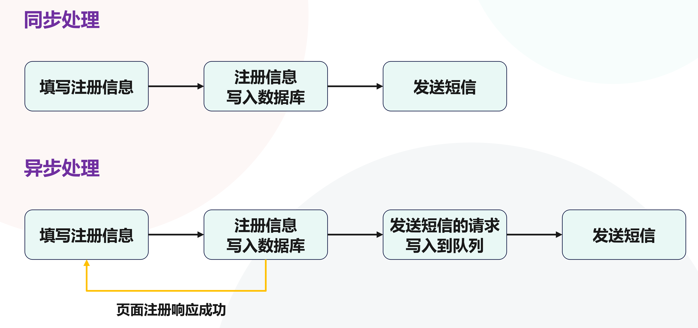
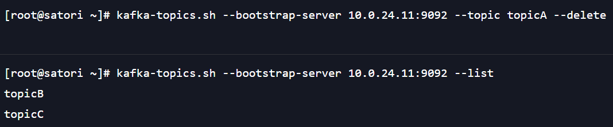
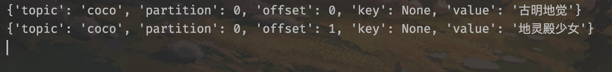

## HTML

### 认识网页和网站

**什么是网页？**

+ 网页的专业术语叫做 Web Page；
+ 它是浏览器请求某个 URL 所返回的页面；
+ 网页的内容可以非常丰富，包含文字、链接、图片、音乐、视频等等；

比如我们打开哔哩哔哩的主页：

**什么是网站？**

+ 网站是由多个网页组成的，比如上图，里面有很多标签，像番剧、国创、综艺、动画等等，当点击的时候，就会返回新的网页（或者说页面）。再比如点击登录会跳转到登录页面，所以一个网站会包含很多的页面；
+ 像百度是一个网站，知乎是一个网站，因特网上存在大量的网站；

**在浏览器中输入一个网址，然后到返回页面的这段过程发生了什么？**

+ 用户在浏览器中输入一个网址，回车；
+ 浏览器会通过 DNS 服务找到网址对应的服务器 IP，然后向服务器发请求；
+ 服务器将资源返回给浏览器，其中资源分为静态资源和动态资源。静态资源指的是那些和后端服务无关的资源，比如 HTML 文件、CSS 文件、JS 文件、图片等等。动态资源则是需要和后端服务交互，比如从数据库、缓存里面查询到的数据等等；
+ 对于一个前后端分离的项目而言，浏览器会先拿到 HTML 等静态资源，然后进行解析和渲染。并且在这个过程中，如果需要动态资源，那么会继续向服务端发请求；

**介绍一下服务器的概念。**

+ 我们日常生活接触到的基本都属于客户端或前端的内容，比如浏览器、微信、QQ、小程序；
+ 而我们的手机不可能存放太多的数据和资源，比如你用的网易云音乐，大部分音乐数据都是存储在服务器上面的；
+ 服务器本质上也是一台类似于你电脑一样的主机，只不过该主机有一些特点：
    + 二十四小时不关机（稳定运行）
    + 没有显示器；
    + 一般装的是 Linux 系统（比如 CentOS），当然也有 Windows 企业版，但很少；
+ 目前大部分公司没有自己的机房，用的都是云服务器，比如阿里云、腾讯云、亚马逊云等等；

### 网页的三大组成部分

下面我们来剖析一下网页是怎么组成的，不过先来看看世界上第一个网站的页面。

世界上第一个网站的主页面就长这个样子，非常的简单，但在当时它却是天才之作。然而随着科技的发展，人类对网页内容的要求也越来越高，比如显示图片、音频、视频等等。

那么问题来了，网页本身是用什么开发出来的呢？它背后由什么组成呢？

+ 阶段一：HTML 元素；
+ 阶段二：HTML 元素 + CSS 样式；
+ 阶段三：HTML 元素 + CSS 样式 + JavaScript 语言；

其中 HTML 负责网页的内容结构，相当于人的骨架；CSS 负责网页的视觉体验，相当于人的血肉；JavaScript 负责网页的动态交互，相当于让人具有动态行为。

所以对于一个面向普通用户的网页，HTML、CSS、JavaScript 三者缺一不可，而本次我们的主题就是 HTML。介绍完 HTML 之后，后续再依次介绍 CSS 和 JavaScript。

### 什么是 HTML

HTML 的全称是 **H**yper**T**ext **M**arkup **L**anguage（超文本标记语言），是一种用于创建网页的标记语言，也是构建网站的基石。

+ 它由无数个标记（或者说标签）组成，负责对内容做一些特殊的处理；比如使用 \<h2\>\</h2\> 标记的文本，浏览器在渲染的时候会将它加粗并放大；使用 \<p\>\</p\> 标记的文本，浏览器在渲染的时候会将它看成单独的段落；
+ 由标签和内容组成的整体被称为元素（element），比如 \<h2\>Hello World\</h2\>；

不同的标签有不同的作用，我们学习 HTML 就是学习它内部的标签。另外上面的两点，只是体现出了 HTML 是一个标记语言，那么什么是超文本呢？

+ 不仅仅可以插入类似 Hello World 的普通文本，还可以插入图片、音频和视频；
+ 此外也可以是超链接（HyperLink），从一个网页跳转到另一个网页；

HTML 文件的后缀名是 .html，但因为历史遗留问题，Win95/Win98 系统的文件扩展名不能超过三个字符，所以使用 .htm，现在统一使用 .html。

然后来看一下一个网页的 HTML 结构。

一个网页里面有一个 html 标签，也是最外层的标签。然后 html 标签里面有一个 head 标签和一个 body 标签，head 标签用来存放网页的元数据，body 标签用来存放页面显示的具体内容。

如果我们希望在页面上展示某些数据的话，那么就将它写在 body 标签里面。当然啦，标签是可以层层嵌套的，标签里面的内容可以普通的文本，也可以是一个新的标签，总之标签 + 内容整体便构成了 HTML 的一个元素。

如果一个元素既有开始标签，又有结束标签，那么称为双标签元素；如果只有开始标签，没有结束标签，那么称为单标签元素，比如 img 标签、input 标签等等。

> 标签不区分大小写，但我们推荐小写。

然后标签内部还可以有很多属性，比如：

~~~html
<input type="text" name="username">
~~~

type="text" 和 name="username" 便是标签属性，其中 type 和 name 属于属性名，"text" 和 "username" 属于属性值。属性要写在开始标签里面，并且一个标签可以有很多的属性。

然后我们就来学习 HTML 的标签。

### html 标签

html 标签表示一个 HTML 文档的根（顶级标签），所以也被称为根标签，其它所有标签都必须 html 标签的后代。

~~~html
<!DOCTYPE html>

<!-- 根标签 -->
<html lang="en">

    <!-- 存放网页的元数据 -->
    <head>
    </head>

    <!-- 存放网页的内容 -->
    <body>
    </body>

</html>
~~~

我们注意到开头还有一个 \<!DOCTYPE html\>，它表示文档声明，告诉浏览器当前页面是 HTML5 页面，让浏览器用 HTML5 的标准去解析识别内容。因为不同版本的 HTML 的标签是有区别的，比如：

~~~html
<!-- HTML5 之前，单标签的结尾必须有一个 / -->

<!-- HTML5 开始，单标签的结尾就不需要 / 了 -->

~~~

当然除此之外还有其它的一些差别，总之我们现在用的是 HTML5，所以这一行最好不要省略，省略了会出现兼容性问题。此外，文档声明必须放在 HTML 文档的最前面。

然后再来看 html 标签，我们注意到它里面还有一个 lang 属性，显然它负责指定该网页使用的语言。那么问题来了，这有什么作用呢？

+ 帮助语音合成工具确定要使用的发音；
+ 帮助翻译工具确定要使用的翻译规则；

如果将 lang 属性指定为 en，表示 HTML 文档的语言是英文；指定为 zh-CN，表示 HTML 文档的语言是简体中文。

### head 标签和 body 标签

html 标签是根标签，它里面包含了 head 标签和 body 标签，其中 head 标签是用来描述网页的元数据的，也就是网页的一些配置信息。包括文档的标题，引用的文档格式和脚本等。

比如我们用 webstorm 创建一个 HTML 文件：

~~~html
<!-- 下面的内容是自动帮我们生成的 -->

<!DOCTYPE html>
<html lang="en">
<head>
    <!-- 网页采用的字符编码 -->
    <!-- meta 标签能设置的属性非常多，这里先只介绍字符编码 -->  
    <meta charset="UTF-8">
    <!-- 网页的标题 -->
    <title>Title</title>
</head>
<body>

</body>
</html>
~~~

当然 head 标签远不止这么简单，CSS 相关的设置也要写在 head 里面，不过这些就等到介绍 CSS 的时候再说。

说完了 head 标签，再来看看 body 标签，它里面的内容就是你在浏览器窗口中看到的，换句话说，网页里面呈现的所有东西都要写在 body 里面。我们后面学习的大部分标签都是写在 body 里面，然后呈现在浏览器窗口中的。

### h 标签和 p 标签

在一个页面中通常会有一些比较重要的文字，需要放在醒目的位置，那么便可以使用 h 标签将它作为标题。h 标签有六种级别，分别是 h1 到 h6。

~~~html
<body>
    <h1>我是 h1 标题</h1>
    <h2>我是 h2 标题</h2>
    <h3>我是 h3 标题</h3>
    <h4>我是 h4 标题</h4>
    <h5>我是 h5 标题</h5>
    <h6>我是 h6 标题</h6>
</body>
~~~

这里只截取 body 里面的内容，我们用浏览器打开文件，看看效果。

效果就是这样，如果在学习到 CSS 的时候，你会发现 h1 到 h6 这些标签，都是 CSS 实现的。我们举个例子：

~~~html
<!DOCTYPE html>
<html lang="en">
<head>
    <meta charset="UTF-8">
    <title>Title</title>
    
</head>
<body>
<h1>我是 h1 标题</h1>

我也是 h1 标题

</body>
</html>
~~~

h1 只是一个普通的标签，只不过浏览器在解析的时候，会给它增加一些样式。我们也可以将相同的样式设置在 div 上面，那么它会呈现和 h1 一样的效果。

效果一模一样，关于 CSS 我们后续再聊。

然后是 p 标签，它用于展示一个段落，举个例子：

~~~html
<body>
古明地觉是一个幽灵也为之恐惧的少女
它拥有独特的心之眼，来自地灵殿
</body>
~~~

你觉得它会展示什么效果呢？

我们看到它展示在了同一行，因为对于浏览器来说，它的解析主要是通过标签来实现的。而文本中的换行（无论多少个），浏览器都会将它视为一个空格。所以下面的代码和上面是等价的。

~~~html
<body>
古明地觉是一个幽灵也为之恐惧的少女
  
  
  
  
它拥有独特的心之眼，来自地灵殿
</body>
~~~

除了换行，空格也是如此，100 个空格和 1 个空格也是等价的，浏览器都会按照 1 个空格来解析。

如果希望单独构成一个段落，那么应该使用 p 标签包起来。

~~~html
<body>

古明地觉是一个幽灵也为之恐惧的少女

它拥有独特的心之眼，来自地灵殿
</body>
~~~

被 p 标签包起来的内容会单独构成一个段落，或者说占满整行，那么它下面的内容就会新起一行，不会连在一起了。

当然第二行也应该用 p 标签包起来，但这里没有，主要是想展示 p 标签只是起到了单独构成一个段落的作用，至于里面的内容不会做任何的修饰（除非我们加上了 CSS）。

那么问题来了，如果所有内容都写在一个 p 标签里面，能不能实现换行呢？答案是可以的，我们可以使用 br 标签。

~~~html
<body>

 <!-- 文本开头的换行和空格都会被忽略掉 -->
    古明地觉是一个幽灵也为之恐惧的少女 
    它拥有独特的心之眼，来自地灵殿

</body>
~~~

然后我们注意到，它和上面的例子有些不一样，就是两行之间的距离。一般来说，两个独立的段落之间是需要保证一些距离的（不仅仅是换行）。但如果是同一个段落，只是换行的话，那么是不需要这么长的距离的。

### a 标签和 img 标签

a 标签有两个作用，第一个作用是跳转到网页的具体位置，它需要两个步骤：

+ 在要跳的标签上定义一个 id 属性；
+ 定义 a 标签，并且标签的 href 属性指向对应的 id；

~~~html
<body>
<a href="#one">点我跳到段落 1</a>
<a href="#two">点我跳到段落 2</a>
<a href="#three">点我跳到段落 3</a>

我是段落 1

我是段落 2

我是段落 3

</body>
~~~

此外 a 标签的 href 属性也可以写上一个链接，点击之后跳转到指定的页面。

~~~html
<body>
<a href="https://www.baidu.com">点击跳转到百度(不打开新页面)</a>
<a href="https://www.baidu.com" target="_blank">点击跳转到百度(打开新页面)</a>
</body>
~~~

注意：这个链接不一定非要是外部链接，本地的文件路径也是可以的，点击之后会自动打开。然后还可以发邮件，将 href 设置成 "mailto:"，那么会自动打开邮件。

然后再来看看 img 标签，用来显示一张图片。

~~~html

~~~

src 表示图片地址；alt 表示当图片无法显示时，对应的提示信息。

a 标签里面如果是文字，那么点击文字即可跳转，同理，a 标签里面如果是图片呢？你在商城网站看到一个衣服很好看，点击图片可以跳转，背后就是通过在 a 标签里面嵌套一个 img 实现的。

> h（h1 ~ h6）标签和 p 标签都是独占一行的，但 a 标签和 img 标签则是尽可能地在一行显示。

### div 和 span 标签

div 和 span 都是纯粹的容器，也可以把它们理解为盒子，都是用来包裹内容的。

+ div：包裹的内容会在不同的行显示。
    + 一般作为其它元素的父容器，把其它元素包裹住，代表一个整体；
    + 用于把网页分割为多个独立的部分；
+ span：包裹的内容会在同一行显示。
    + 默认情况下，和普通文本没有区别；
    + 用于区分普通文本和特殊文本，比如用来显示一些关键字；

我们来编写一段 HTML：

~~~html
<body>
<h1>学习前端最重要的三板斧</h1>
<h2>HTML</h2>

构成了网页的基本骨架

<h2>CSS</h2>

给网页添加一些装饰

<h2>JavaScript</h2>

让网页具有动态交互效果

</body>
~~~

页面的效果如下：

页面很简单，但如果我让你给第二个 h2 标签和 p 标签添加一些样式该怎么办呢？显然比较麻烦。因为当前所有的内容都是连在一起的，最好的办法是将它们隔离开，而隔离的办法就是使用 div 标签。

~~~html
<body>
<h1>学习前端最重要的三板斧</h1>

    <h2>HTML</h2>
    
构成了网页的基本骨架

    <h2>CSS</h2>
    
给网页添加一些装饰

    <h2>JavaScript</h2>
    
让网页具有动态交互效果

</body>
~~~

此时呈现的效果和之前没有任何区别，但是不同的部分之间进行了隔离，如果想调整第二个 h2 和 p 标签，那么只需要找到第二个 div 即可。当然这里的元素还比较少，如果多的话，那么肯定要使用 div 进行划分。

所以 div 没有具体的含义，它就是一个容器，将指定部分的元素单独包起来。

说完了 div 再来看看 span：

~~~html

    你喜欢这个
残酷
的世界吗

    你喜欢这个残酷的世界吗

    你喜欢这个残酷的世界吗

~~~

有时候我们需要给一段文字中的某个部分增加一些样式，那么最好的办法就是用标签包起来，然后给标签设置样式即可。但使用的标签应该满足一个特点，就是在没有设置样式的时候，标签包裹的文本和普通文本没有任何区别。

我们看到 div 和 span 在不设置 CSS 的前提下，没有对内容的样式造成任何的变化，它们起到的都是一个隔离的作用。但 div 的作用范围明显更大一些，并且独占一行，它适合大量元素的隔离；而 span 则不是，它会和前后的内容占据同一行（多个 span 也是如此），所以当你希望隔离一行中的某个部分时，使用 span 标签。

总结：div 和 span 用的非常广泛，再次强调，它们就是普通的容器，没有特殊含义。不像 a 标签表示链接、h 标签表示标题，div 和 span 就是普通的容器，只要不设置 CSS，它们不会对元素的样式造成任何影响。

### 不常用标签

到目前为止我们介绍了 h1~h6 标签、p 标签、a 标签、img 标签、div 标签、span 标签，这些标签可以说占据了 HTML 开发的 90%。至于 input 标签、table 标签、ul 标签等等也很重要，但它们在用的时候需要结合 CSS 使用，所以这些标签我们放到 CSS 的时候再说。

然后除此之外还有一些不常用的标签，来看一下。

**strong 标签：内容加粗、强调**

+ 通常加粗会使用 CSS 样式来完成
+ 开发中偶尔会使用一下

**i 标签：内容倾斜**

+ 斜体和加粗一样，都属于样式，一般都用 CSS 来完成
+ 开发中偶尔会用它来做字体图标（因为看起来像 icon 的缩写）

**code 标签：用于显示代码**

+ 偶尔会用来显示等宽字体

还有很多不常用的元素，我们后面介绍到的时候再说，下面演示一下。

~~~html

我是 <strong>加粗</strong>

我是 <i>斜体</i>

    我是 <code>print("Hello World")</code>

~~~

比较简单。

### HTML 的全局属性

前面说过，标签是具有属性的，有的属性只能设置在固定的标签当中，比如 img 标签的 src（图片链接）、a 标签的 href（跳转链接）等等。但有一些属性是所有的标签都可以拥有的，这样的属性我们叫做全局属性。

那么全局属性都有哪些呢？首先全局属性非常多，但常用的就以下几个。

**id**：定义唯一标识符，该标识符在整个 HTML 文档中必须是唯一的，后续通过 id 便可以定位到具体的元素；

**class**：给标签增加一个类名，如果是多个类，那么用空格分开。后续通过 class 便可以定位到一个或多个指定的元素，然后批量操作，比如增加样式等等；

**style**：给元素增加内联样式；

**title**：包含表示与其所属元素相关的文本，这些信息通常可以作为提示呈现给用户，但不是必须的；

id、class、style 就不说了，后续留到 CSS 的时候再说，这里看看 title。

~~~html
<body>

这是一个残酷的世界

</body>
~~~

当把鼠标放上去然后保持不动之后，就会显示 title 里面的内容。当然不光是 p 标签，h 标签、img 标签、a 标签都是可以的，因为 title 是所有标签都支持的。

### 字符实体的作用

这里再来补充一些知识点，首先我们编写的 HTML 代码是需要被浏览器解析的，但浏览器也是一个程序，也是按照固定的规则去解析的。如果我们的 HTML 代码出现了歧义，那么浏览器就不知道该怎么解析了，举个例子。

~~~html

    div = 123
    span = 234
    这是内容：div

小于号：&lt;

大于号：&gt;

磅：&pound;

版权：&copy;

</body>
~~~

这里随便演示几个，其它的可以自己测试一下。

### 元素的语义化

元素的语义化指的是用正确的元素做正确的事情，比如有两个元素，对应的标签分别是 h1 和 p。

~~~html
<h1>Hello World</h1>

Hello World

~~~

在浏览器中它们会显示不同的样式，但这些都是浏览器在背后给标签增加了 CSS。

~~~css
h1 {
    display: block;
    font-size: 2em;
    margin-block-start: 0.67em;
    margin-block-end: 0.67em;
    margin-inline-start: 0px;
    margin-inline-end: 0px;
    font-weight: bold;
}

p {
    display: block;
    margin-block-start: 1em;
    margin-block-end: 1em;
    margin-inline-start: 0px;
    margin-inline-end: 0px;
}
~~~

如果把这些样式给它去掉，那么 h1 和 p 没有任何区别，甚至我们也可以用 p 标签去实现 h1 标签的效果。

所以再次强调，这些标签本质上没太大区别，像 h1、p、div、span 等等，只不过浏览器在解析的时候自动给它们增加了一些相应的 CSS 罢了。但在开发当中，还是要用正确的元素去做正确的事情，比如一个 div 标签，非要用 span 去实现，虽然可以，但明显不应该这么做。

## CSS

### CSS 的作用和使用方式

CSS 表示层叠样式表，cascading style sheet，是为网页添加样式的代码。但 CSS 不是真正的编程语言，甚至不是标记语言，它是一门样式表语言。CSS 有以下三种形式：

**1）内联样式表：样式存在于 HTML 标签的 style 属性中**

~~~html
<!DOCTYPE html>
<html lang="en">
<head>
    <meta charset="UTF-8">
    <title>Title</title>
</head>
<body>

    我是 div

</body>
</html>
~~~

将文字颜色设置成绿色，大小设置为 24px，不同样式之间使用分号分隔。所以学习 CSS，就是学习相应的样式。

**2）内部样式表：将样式放在 head 标签里的 style 标签中**

假设有 10 个 div，每个 div 都要加上相同的样式，该怎么做呢？如果用上面的做法，那么我们等于是将这些样式重复了 10 遍。

~~~html
<!DOCTYPE html>
<html lang="en">
<head>
    <meta charset="UTF-8">
    <title>Title</title>
    
</head>
<body>

    
我是需要样式的 div1

    
我是需要样式的 div2

    
我是需要样式的 div3

    
我是不需要样式的 div1

    
我是不需要样式的 div2

    
我是不需要样式的 div3

</body>
</html>
~~~

此时我们就批量修改了样式，核心就是在 head 标签的 style 标签里面定义好样式即可，但是要给哪些元素增加样式呢？这就需要我们后面学习的选择器的知识了。而且从这里我们也能看出 div 的作用了，如果没有外层的 div，那么想要实现上面的效果还是很麻烦的，你需要找到想渲染的 div 的数量。

但是将渲染的的 div 和不渲染的 div 在放在单独的 div 里面进行隔离，就方便多了。比如上面的逻辑就是：对 id 为 box1 的元素下面的 div 元素进行渲染。或者我们还有另一种做法：

~~~html
<!DOCTYPE html>
<html lang="en">
<head>
    <meta charset="UTF-8">
    <title>Title</title>
    
</head>
<body>

    
我是需要样式的 div1

    
我是需要样式的 div2

    
我是需要样式的 div3

    
我是不需要样式的 div1

    
我是不需要样式的 div2

    
我是不需要样式的 div3

</body>
</html>
~~~

给要渲染的 div 增加一个 class 即可，这样凡是 class 具有 render 的标签，都会被渲染。然后第三个 div 的 class 除了有 render 之外，还有 render2，那么它的背景颜色也会被修改。

非常简单，再次强调，学习所谓的 CSS，就是学习相应的样式，以及选择器。

**3）外部样式表：将 CSS 编写在一个独立的文件中，然后通过 link 标签引入进来**

内联样式表简单方便，但是当元素一多就不得不将样式重复多次；内部样式表更加清晰，但如果多个 HTML 文件都依赖同一种样式呢？

所以还有外部样式表，将样式单独写在一个 CSS 文件里面，哪个 HTML 要用的话，直接通过 link 标签引入即可。

~~~html
<!-- css/style.css -->
.render {
    color: darkgoldenrod;
    font-size: 24px;
    font-style: italic;
}

.render2 {
    background-color: peachpuff;
}

<!-- index.html -->
<!DOCTYPE html>
<html lang="en">
<head>
    <meta charset="UTF-8">
    <title>Title</title>
    <!--  link 标签负责引入外部文件，rel 表示文件的类型  -->
    <!--  rel="icon" 表示引入图标，rel="stylesheet" 表示引入外部的 CSS 文件  -->  
    <link rel="stylesheet" href="./css/style.css">
</head>
<body>

    
我是需要样式的 div1

    
我是需要样式的 div2

    
我是需要样式的 div3

    
我是不需要样式的 div1

    
我是不需要样式的 div2

    
我是不需要样式的 div3

</body>
</html>
~~~

效果和之前一样，没有任何问题。

值的一提的是，HTML 文件可以通过 link 标签导入很多的 CSS 文件，但如果文件一多，看起来也会比较麻烦。

~~~html
<link rel="stylesheet" href="./css/1.css">
<link rel="stylesheet" href="./css/2.css">
<link rel="stylesheet" href="./css/3.css">
<link rel="stylesheet" href="./css/4.css">
~~~

于是我们可以换一种做法，在 ./css 中再定义一个 index.css。

~~~css
@import url(./1.css)
@import url(./2.css)
@import url(./3.css)
@import url(./4.css)
~~~

然后在 html 中只需要引入 index.css 即可，这算是一种比较简便的写法。

### 必须掌握的 CSS 属性

CSS 的属性或者说样式非常非常多，一下子全部掌握不太现实，我们先来介绍一些常用的。把这些常用的学好，那么你就能完成工作中 90% 的任务。

+ font-size：文字大小
+ color：文字颜色（前景色）
+ background-color：背景色
+ width：宽度
+ height：高度

~~~html
<!DOCTYPE html>
<html lang="en">
<head>
    <meta charset="UTF-8">
    <title>Title</title>
    
</head>
<body>
    
古明地觉的编程教室

</body>
</html>
~~~

div 属于块级标签，它会独占一行，前景色设置的当然是文字。而背景色，则会设置该标签所占的整个区域。

当然啦，我们也可以指定宽度：

~~~html
<!DOCTYPE html>
<html lang="en">
<head>
    <meta charset="UTF-8">
    <title>Title</title>
    
</head>
<body>
    
古明地觉的编程教室

</body>
</html>
~~~

此时效果就变成了这样，注意：此时 div 仍然是块级标签，它独占一行，只是我们限制了它的长度和宽度。

~~~html
<!DOCTYPE html>
<html lang="en">
<head>
    <meta charset="UTF-8">
    <title>Title</title>
    
</head>
<body>
    
古明地觉的编程教室

    古明地觉的编程教室
</body>
</html>
~~~

这里将宽度改成 100px，看看效果。

此时就尴尬了，我们限制了 div 的宽度为 100px，那么背景色就会只填充这 100px 的部分。但它仍然是独占一行，接下来的 span 标签会出现在它的下面。

> 设置宽度另一个比较常见的地方就是图片，如果图片过大，看起来会很麻烦，那么便可以给指定的 img 设置一个最大宽度，至于高度则等比例缩小。

然后是高度的问题，不设置宽度的话，由于块级标签独占一行的特性，会自动横向填满整个区域。但高度呢？很简单，不设置高度，那么取决于内部的文本内容，相当于文本将整个 div 给撑开了。

再举个例子，形象地说明这一点：

~~~html
<!DOCTYPE html>
<html lang="en">
<head>
    <meta charset="UTF-8">
    <title>Title</title>
    
</head>
<body>
    
古明地觉的编程教室

    

    

</body>
</html>
~~~

显示结果如下：

在没有设置宽度的情况下，那么默认会填充整个横向区域，因为块级元素是独占一行的，所以没有指定宽度，那么这一整行就是它的宽度。如果指定宽度为 200px，那么它仍然是独占一行，只不过能用的范围只有 200px。

但高度如果不设置，那么取决于内容。id 为 box2 的 div 由于没有设置高度、并且没有内容，那么相当于高度为 0，因此直接就不显示了。id 为 box1 的 div 取决于内部的文本内容，id 为 box3 的 div 我们设置了高度为 100px。

然后再来看看当显示不下的时候，会有什么后果，如果宽度不够，那么采用多行显示。但高度不够呢？

~~~html
<!DOCTYPE html>
<html lang="en">
<head>
    <meta charset="UTF-8">
    <title>Title</title>
    
</head>
<body>

古明地觉的编程教室

</body>
</html>
~~~

横向显示不下，会使用多行，但如果高度不够，那么在垂直方向上会被撑开。

> 行内元素不可以设置宽度。

这里补充一点，HTML 和 CSS 都是需要被解析的，整个过程如下：

整个 HTML 会被解析成一个树形结构，这个树就叫做 DOM 树，根节点就是 html 标签节点。这些目前知道一下即可，后续介绍 JavaScript 的时候再细说。

### 文本属性

然后来看看调整文本相关的属性，我们要学如下几个。

**1）text-decoration**：设置文字的装饰线

+ none：无任何装饰线，a 标签默认有一个下划线，通过指定为 none 可以将其去掉
+ underline：下划线
+ overline：上划线
+ line-through：中划线（删除线）

~~~html
<body>

下划线

上划线

删除线

<a href="">点击跳转</a>
<a href="" style="text-decoration: none">点击跳转</a>
</body>
~~~

a 标签为什么会有下划线呢？不用想，肯定是浏览器给它设置了 text-decoration，我们指定为 none 可以进行修改。

**2）text-transform**：设置文字的大小写转换

+ capitalize：每个单词的首字母大写
+ uppercase：每个单词大写
+ lowercase：每个单词小写
+ none：无影响

这个特性用的不多，一般用 JavaScript 来控制。

**3）text-indent**：首行缩进

这个特性用的也不多，应为每个段落之间是有距离的，所以现在新闻网站基本不用首行缩进了。

**4）text-align**：设置文本的对齐方式

+ left：左对齐
+ right：右对齐
+ center：正中间显示
+ justify：两端对齐

~~~html
<!DOCTYPE html>
<html lang="en">
<head>
    <meta charset="UTF-8">
    <title>Title</title>
    
</head>
<body>

古明地觉

古明地觉

</body>
</html>
~~~

如果不指定 width，那么按照整个屏幕居中，这里指定了宽度，那么按指定的宽度居中。

另外这里虽然叫 text-align，但它不仅仅可以修改文本的位置，其它标签（比如图片、输入框等等）也可以居中，所以这个名字起的不好。

~~~html
<!DOCTYPE html>
<html lang="en">
<head>
    <meta charset="UTF-8">
    <title>Title</title>
    
</head>
<body>

    

</body>
</html>
~~~

+ 块级元素：独占一行，有宽高的概念，一旦设置了宽高，那么按照指定的宽高进行显示，但仍独占一行；
+ 行内元素：不独占一行，但是没有宽高的概念；
+ 块级行内元素：按照行内元素显示，但是有宽高的概念；

所以要保证设置 text-align 的标签里面的元素是行内元素，这样里面的内容才能居中显示。除了 text-align 还有 text-align-last，它用于设置文本最后一行的对齐效果。

**5）word-spacing、letter-spacing**：设置单词、字母之间的间距

这个一般用于英文，比较简单。

### 字体属性

说完了文本，再来看看字体，字体有以下几个重要属性，我们分别介绍。

**1）font-size**：决定文字的大小

+ 比如 100px，或者使用 em 单位：1em 代表默认大小的 100%，2em 代表 200%，但是不推荐 em；
+ 基于百分比，比如 50% 表示父元素 font-size 的一半

**2）font-family**：设置文字的字体名称

+ 可以设置一个或多个字体名称
+ 浏览器会选择列表中第一个计算机已安装的字体
+ 也可以通过 @font-face 指定可以直接下载的字体

**3）font-weight**：设置字体的粗细

+ 100、200、300....、900，每一个数字表示一个重量，越重越粗
+ normal：等于 400
+ bold：等于 700

像 strong 标签和 b 标签可以对元素加粗，它们的 font-weight 本质上也被设置为了 bold。当然还有 h1，只不过 h1 除了加粗之外，，大小也改变了。

**4）font-style**：设置文本的显示风格

+ normal：正常显示
+ italic：斜体，当字体支持斜体时，按照斜体的风格显示
+ oblique：还是斜体，但无论字体支不支持斜体，都会将文字倾斜一下，看起来像斜体

**5）font-variant**：针对于英文，基本不用，它有两个值

+ normal：正常显示
+ small-caps：将小写字母替换为缩小之后的大写字母

**6）line-height**：用于设置文本的行高

+ 行高可以先简单理解为一行文字所占据的高度

