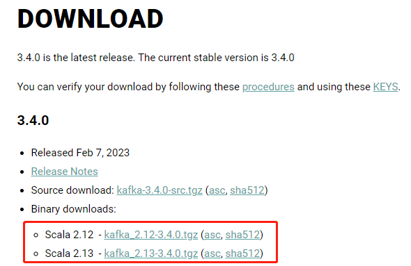

### CSS flex 布局

浮动用来做布局现在也很少了，基本都是大的电商公司，因为它要考虑到多种不同的用户。但是现在基本都用 flex 布局，而且用起来也非常方便，下面来介绍一下。

首先像 div、span 啥的都可以看成是一个盒子，而 Flexbox 翻译为弹性盒子。比如 id 为 box1 的 div 内部有一个 id 为 box2 的 div，如果 box1 放大或缩小，那么和 box2 无关。但使用弹性盒子，那么子元素会跟着父元素放大或缩小。

+ 弹性盒子是一种用于按行或按列布局元素的一维布局方法；
+ 元素可以膨胀以填充额外的空间，收缩以适应更小的空间；
+ 通常我们使用 Flexbox 来布局的方案称之为 flex 布局（flex layout）

flex 布局是目前 web 开发中使用最多的布局方案：

+ flex 布局（flexible 布局，弹性布局）；
+ 目前特别在移动端，可以说已经完全普及；
+ 在 PC 端也几乎已经完全普及和使用，只有非常少数的网站依然采用浮动来布局；

为什么使用 flex 来布局呢？

+ 长久以来，CSS 布局中唯一可靠且跨浏览器兼容的布局工具只有 float 和 position；
+ 但是这两种方法本身存在很大的局限性，并且用它们来布局属实无奈之举；

那原来的布局存在哪些痛点呢？

+ 比如在父元素里面垂直居中一个块元素，一般是要通过定位来实现，麻烦不说，如果有很多内容呢？还会对不齐；
+ 使容器的所有子项等分可用宽度/高度，而不管有多少宽度/高度可用；
+ 使多列布局中的所有列采用相同的高度，即使它们包含的内容量不同；

所以长久以来，大家都非常期待一种真正可以用于对元素布局的方案，于是 flex 布局出现了。

#### flex 布局的重要概念

盒子默认是非弹性的，如果想让它变成弹性盒子，那么需要将 display 设置为 flex。两个重要的概念：

+ 开启了 flex 布局的元素叫 flex container；
+ flex container 里面的直接子元素叫做 flex item；

当 flex container 中的子元素变成了 flex item 时，具备以下特点：

+ flex item 的布局将受 flex container 属性的设置来进行控制和布局；
+ flex item 不再严格区分块级元素和行内元素；
+ flex item 默认情况下是包裹内容的，但是可以设置宽度和高度（和 inline-block 类似，但不是 inline-block）；

设置 display 为 flex 或 inline-flex 可以成为 flex container

+ flex：flex container 以 block level 的形式存在；
+ inline-flex：flex container 以 inline level 的形式存在；

我们来编写代码：

~~~html
<!DOCTYPE html>
<html lang="en">
<head>
    <meta charset="UTF-8">
    <title>Title</title>
    
</head>
<body>
aaa

    
1

    
2

    
3

bbb

aaa

    
1

    
2

    
3

bbb
</body>
</html>
~~~

我们看到 flex container 里面的元素不再受行内或块级的影响，统一由 flex container 本身决定。

#### flex 的布局模型

改成 flex container 之后，内部的块级元素自动水平排布，目前看到的是这样，但能不能按照其它方式排布呢，排布的规则又如何呢？所以我们要先理解flex 的布局模型。

整个由灰色边框包裹的区域就是 flex container，里面有两个元素 1 和 2。然后水平方向上是主轴，垂直方向是交叉轴，而元素默认是按照主轴的方向（从左往右，可以修改）排列的。

~~~html
<!DOCTYPE html>
<html lang="en">
<head>
    <meta charset="UTF-8">
    <title>Title</title>
    
</head>
<body>

    <!--  显然是 div 至少需要 400px，而外层的 div 只有 300px，那么会怎么显示呢？  -->
    
1

    
2

    
3

    
4

</body>
</html>
~~~

我们看到内容被自动压缩了（这个特性很强），但如果不想压缩，那么需要额外设置一个属性。

~~~css
.content {
    background-color: coral;
    display: flex;
    width: 300px;
    height: 300px;
    /*换行显示*/
    flex-wrap: wrap;
}
~~~

所以交叉轴并非不重要。

#### flex 布局的相关属性

然后重头戏，flex 布局的相关属性，分门别类的组织一下。

**flex-direction**

flex items 默认都是沿着 main axis（主轴），从 main start 到 main end 的方向开始排布。

+ flex-direction 决定了 main axis 的方向

它有 4 个取值。

+ row：默认值
+ row-reverse：沿着从 main end 到 main start 的方向排列；
+ column：让原本的主轴变交叉轴，交叉轴变主轴，最终沿着从 cross start 到 cross end 的方向排列；
+ column-reverse：沿着从 cross end 到 cross start 的方向排列；

