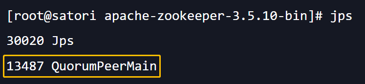
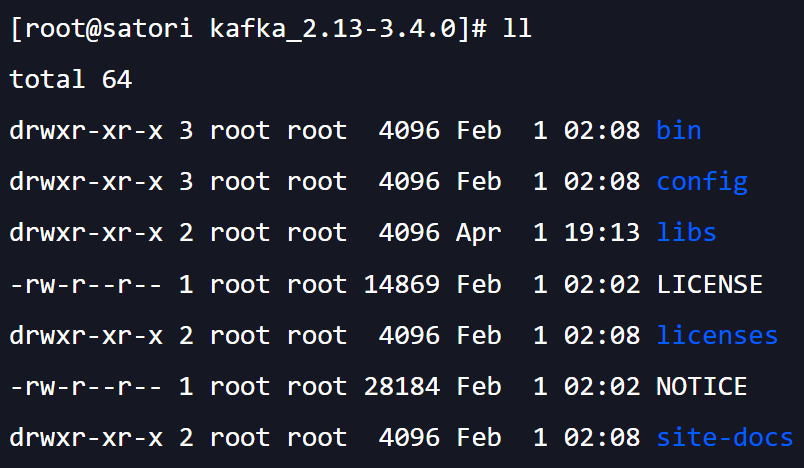
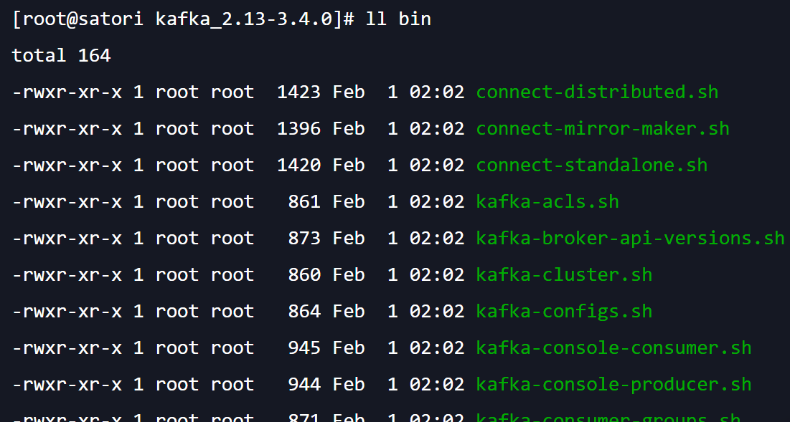
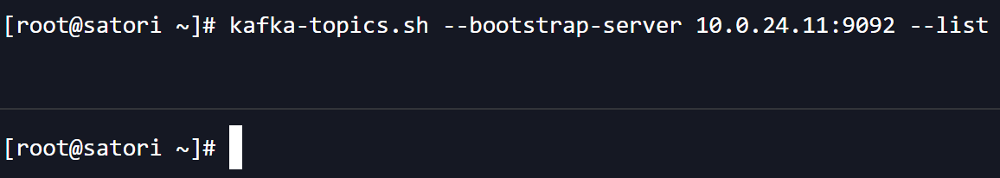
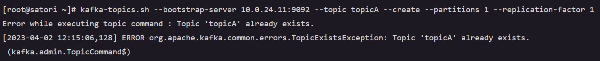
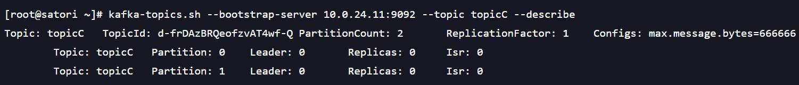
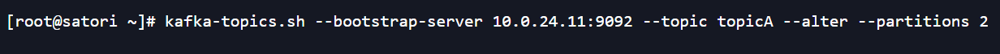
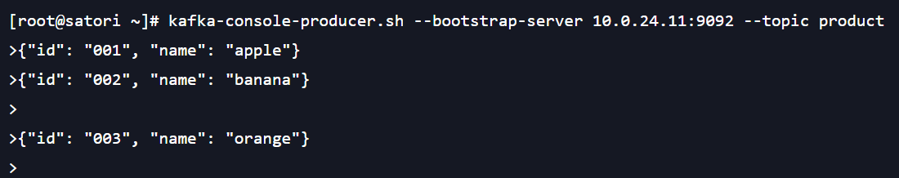

### 网络字体

我们在输入文字的时候，浏览器会使用操作系统默认的字体进行显示。而其它字体也有对应的名字，通过名字即可指定字体。

但对于我们下载到本地的字体就不行了，必须先将字体文件引入到当前网页中，然后才可以使用。

~~~html

~~~

后续通过 myFont 进行引入即可。

> 还有字体图标，www.iconfont.cn ，登录进去下载即可，然后通过 i 标签使用 CSS 里面的类。

### 认识精灵图 CSS Sprite

什么是 CSS Sprite

+ 是一种图像合成技术，将各种小图片合并到一张图片上，然后利用 CSS 的背景定位来显示对应的图片部分；
+ 有人翻译为：CSS 雪碧，CSS 精灵；

使用 CSS Spirte 的好处

+ 减少网页的 HTTP 请求数量，加快网页的访问速度，减轻服务器压力；
+ 减少图片总大小；
+ 解决了图片命名的困扰，只需要针对一张集合的图片命名；

Spirte 图片一般由设计人员制作。

比如这里就是一张精灵图，然后选择指定的部分，通过指定大小和位置的方式。

### cursor：设置光标

cursor 可以设置鼠标指针（光标）在元素上面的显示形式，常见的值如下：

+ auto：浏览器根据上下文决定指针的显示样式，比如根据文本和非文本切换指针样式；
+ default：由操作系统决定，一般就是一个小箭头；
+ pointer：一只小手，鼠标指针挪动到链接上面，默认就是这个样式；
+ text：一条竖线，鼠标指针挪到文本输入框上面就是这个样式；
+ none：没有任何指针显示在元素上面；

### CSS  布局之元素定位（非常重要）

#### 标准流

默认情况下，元素都是按照 normal flow（标准流）进行排布

+ 从左到右、从上到下按顺序排放好
+ 默认情况下，兄弟元素之间不存在层叠现象

如果想调整元素位置，那么可以使用 margin、padding，其中 margin 还可以为负数。但它有比较明显的缺点：

+ 设置一个元素的 margin 和 padding 通常会影响标准流中其它元素的定位效果；
+ 不便于实现元素的层叠效果；

> inline 元素的上下 margin 是无效的，inline-block 和 block 的上下左右 margin 都是有效的，但 margin 0 auto 只有 block 支持。

如果我们希望一个元素可以跳出标准流，单独对某个元素进行设置，那么可以通过 position 属性。这样的话，元素就会脱离文档流，被单独拎出来了，不再受标准文档流的要求按照规则排布了。

#### position 属性

你在浏览网页的时候，发现不断滚轮怎么滑动，有一部分元素始终固定在浏览器视口的某个区域，那么它肯定是脱离了标准文档流。

所以 position 允许你从正常的文档流布局中取出元素，并使它们具备不同的行为：

+ 例如放在另一个元素的上面；
+ 或者始终保持在浏览器视窗内的同一位置；

那么position 都有哪些取值呢？

+ static：默认行为，当没有设置 position 的时候，那么position 默认为 static；
+ relative：相对定位；
+ absolute：绝对定位；
+ fixed：固定定位；
+ sticky：粘性定位；

下面分别介绍。

**static**

+ position 属性的默认值
+ 元素按照 normal flow 布局
+ left、right、top、bottom 没有任何作用（当设置为后面四个值的时候，会被激活）

**relative**

将 position 设置 relative 之后，元素依然是按照标准流布局的，占据相应空间。

~~~html
<!DOCTYPE html>
<html lang="en">
<head>
    <meta charset="UTF-8">
    <title>Title</title>
    
</head>
<body>

<a>你好</a>
古明地觉
古明地恋

魔理沙

</body>
</html>
~~~

但可以通过 left、right、top、bottom 进行定位，并且定位是相对于元素原来自己的位置。

~~~html
<!DOCTYPE html>
<html lang="en">
<head>
    <meta charset="UTF-8">
    <title>Title</title>
    
</head>
<body>

<a>你好</a>
古明地觉
古明地恋

魔理沙

</body>
</html>
~~~

我们看到元素重叠在一起了，想象一下 margin，如果是 margin 的话，那么会影响其它元素。而使用 left，那么它相当于脱离了标准流，直接相对原本的位置进行移动，而不影响其它元素，因此效果就是两个元素发生了重叠。

所以相对定位的场景就是，在不影响其它元素位置的前提下，对当前元素进行微调。

~~~html
<!DOCTYPE html>
<html lang="en">
<head>
    <meta charset="UTF-8">
    <title>Title</title>
    
</head>
<body>

    32 + 42 = 52

</body>
</html>
~~~

是不是很有趣呢？当然这个功能也可以通过 sup 标签实现。

**fixed**

元素直接脱离文档流，可以通过 left、right、top、bottom 进行定位。注意它和 relative 的区别，前者参照的是元素所在位置本身，而 fixed 参考的是浏览器视窗（viewport），当画布滚动时固定不动。

并且 relative 在不设置位置的时候，还是按照标准流的方式来排的，别的元素不会主动和它重叠，除非我们改变位置。但 fixed 从设置的那一刻就已经脱离标准流了，它就仿佛不存在一样，别的元素会顶替它的位置。至于该元素究竟在哪，则取决于我们。

~~~html
<!DOCTYPE html>
<html lang="en">
<head>
    <meta charset="UTF-8">
    <title>Title</title>
    
</head>
<body>

<a>你好</a>
古明地觉
古明地恋

魔理沙

</body>
</html>
~~~

这是刚才的例子，但将 relative 改成了 fixed。

我们看到两个 span 发生了重叠，如果是 relative 的话，那么元素的排列是不会重叠的，仍然按照标准文档流的方式是排列。第二个 span 会在第一个 span 的后面，除非我们手动改变第一个 span 的位置。但将第一个 span 从 relative 改成 fixed 之后，它就已经脱离标准文档流了，元素的排列不会考虑它，因此它和后一个 span 发生了重叠。

一般设置成 fixed 最常用的场景就是回到顶部，再比如右侧的一些导航栏之类的，它们的位置始终固定，且不会随着鼠标的滑动而改变位置。

我们实现个案例吧，在右下角写一个回到顶部和反馈的用例。

~~~html
<!DOCTYPE html>
<html lang="en">
<head>
    <meta charset="UTF-8">
    <title>Title</title>
    
</head>
<body>

    
回到顶部

    
反馈

</body>
</html>
~~~

这个效果我们就做出来了。

**absolute**

relative 是没有脱离标准流的，只是激活了 left、right等属性，可以在不影响其它元素的情况下改变位置。但 fixed 和 absolute 都会脱离文档流，不过 fixed 是相对于整个浏览器视窗的，而 absolute 是相对于最近的（有定位的）父元素。如果没有找到这样的元素，那么参照的是浏览器视窗，此时就和 fixed 完全等价了。

所以当我们使用 absolute 的时候，一定不是希望它相对浏览器视窗，因为那样使用固定定位 fixed 即可。当使用 absolute 的时候，一定是希望它相对某个父元素，但前提是父元素也要是有定位的。不过按照逻辑上来讲，我们是为了子元素而影响了父元素，非要让父元素设置 position。但这么做也可以，就是你不能影响父元素，所以一般父元素都会设置成 relative，不让它脱离文档流。

> 所以子绝父相就是这么来的，子元素用绝对定位，那么父元素要相对定位。其实对于子元素而言，父元素啥定位都无所谓（除了 static），但是不能影响父元素原本的逻辑。因为父元素原本就是按照标准文档流布局的，所以为了子元素，父元素可以设置 position，但是依然要满足文档流布局。所以这个时候要设置为 relative，此时会激活 left 等属性，但我们不用，那么对父元素就无影响。

这里补充一个知识点，就是绝对定位元素的特点，首先 absolute 虽然叫绝对定位，fixed 叫固定定位，但这两者都算绝对定位元素。如果设置了 position 为 absolute 或 fixed，那么具有如下特点。

+ 可以任意设置宽高，不关你事行内还是非行内，不管是 span 还是 div，都可以随意设置。不设置的话，宽高则由内容决定。比如 div 里面嵌套 span，div 的高度会由 span 撑起来，但是宽度占据一行，而如果 div 设置了绝对定位，那么宽度也由 span 决定。所以这类似 inline-block，不过它只是符合 inline-block 的特性，但并不是真的设置成了 inline-block。
+ 不再受标准流的约束，不再严格按照从上到下，从左到右的顺序排布；
+ 不再严格区分块级、行内级，块级和行内级的很多特性都会消失；
+ 不再给父元素汇报宽高数据，比如 div 嵌套 span，如果 span 设置了绝对定位，那么不会像父元素汇报宽高，于是外层的 div 会消失，因为没有高度；
+ 脱离标准流的内部的数据还是按照标准量来布局的；

对于绝对定位元素来说：

+ 相对定位的父元素的宽度 = 绝对定位的子元素的宽度 + left + right + margin-left + margin-right；
+ 相对定位的父元素的高度 = 绝对定位的子元素的高度 + top + bottom + margin-top + margin-bottom；

auto 就是交给浏览器来决定，宽度如果为 auto。

+ 行内元素：由包裹内容决定；
+ inline-block 元素：由包裹内容决定，但可以设置宽高；
+ 块级元素：由父元素宽度决定，独占父元素的一行；

**sticky**

+ 这是一个期待已久的属性，比其它定位方式要新一些；
+ 它可以看成是相对定位和绝对（固定）定位的结合体；
+ 它允许被定位的元素表现得像相对定位一样，直到它滚动到某个阈值点；
+ 当达到这个阈值点时，就会变成固定定位；

举个例子，导航栏，一开始在上方，当滑动一段时间后就固定了。

~~~html
    
~~~

滑动滑动，距离顶部为 0 时，保持固定。

> sticky 相对的也不是视窗，而是最近的一个可以滚动的视口。

#### z-index

z-index 属性用来定位元素的层叠顺序（仅对定位元素有效），我们说浏览器以左上角为原点，水平向右是 x 轴，水平向下时 y 轴。但还有一个 z 轴， 从屏幕向外。

+ 取值可以是正整数、负整数、0

如果是兄弟关系

+ 值越大，层叠在越上面，因为越向外，越靠近人眼；
+ 值相等，写在后面的元素层叠在上面；

如果不是兄弟关系

+ 各自从元素自己以及祖先元素中，找出最临近的两个元素进行比较；
+ 而且这两个元素必须有设置 z-index 的具体数值；

### CSS 布局之元素浮动

多个 div 默认是垂直显示的，如果想水平显示的话，那么必须设置 inline-block，但问题是这样会对不齐，很丑。但学完了浮动之后，就好办了。

#### 认识浮动

float 属性可以指定一个元素沿着所在容器的左侧或右侧放置，允许文本和内联元素环绕它。

+ float 属性最初只用于在一段文本内浮动图像，实现文字环绕的效果；
+ 但是早期的 CSS 标准中并没有提供好的左右布局方案，因此在一段时间里面它成为网页多列布局的最常用工具；
+ 绝对定位和浮动都会让元素脱离标准文档流，以达到灵活布局的效果；

float 可以让元素产生浮动效果，常用取值如下：

+ none：不浮动，默认值；
+ left：向左浮动；
+ right：向右浮动；

元素一旦浮动，脱离标准流：

+ 朝着向左或向右的方向移动，直到自己的边界紧贴着包含块（一般是父元素）或者其它浮动元素的边界为止；
+ 定位元素会层叠在浮动元素上面，浮动元素会在非定位元素上面；

~~~html
<!DOCTYPE html>
<html lang="en">
<head>
    <meta charset="UTF-8">
    <title>Title</title>
    
</head>
<body>
    

        
1

        
2

    

</body>
</html>
~~~

浮动元素不会超过父元素内容的边界，并且浮动元素之间是不能层叠的。

看一下京东的页面：

默认情况下 div 是独占一行的，应该向下排列，但这里水平排列了，说明设置了浮动。

~~~html
<!DOCTYPE html>
<html lang="en">
<head>
    <meta charset="UTF-8">
    <title>Title</title>
    
</head>
<body>
    
1

    
2

    
3

</body>
</html>
~~~

三个 div 是并排显示的，这里可能有人会有一个误区，这三个元素都设置了浮动，都脱离标准文档流。那么根据之间的结论，都相对于左上角为 0，那么应该重叠才对啊。其实这是 CSS 浮动的规则，浮动元素是不会重叠的。但如果 box1 是浮动，box2 没有浮动，那么两者是会重叠的。

所以浮动规则如下：

+ 如果一个元素浮动，发现另一个元素已经在那个位置了，后浮动的元素紧贴着前一个浮动的元素。左浮找左浮，右浮找右浮。
+ 如果水平方向上的剩余空间不够显示浮动元素，浮动元素将向下移动，直到有充足空间为止（相当于找了新的一行）。

浮动元素虽然脱离标准文档流了，但是后面的浮动元素不会和它重叠，这是 CSS 的规定。如果后面的是普通元素，那么重叠，因为脱标之后，后面的元素是不会考虑的。

~~~html
<!DOCTYPE html>
<html lang="en">
<head>
    <meta charset="UTF-8">
    <title>Title</title>
    
</head>
<body>
    
1

    
2

    
3

</body>
</html>
~~~

box2 和 box3 不浮动，那么忽略 box1，box2 会和 box1 的位置相同，box3 在 box2 下面。而浮动元素的优先级大于非定位元素，所以页面如下：

注意：如果是行内元素，那么浮动元素是不会覆盖的。

~~~html
<!DOCTYPE html>
<html lang="en">
<head>
    <meta charset="UTF-8">
    <title>Title</title>
    
</head>
<body>
    
1

    
2

    
3

</body>
</html>
~~~

按理说途中应该只显示两个块，box2 是浮动元素，它会把 box1 给盖住。但 box1 变成了 inline-block，是按照行内显示的，所以被挤出来了。

一开始 float 出来就是干这件事的，为了实现文字环绕。

#### 行内元素的间隙处理

标签之前由于有换行，所以会被当成一个空格处理。

~~~html
<!DOCTYPE html>
<html lang="en">
<head>
    <meta charset="UTF-8">
    <title>Title</title>
    
</head>
<body>
    aaa
    bbb
    ccc
</body>
</html>
~~~

这个时候就可以使用 float: left，但仅仅贴在一起又会很丑，于是可以设置一个 margin-right。

~~~html
    
~~~

虽然效果类似，但之间的间隙是精准的。

#### 实现一个百度页面

我们实现一个百度页面。

~~~html
<body>
    <ul>
        <li class="item"><a href="#">1</a></li>
        <li class="item"><a href="#">2</a></li>
        <li class="item"><a href="#">3</a></li>
        <li class="item"><a href="#">4</a></li>
        <li class="item"><a href="#">5</a></li>
        <li class="item"><a href="#">6</a></li>
        <li class="item"><a href="#">7</a></li>
        <li class="item"><a href="#">8</a></li>
        <li class="item"><a href="#">9</a></li>
        <li class="item"><a href="#">10</a></li>
        <li class="item"><a href="#">下一页</a></li>
    </ul>
</body>
~~~

~~~html
<!DOCTYPE html>
<html lang="en">
<head>
    <meta charset="UTF-8">
    <title>Title</title>
    
</head>
<body>
    <ul>
        <li class="item"><a href="#">1</a></li>
        <li class="item"><a href="#">2</a></li>
        <li class="item"><a href="#">3</a></li>
        <li class="item"><a href="#">4</a></li>
        <li class="item active"><a href="#">5</a></li>
        <li class="item"><a href="#">6</a></li>
        <li class="item"><a href="#">7</a></li>
        <li class="item"><a href="#">8</a></li>
        <li class="item"><a href="#">9</a></li>
        <li class="item"><a href="#">10</a></li>
        <li class="item"><a href="#">下一页</a></li>
    </ul>
</body>
</html>
~~~

还是比较简单的，所以有的人不喜欢 ul 和 li，就是因为重置默认属性比较麻烦，还不如用 div 实现。

#### 实现一个京东页面

