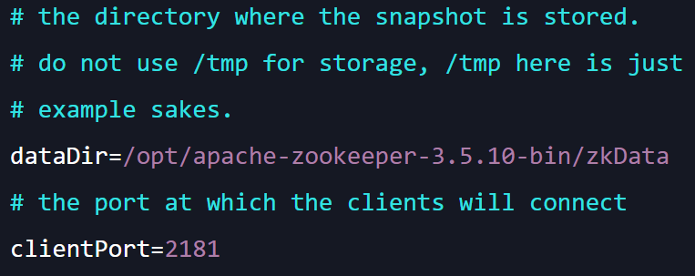
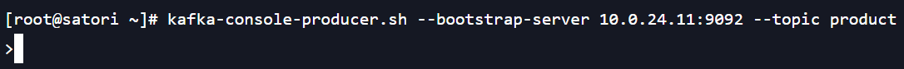
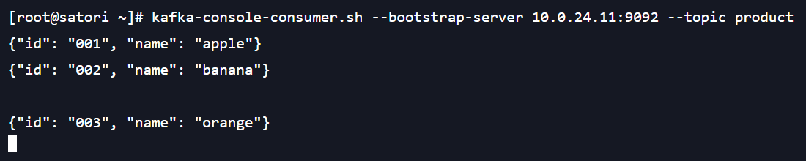
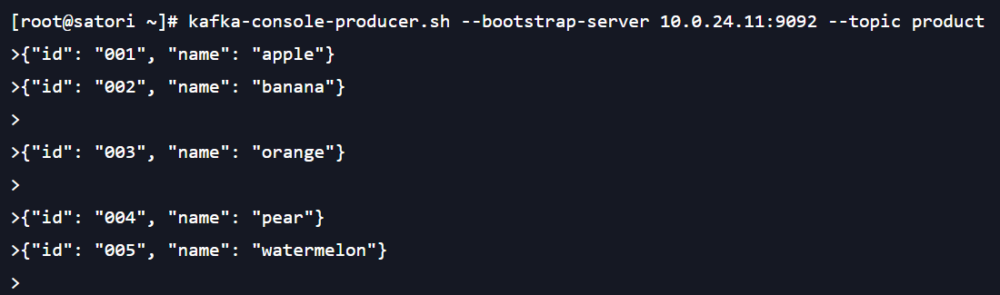
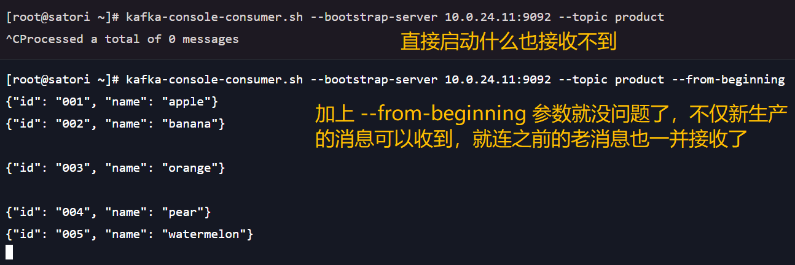
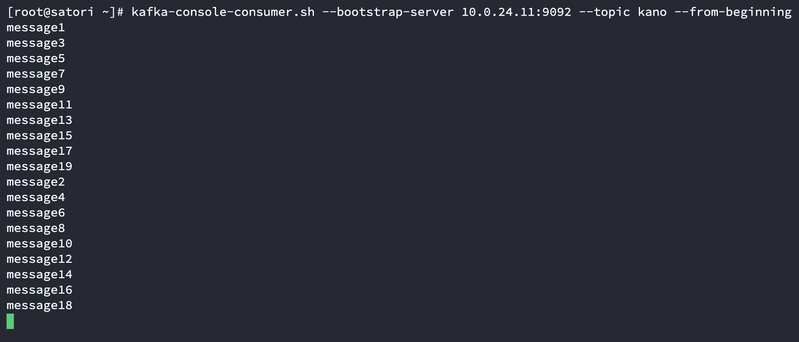

### 认识 Vue

Vue 是一套用于构建用户前端界面的渐进式 JavaScript 框架，它基于标准 HTML、CSS 和 JavaScript 构建，并提供了一套声明式的、组件化的编程模型。帮助你高效地开发用户界面，无论任务是简单还是复杂。

那什么是渐进式框架呢？

+ 表示我们可以在项目中一点点地来引入 Vue，而不一定要全部使用 Vue 来开发整个项目；
+ 但目前来将，很少使用 Vue 来做渐进式开发，基本上用 Vue 都是开发整个项目；

目前 Vue 在前端开发中处于什么地位呢？

目前前端最流行的三大框架：Vue、React、Angula。

+ Angular：入门门槛较高，并且国内市场占有率低，但框架本身是非常优秀的；
+ React：在国内外市场的占有率都非常高，作为前端工程师也是必学的一个框架；
+ Vue：在国内市场的占有率是最高的，几乎所有的前端岗位都会对 Vue 有要求；

总之 Vue 必须要学好的，Vue 对于前端来说非常非常重要。

学习 Vue2 还是 Vue3？

Vue 存在两个版本，分别是 Vue2 和 Vue3，我们应该学习哪一个呢？关于这一点 Vue 的作者给出了答复，直接学习 Vue3 即可，因为 Vue3 兼容 Vue2。而在 2020 年的 9 月 19 日，万众期待的 Vue3 终于发布了正式版，命名为 One Piece，它具有以下特点：

+ 更好的性能；
+ 更小的包体积；
+ 更好的 TypeScript 集成；
+ 更优秀的 API 设计；

那么现在是学习 Vue3 的时间吗？答案是肯定的。

+ Vue3 目前已经是最稳定的版本，并且在 2022 年 2 月 7 日已经成为默认安装版本；
+ 目前社区也经过一定时间的沉淀，更加的完善了，包括 AntDesignVue、Element-Plus 都提供了对 Vue3 的支持，所以很多公司目前新的项目都采用 Vue3 来开发了；
+ 并且在面试的时候，几乎都会问到各种各样 Vue3 相关的问题；

Vue 要如何使用呢？

Vue 的本质就是一个 JavaScript 库（一个普通的 .js 文件），刚开始我们不需要把它想的过于复杂，就把它理解成一个已经帮助我们封装好的库，在项目中引入并使用即可。因此可以把 Vue 想象成 jQuery，它就是一个普通的 JavaScript 库，我们将它下载下来，然后直接通过 script 标签引入就行。

而 Vue 的下载也很简单，我们在浏览器中输入 https://unpkg.com/vue@next 然后回车，就能看到 Vue 的源码了，并且是最新版的 Vue。然后创建一个 vue.js 文件，将源码拷贝到 vue.js 当中，就可以使用了。

~~~html
<body>
<!-- 这里的 src 也可以指定为 https://unpkg.com/vue@next 
     会通过 CDN 自动下载 Vue，另外 jQuery 也支持 CDN -->

</body>
~~~

下面我们就来体验一下 Vue。

### Vue 初体验

我们通过 Vue 来往页面中输出一个 h2 标签，内容是 Hello World。

~~~html
<body>

古明地觉

古明地恋

</body>
~~~

我们看到内容成功挂载到 #app 里面了，具体做法就是：

+ 通过 Vue 创建一个 app，在内部指定 template 模板；
+ template 就是要渲染到页面上的内容；
+ 内容已经有了，但是要渲染到什么地方去呢？通过 app.mount("#app")，表示将模板内容渲染到 id 为 "app" 的标签里面（注意是标签的里面）；

所以从这里也能感受到 Vue 的渐进式体验，里面的 HTML 元素既可以手动编写，也可以通过 Vue 渲染。

然后来做几个小案例，进一步感受一下 Vue 的使用。

#### 案例一：动态展示数据

我们上面虽然输出了一个 Hello World，但这个数据是写死的，能不能动态展示数据呢？

~~~html
<body>

</body>
~~~

此时数据就动态展示了，这个功能就比较强大了。并且对于有 Python 经验的人，看到 {{ }} 会立刻反应过来，这不和 Python 的模板渲染引擎是一样的嘛。没错，它们本质都是类似的。然后 data 函数里面的数据是我们随便写的，如果是在工作中的话，我们会向后端请求数据，然后动态渲染到页面上。而在整个过程中，我们不需要手动操作 DOM，这种开发模式就是声明式，我们只负责声明某个位置要展示什么数据，至于渲染则交给框架来完成。

另外看到 {{ }}，估计会有人想到 ES6 的 \${ }，它们本质上都是对字符串做替换，不过替换的时机不一样。

~~~html
<body>

</body>
~~~

非常简单，然后再来思考一个问题。如果 template 模板中，{{ }} 里面的变量在 data 函数返回的对象中不存在怎么办？

~~~html
<body>

    

</body>
~~~

首先 data 函数返回的对象中的 gender 属性，template 并没有用到，但是不影响渲染。其次，如果 template 里面要替换的模板变量在 data 函数返回的对象中不存在的话，那么默认会被替换为空字符串。

所以结论很简单，data 函数返回的对象，里面可以包含任意的属性。如果在渲染 template 的时候，发现 {{ ... }} 在对象里面存在，那么就用对应的 value 替换掉；如果不存在，那么替换为空字符串。

> 如果只写 {{ }}，大括号里面啥都没有，那么也会被替换为空字符串。

#### 案例二：展示列表数据

在上面的案例中，要渲染的数据是一个普通的字符串，比较简单。但如果是一个数组呢？

~~~html
<body>

</body>
~~~

数组的话也是可以渲染的，但很明显我们想要的效果应该不是这样的，我们应该将里面的每个元素放在 li 标签中进行展示。

~~~html
<body>

</body>
~~~

这才是我们真正期望的效果，但代码属于硬编码模式，如果后续数组改变了，那么程序就会出问题。

~~~html
<body>

</body>
~~~

我们在 li 标签里面写上了 v-for="item in items"，那么 Vue 在解析的时候就知道要去遍历 items，遍历出来的元素命名为 item。

然后每遍历一次，就创建一个 \<li\>{{ item }}\</li\>，直到遍历结束。其中 {{ item }} 会被替换为遍历得到的具体的值，如果只写 item 而不加 {{ }} 的话，那么 item 就是一个普通的长度为 4 的字符串。

然后我们用浏览器打开，效果和之前是一样的。另外关于这里 v-for，后面会详细讲解。

#### 案例三：计数器

我们来实现一个计数器：

+ 点击 +1，那么数字便自增 1；
+ 点击 -1，那么数字便自减 1；

~~~html
<body>

</body>
~~~

因为数字就是 Vue 渲染上去的，它的值取决于 counter，所以如果我们能够改变 counter 的值，那么浏览器上的计数会自动刷新。因此现在要做的是，点击加 1 按钮，那么将 counter 自增 1，点击减 1 按钮，将 counter 自减 1，该怎么实现呢？

~~~html
<body>

</body>
~~~

我们再来测试一下：

此时点击按钮，数字就会发生改变。因为点击按钮，会修改 counter 的值，而页面上的数字又是和 counter 绑定的，所以也会跟着改变。上面这个例子就是 Vue 的整个逻辑，以后使用 Vue 的时候，做的基本都是这个事情。后面会介绍 Vue 各种各样的语法，并且编写方式也会有所改变，但核心就是这些东西。

#### 案例三：计数器（重构）

计数器这个功能虽然简单，但是它将 Vue 的核心都体现了出来。不过重新审视一下编写的代码的话，会发现有一个地方让人感觉很不爽，那就是 template。因为当前是将 HTML 代码放在字符串里面的，编写起来非常的不方便，那么能不能将内容放在普通的 HTML 标签里面，然后再让 Vue 渲染呢？答案是可以的。

~~~html
<body>

    <h2>当前计数: {{counter}}</h2>
    <button @click="incr">加 1</button>
    <button @click="decr">减 1</button>

</body>
~~~

注意：app.mount("#app") 是将 template 里面的内容渲染之后，挂载到 id="app" 的标签里面。但如果该标签里面本身就有内容的话，那么里面的内容会被丢弃，只显示渲染之后的 template。

但如果没有 template 的话，那么 Vue 会将 id="app" 的标签里面的内容当做 template 进行渲染。因此我们可以不设置 template 属性，而是把内容直接写在要挂载的标签里面，这样做会更方便一些。

我们用浏览器打开文件，效果和之前是一样的。另外上面的案例一和案例二也可以进行重构，只需要将渲染的内容放在要挂载的标签里面，然后删除 template 属性即可。

### 命令式编程和声明式编程的区别

现在我们已经对 Vue 有了一个基本的认识，那么就要对比一下它和之前编写代码的区别。我们将上面的计数器案例使用原生的 JavaScript 实现一下，然后看看两者有什么不一样，进而对比一下命令式编程和声明式编程在思想上的差异。

~~~html
<body>

    <h2>当前计数: 0</h2>
    <button id="incr">加 1</button>
    <button id="decr">减 1</button>

</body>
~~~

最终实现的效果是一样的，如果你是刚学习 Vue 的话，那么通过原生 JavaScript 或者 jQuery 操作 DOM 的方式，会更熟悉一些。这种编程方式叫做命令式编程，而通过 Vue 编程的方式叫做声明式编程，不难发现这两种方式有着很明显的区别。

命令式编程：如果想完成某一个功能，那么必须要思考完成该功能需要哪些步骤，然后一步步完成它。所以它关注是 how to do，how 需要我们来完成。以当前使用原生 JavaScript 编写的计数器为例，如果希望点击按钮能够修改计数器的值，那么需要以下步骤：

+ 通过操作 DOM 的方式，获取按钮对应的标签，然后给它绑定一个点击事件，并开启监听；
+ 当按钮被点击时，执行事件处理函数，在函数中依旧通过操作 DOM 的方式，获取计数器的值，并进行加 1 或减 1；
+ 用更新后的值替换掉计数器的值；

所以每一个操作，都要通过 JavaScript 编写相应的代码，给浏览器一个指令，这就是命令式编程，原生 JavaScript 和 jQuery 都是这种编程模式。

声明式编程：关注的是 what to do，要什么样的效果提前声明好，至于 how 则由框架来完成。以当前使用 Vue 编写的计数器为例，如果希望点击按钮能够修改计数器的值，那么需要以下步骤：

+ 声明一个模板，并将后续要动态变化的数据通过 {{ }} 包起来，即 {{ counter }}。至于点击按钮所执行的函数，也通过 @click 声明好；
+ 定义一个 data 函数，模板里面需要的数据通过 data 函数返回（换句话说就是将数据声明好），然后 Vue 会渲染到页面上。至于 Vue 到底是怎么做的，我们不需要关心，框架会帮我们完成；
+ 而点击事件所执行的函数，也通过 methods 属性指定好，当事件触发时会自动自行；

所以 Vue 的开发模式就是，先声明一个模板，告诉你需要哪些数据。然后我们在其它地方将数据准备好，至于数据怎么渲染到模板上，Vue 会帮我们处理。并且后续当数据发生改变时，页面显示的内容也会自动发生改变，不需要我们手动做绑定操作。

因此这就是声明式编程，当然并不是说 Vue 就不会操作 DOM 了，Vue 底层也是要操作 DOM 的，只不过它将我们的编程方式改变了。以前是要一步一步手动操作 DOM，现在则是将数据声明好、并告诉 Vue 数据要怎么展示即可（指定 template、data、methods），至于具体的绑定过程由 Vue 去做。目前 Vue、React、Angular、小程序的编程模式，都是声明式编程。

#### MVC 和 MVVM 的架构模型

这里再补充一些概念性的东西，就是关于 MVC 和 MVVM，它们都是一种软件的体系结构。

+ MVC 是 Model - View - Controller 的简称，在早期使用非常广泛的一种架构模式，比如 IOS、前端。不过 MVC 对于后端开发人员来说，或许会更熟悉一些，概念是相似的；
+ MVVM 是 Model - View - ViewModel 的简称，是目前非常流行的架构模式；

通常情况下，我们也称 Vue 是一个 MVVM 框架。不过 Vue 官方其实有说明，Vue 虽然没有完全遵守 MVVM 模型，但整个设计是受到它的启发的。那么什么是 MVVM 呢？

View 可以理解为 DOM，Model 可以理解 JavaScript 的一些对象，说白了就是要展示的数据。本来使用 DOM 就是为了要操作这些数据，然后通过 innerText、innerHTML 等等，将数据放在标签里面，但在 MVVM 当中这两者却不直接沟通。

在 MVVM 中 View 只需要定义模板，比如 \<h2\>当前计数: {{ counter}}\</h2\>，而不用去操作 DOM。然后 ViewModel 会帮我们将 Model 中的数据绑定到 View 上面，也就是 Data Bindings，这是框架帮我们做的第一件重要的事。而第二件重要的事就是事件监听，比如在定义模板的时候绑定了一些事件，那么当事件发生时，由框架帮我们完成 DOM Listeners。我们没有写类似 btn.onclick = ... 之类的代码，只需要在 View 中定义模板时，通过 @click 指定好要执行的函数即可，当事件发生时，ViewModel 框架会自动帮我们去做。

所以这就是 MVVM 架构，M 是 Model，V 是 View，VM 是 ViewModel，而 Vue 便是 ViewModel 的一种。数据绑定，事件处理，都由 Vue 来完成。

### 聊一聊 createApp 中的 data 属性

Vue.createApp 里面有一个 data 属性，它的值是一个函数，函数里面返回一个对象，用于 template 的渲染；

+ 在 Vue 2.x 的时候，也可以直接给 data 传递一个对象（官方推荐是函数），用于 template 的渲染；
+ 在 Vue 3.x 的时候，必须给 data 传入一个函数，否则浏览器会报错；

而在 data 函数中返回的对象，会被 Vue 的响应式系统劫持，之后对该对象的修改和访问都会在劫持中被处理：

+ 所以在 template 或者 #app 中，可以通过 {{ counter }} 访问 data 函数返回的对象里的 counter 属性；
+ 同时 Vue 还会监听对象的变化，通过 new 一个 Proxy 的方式实现。所以在修改了对象的 counter 属性的值时，Vue 会立刻感知到，将 {{ counter }} 换成修改之后的值，同时浏览器显示的内容也会发生改变；

现在先做一个了解，后面会手动实现它。事实上即便不理解也没关系，Vue 已经封装的非常好了，我们只需要按照它规定的方式编写代码即可。

### 聊一聊 createApp 中的 methods 属性

在计数器的案例中，我们给 button 标签绑定了 click 事件，事件的处理函数是 incr 和 decr。而绑定的过程也很简单，在标签里面写上 @click="incr" 和 @click="decr" 即可。然后具体的 incr 和 decr 函数，我们要写在 methods 属性里面，这是 Vue 的要求。

所以 methods 属性的值是一个对象，通常我们会在这个对象中定义很多的方法：

+ 这些方法可以被绑定到模板中；
+ 在方法中，可以通过 this 关键字来直接访问 data 返回的对象中的属性；

我们再看一下之前关于计数器的案例：

~~~html
<body>

    <h2>当前计数: {{counter}}</h2>
    <button @click="incr">加 1</button>
    <button @click="decr">减 1</button>

</body>
~~~

现在来看这个例子就很轻松了，但我想问的是，根据官方文档，我们在定义 incr 和 decr 的时候，不可以使用箭头函数，这是为什么呢？如果不使用箭头函数，而是普通函数，那么里面的 this 又指向谁呢？

为什么不能使用箭头函数？

如果把 incr 和 decr 换成箭头函数，由于箭头函数不可以绑定 this，那么会从父级作用域中寻找 this，而父级作用域是谁呢？首先肯定不是 methods，因为 methods 是一个对象，它没有自己的作用域，同理 methods 的上一层还是一个对象，也没有自己的作用域。于是再往上找，相信结论很清晰了，如果使用箭头函数，那么里面的 this 最终指向的是 window。

如果使用普通函数，那么里面的 this 指向谁呢？

有人说它可以访问 data 函数返回的对象的属性，那么它肯定指向这个对象，真的是这样吗？根据我们对 JavaScript 的理解，函数是谁调用的，那么函数里面的 this 就指向谁。

事实上在 Vue 的源码中有一个变量叫 publicThis，它是 data 函数返回的对象的一个代理，当然通过代理也可以修改原对象。然后 Vue 会遍历 methods 对象，取出里面的每一个函数（methodHandler），并调用 methodHandler.bind(publicThis)。我们知道调用 bind 会返回一个新的函数，而 Vue 会用这个新的函数将原来老的函数替换掉。所以后续调用的时候，函数里面 this 的指向就改变了，它会和全局的 publicThis 一样，都指向 data 函数返回的对象的代理。

因此我们通过 this，能够直接操作 data 函数返回的对象里面的属性。

### Vue 模板语法

模板说白了就是要显示在页面上的内容，一开始我们是写在 template 属性里面的，但这样太麻烦了，于是后面又将它写在了要挂载的标签中。而我们接下来的任务就是学习 Vue 的模板语法，掌握了模板语法，我们才能更好地开发。

首先是 mustache 语法，也就是 {{ }} 实现的文本插值。

如果需要展示一个动态数据，比如前面提到的计数器，那么便可以使用 {{ }} 将 counter 包起来，后续会整体替换掉。并且当 data 函数返回的对象的属性发生改变时，页面内容也会自动更新。

这一点我们已经提到了，但其实 {{ }} 里面不仅仅可以是属性，还可以是一个 JavaScript 表达式。

~~~html
<body>

    <h2>个人信息</h2>
    
姓名: {{ name }}

    
年龄: {{ age }}

    
年龄+1: {{ age + 1 }}

    
兴趣: {{ hobby.join(",")}}

</body>
~~~

注意：{{ }} 里面只能放表达式，不能放语句。因此 {{ }} 里面也可以是一个函数调用，因为函数调用最终返回的也是一个普通的值。

~~~html
<body>

    <h2>个人信息</h2>
    
{{ Number("123") + Number("234") }}

    
{{ Number("123") + "234" }}

    
{{ mySum(11, 22, 33) }}

    
{{ mySum("11", 22, 33) }}

</body>
~~~

结果没有问题，{{ }} 里面调用的函数可以是内置的，也可以是我们定义在 methods 对象里面的。所以 {{ }} 还是很强大的，并且也支持三元运算符，不过在实际开发中，不建议在 {{ }} 里面做太复杂的计算。

{{ }} 里面只需要传递一个属性即可，至于该属性对应的值，应该在函数里面提前处理好，而不是等到渲染的时候在 {{ }} 里面计算。

#### v-once 指令（了解）

介绍完 mustache 语法之后，再来看看 Vue 提供的一些指令，它也算是模板语法的一部分。首先 Vue 提供的指令非常多，比如 v-for、v-once、v-bind 等等，这些指令都作为标签的属性而存在，比如 \<h2 v-for="..."\>\</h2\> 等等。

我们要学习的第一个指令就是 v-once，它表示内容只会渲染一次。

~~~html
<body>

    <h2 v-once>当前计数: {{counter}}</h2>
    <button @click="incr">加 1</button>
    <button @click="decr">减 1</button>

</body>
~~~

这是之前计数器的例子，但是在 h2 标签里面加上了一个 v-once，那么它就只会在初始的时候被渲染一次。即使后续修改了 counter 的值，页面中 h2 标签里面的内容也不会发生变化。即使标签是嵌套的，也是如此。

~~~html

    <h2 v-once>
        当前计数: {{counter}}
    </h2>
    <button @click="incr">加 1</button>
    <button @click="decr">减 1</button>

~~~

counter 发生改变时，同样不会被渲染。但如果 span 标签在 h2 标签的外部，那么两者就没有关系了，h2 是否指定 v-once 和 span 无关。

所以 v-once 用于指定标签元素只被渲染一次。

+ 当指定了 v-once，在数据发生变化时，标签元素以及所有的子元素会被视为静态内容并跳过；
+ 该指令可以用于性能优化；

#### v-text 指令和 v-html 指令（了解）

再来看看 v-text 指令，它用于更新元素的 innerText。

~~~html
<body>

    <h2>{{ message }}</h2>
    <h2 v-text="message"></h2>

</body>
~~~

代码中的两个 h2 标签是等价的，都是用来更新标签元素的文本内容。但很明显 {{ }} 比 v-text 要更加灵活一些，因为第二个 h2 标签如果本身有内容的话，那么会被替换掉。

注意：如果我们展示的内容包含 HTML 标签，那么会被转义，Vue 不会对它做特别的解析。如果我们希望 HTML 标签能够被识别出来，那么可以使用 v-html。

~~~html
<body>

    <h2 v-text="message"></h2>
    <h2 v-html="message"></h2>

</body>
~~~

区别很明显，v-text 会一律将内容当成纯文本来解析，而 v-html 会将内容当成 HTML 元素来解析。

我们再通过审查元素，看一下两者的区别。

#### v-pre 指令和 v-cloak 指令（了解）

该指令用于跳过元素和其子元素的编译过程，直接显示原始的 mustache 标签。通过跳过不需要编译的节点，可以加快编译的速度。其实有时候，我们也不希望 Vue 进行解析，比如我们就是想展示 {{ }}，那么这个时候就可以使用 v-pre 指令。

~~~html
<body>

    <h2>{{ name }}</h2>
    <h2 v-pre>{{ name }}</h2>
    <h2 v-pre>{{ }}</h2>

</body>
~~~

v-pre 用的不多，了解一下即可。然后是 v-cloak 指令，它对于当前来说还是有些用处的，不过后续我们会通过编写 .vue 文件的形式开发，到时候 v-cloak 指令就没多大用了。

首先浏览器会自上而下的解析 HTML，并尽可能早地将内容展示在页面上。所以当解析到 {{ }} 的时候，页面其实就已经有内容了，只不过是原始的 {{ }}。然后当浏览器解析到 script 标签时，执行 Vue 相关的代码，再反过来对 {{ }} 进行渲染。只不过这个动作非常快，我们看到的直接就是渲染后的结果。

但如果渲染不及时，比如渲染之前有一段比较耗时的代码，那么最终的效果就是用户会先看到 {{ }}，然后再看到具体的内容，我们举例说明。

~~~html
<body>

    <h2>{{ name }}</h2>

</body>
~~~

假设两秒之后才能渲染，那么结果就是用户在页面上会先看到 {{ name }}，两秒之后，再看到具体内容 Your Name。

很明显这种体验是不好的，我们不应该让用户看到 mustache 标签这种原始内容。但如果在渲染之前就是需要额外花费一些时间，那么可以给标签元素加上 v-cloak 属性。cloak 的中文翻译是斗篷，所以使用 v-cloak 就相当于给元素添加了一个斗篷，把元素遮起来了，等渲染完毕后再将斗篷给撤掉。

~~~html
<!DOCTYPE html>
<html lang="en">
<head>
    <meta charset="UTF-8">
    <title>Title</title>
    
</head>
<body>

    <h2 v-cloak>{{ name }}</h2>

</body>
</html>
~~~

此时打开页面，不会显示任何内容。但两秒过后，Vue 会将元素上的斗篷给撤掉，从而让元素展示出来，并且展示的元素是渲染过后的。

#### v-memo（了解）

这个指令非常的新，主要是做性能优化的。我们举个例子：

~~~html
<body>

    

        
{{ name }}

        
{{ age }}

        
{{ gender }}

    

</body>
~~~

代码非常简单，如果 name、age、gender 发生改变，那么 Vue 会重新渲染。但问题来了，如果我希望只有当 name 发生改变才渲染，age 和 gender 发生改变则忽略掉，该怎么做呢？

~~~html

    

        
{{ name }}

        
{{ age }}

        
{{ gender }}

    

~~~

此时通过 v-memo 指令即可实现，但如果还希望 age 改变时也重新渲染，那么将 v-memo 指定为 "[name, age]" 即可。

#### v-bind 指令（重要）

上面介绍的一系列指令，主要是将值插入到模板内容中。但除了内容需要动态设置之外，一些属性我们也希望能够动态指定。

+ 比如动态绑定 a 元素的 href 属性；
+ 比如动态绑定 img 元素的 src 属性；

~~~html
<body>

    <!--  
        注意：不要写成了   
        {{ }} 是用在标签内容当中的，而不是标签属性
        
        如果要动态修改标签属性，那么在属性名的前面加上一个 v-bind: 
        比如我们要修改 src 属性，那么指定为 v-bind:src
        然后属性的值直接写成 "imageUrl" 即可
     -->
    

</body>
~~~

此时图片就显示在上面了，再比如绑定超链接。

~~~html
<a v-bind:href="baidu">点击进入百度</a>
~~~

在 data 函数返回的对象中，指定 baidu 属性即可。

后续如果改变了 src 和 href，那么页面上显示的图片和超链接也会跟着改变。

那么在开发中，有哪些属性需要动态绑定呢？其实有很多，比如图片的 src，超链接的 href，动态绑定一些类、样式等等。然后 v-bind 还有一个语法糖，就是把 v-bind 给省略掉，只保留一个冒号。

~~~html
<a v-bind:href="baidu">点击进入百度</a>
<a :href="baidu">点击进入百度</a>
~~~

以上两种写法是等价的，但是注意：冒号不可以省略，否则就变成普通的 href 了。

**动态绑定 class**

然后我们使用 v-bind 来绑定一下 class，这一部分非常重要，先来看个例子。

~~~html
<body>

    <!--  :class 等价于 v-bind:class  -->
    
你好

</body>
~~~

这个例子本身就很简单了，但开发中，有时候元素的 class 也是动态的，比如：

+ 当数据为某个状态时，字体显示为红色；
+ 当数据为另一个状态时，字体显示为蓝色；

~~~html
<body>

    <!--  :class 可以接收一个对象，key 为 class 的名称，value 是布尔值  -->
    <!--  如果 value 为真，则表示添加该 class，否则不添加  -->
    
你好

</body>
~~~

由于 box2 对应的 value 为假，所以没有被添加进去。因此这个功能就比较强大了，可以将 class 名称对应的 value 用一个变量保存起来，后续通过修改这个变量，便可控制相应的 class 属性是增加还是删除。

然后这里可能有人会产生疑问，如果里面既有普通的 class 又有动态绑定的 :class，那么以谁为准呢？很简答，这两者是可以结合使用的，:class 会将里面的类名添加到 class 属性里面。

~~~html
<h2 class="item1" :class="{item2: false, item3: true}"></h2>
<!-- Vue 解析之后等价于如下 -->
<h2 class="item1 item3"></h2>
~~~

非常简单，但如果 :class 里面的内容非常多的话，那么这个标签写起来就会很长，有没有清晰一点的做法呢？

~~~html
<body>

    
你好

</body>
~~~

我们可以将内容放在一个函数中，然后调用这个函数即可。

补充，像 v-text、v-html、v-bind 等等：

+ 如果它们后面跟的是 ="xxx"，那么会去 data 函数返回的对象中寻找 xxx 属性；
+ 但如果后面跟的是 ="xxx()"，那么会去 methods 对象中寻找 xxx 函数，然后调用并拿到返回值；

**动态绑定 style**

除了动态绑定 class 之外，还可以动态绑定 style，语法和绑定 class 是一样的。

~~~html
<!-- fontColor 是 data 函数返回的对象的一个属性 -->
<h2 :style="{ color: fontColor, 'font-size': '30px'}"
~~~

JavaScript 的对象，key 是可以不带引号的，比如这里的 color。但有些 key 就比较尴尬了，比如 font-size，如果它不加引号，那么会出现编译错误，因为不符合变量的命名规则。因此我们可以换一种写法，比如 fontSize，改成驼峰的形式，这样也是可以正确解析的，当然使用引号也是可以的。

**动态绑定属性名称**

像 src、href、class、style 等等，这些属性名称是固定的，但在某些情况下，我们属性的名称可能也是不固定的。

如果属性名称不固定，那么可以使用 :[属性名]=值 的格式来定义。

~~~html
<body>

    
{{ message }}

</body>
~~~

此时就实现了动态绑定属性名称，不过这种用的不多。

**动态绑定对象**

假设我们要动态指定 a 标签的 id、href、target 属性，那么要怎么做呢？

~~~html
<body>

    <a :href="href" :id="id" :target="target">点击进入</a>

</body>
~~~

非常简单，但还有一种做法。

~~~html
<body>

    <a v-bind="info">点击进入</a>

</body>
~~~

这种做法也是可以的，直接将 v-bind 指定为一个对象，Vue 会遍历该对象，然后将属性依次设置上去。可能目前还感受不到这种做法的优势，后续在给组件传值的时候，就会感受到了，目前只知道可以绑定一个对象即可。

### 事件的监听与绑定

前面我们知道了如何给元素绑定内容和属性，但前端开发中还有一个重要的特性就是交互，因此这个时候就必须要监听用户产生的事件，比如点击、拖拽、键盘事件等等。而监听事件，在 Vue 中通过 v-on 指令实现，比如监听点击事件就是 v-on:click。和 v-bind 一样，v-on 也有一个语法糖，我们之前用过的，就是把 v-on: 整体换成 @，即 @click。

~~~html
<body>

    
我是被隐藏起来的内容

    <button v-on:click="showMessage">点击查看隐藏内容</button>

</body>
~~~

一开始上面的文字是没有的，但点击按钮之后，将 p 元素的 display 改成 block，文字就显示出来了。当然，在一开始介绍计数器的时候，我们就已经见过事件绑定了。

当然这里是以单击事件为例，其它事件也是支持的，并且名称不变，直接 @event="function" 即可。然后绑定多个事件也是可以的，比如：

~~~html

<!-- 或者还有一种写法 -->

~~~

绑定多个事件的话，还是建议使用第一种方式，分开绑定，更加清晰一些。

#### 事件函数的参数

当事件发生时会执行相应的处理函数，然后该函数是可以接收参数的。

~~~html
<body>

    <button @click="btn1">点击</button>
    <!-- 处理函数里面的参数，也可以来自于 data 函数的返回值里的属性 -->
    <button @click="btn2('satori', 17)">点击</button>

</body>
~~~

点击第一个按钮的时候，会触发一个点击事件，然后调用 btn1 函数，而参数 event 保存了事件相关的全部信息。这个 event 在学习 DOM 的时候会遇到，比如你想给 ul 标签下的所有 li 标签都绑定一个事件，可如果 li 标签很多的话，会不方便。那么这个时候可以选择给 ul 绑定，由于事件会向上冒泡，li 发生点击事件会传递给 ul，触发相关函数执行。这个过程就叫做事件委托，把子元素该执行的动作交给父元素来执行，但问题来了，我们怎么知道是哪一个 li 被点击了从而触发 ul 的点击事件呢？这个时候就可以通过 event.target，我们举个例子。

~~~html
<body>

    <!--  当 li 被点击时，对应文字变成蓝色  -->
    <!--  我们可以给每个 li 都绑定上一个事件，但是比较麻烦  -->
    <!--  一个简单的做法是给 ul 绑定  -->
    <ul>
        <li>古明地觉</li>
        <li>古明地恋</li>
        <li>雾雨魔理沙</li>
        <li>琪露诺</li>
    </ul>

</body>
~~~

所以点击的时候，会自动传递一个 event 函数。然后点击第二个按钮的时候，会调用 btn2，注意：这里不是调用 btn2 的返回值。如果 btn2 后面没有括号，那么自动加上括号并传递 event 参数（可以不接收）。而一旦加上了括号，那么具体传什么参数就由我们来指定了。

+ @click="btn2"，调用的时候自动传递 event 参数；
+ @click="btn2()"，调用的时候不会传递参数，因为加上括号，参数什么的由我们来指定；

那这就产生问题了，我们加上括号是为了传递自定义的参数，但 event 怎么办？很简单。

~~~html
<body>

    <button @click="btn(name, age, $event)">点击</button>

</body>
~~~

Vue 提供了一个特殊的语法，通过 $event 来代指 event 对象。

#### v-on 的一些修饰符

v-on 提供了一些修饰符，相当于对事件进行了一些特殊的处理。举个例子：

~~~html
<!DOCTYPE html>
<html lang="en">
<head>
    <meta charset="UTF-8">
    <title>Title</title>
</head>
    
<body>

    

        <button @click="btnClick">按钮</button>
    

</body>
</html>
~~~

前面我们说了事件会冒泡，当按钮被点击时，也会触发 div 的点击事件，那么问题来了，如何阻止这一点呢？

~~~js
btnClick(event) {
    event.stopPropagation()
    console.log("btnClick")
}
~~~

非常简单，在 btnClick 里面接收一个 event 参数，然后通过 event.stopPropagation() 阻止事件冒泡即可。但是 v-on 指令，可以让我们更方便地做到这一点。

~~~html
<body>

    

        <button @click.stop="btnClick">按钮</button>
    

</body>
~~~

我们在 @click 后面加上了 .stop，那么在执行事件函数的时候，会自动加上 event.stopPropagation()，阻止事件冒泡。

当然还有很多其它事件，比如：

不过用的都不多，了解一下即可。

### 条件渲染

在某些情况下，我们需要根据当前条件来决定某些元素或组件是否被渲染，这时候就需要进行条件判断了，而 Vue 提供了以下指令。

+ v-if
+ v-else
+ v-else-if
+ v-show

~~~html
<body>

    <h2 v-if="score > 90">
        
你的成绩是 A

    </h2>

    <h2 v-else-if="score > 85">
        
你的成绩是 B

    </h2>

    <h2 v-else-if="score > 60">
        
你的成绩是 C

    </h2>

    <h2 v-else>
        
你的成绩是 D

    </h2>

</body>
~~~

非常简单，说白了就是在标签里面指定 v-if、v-else-if、v-else，当条件成立时，指定的标签元素以及内部的子元素才会被渲染。并且这些都是惰性的，当条件为 false 时，其判断的内容完全不会被渲染，整个 DOM 树都会被销毁掉。当条件为 true 时，才会真正渲染条件块里的内容。

#### template 标签

来看一段代码：

~~~html

    
 90">
        
你的成绩是 A

    

    
 85">
        
你的成绩是 B

    

    
 60">
        
你的成绩是 C

    

    

        
你的成绩是 D

    

~~~

我们的目的是为了展示里面的 p 元素，实际上外层的 div 只是起到了一个包裹的作用。我们当前每个条件块里面只有一行代码，所以把外层的 div 去掉，将 v-if 等指令写在 p 标签上面也是可以的，但如果条件块里面有多行就不行了。

不过这个 div 确实没啥卵用，浏览器在渲染的时候也会对它解析，会浪费性能。所以我们可以将 div 换成 template 标签，而 template 标签浏览器是不会渲染的，这样既节省了资源， 也可以很好地起到限定作用。

~~~html

    <template v-if="score > 90">
        
你的成绩是 A

    </template>

    <template v-else-if="score > 85">
        
你的成绩是 B

    </template>

    <template v-else-if="score > 60">
        
你的成绩是 C

    </template>

    <template v-else>
        
你的成绩是 D

    </template>

~~~

我们看到渲染之后并没有出现 template 标签。

因为 v-if 是一个指令，所以必须将其添加到一个元素上，但如果我们希望切换的是多个元素呢？此时需要通过 div 起到一个限定作用，但我们又不希望浏览器多渲染一个标签，那么这时候可以使用 template 标签，它可以当做不可见的包裹元素，并且不会被渲染，类似于小程序的 block。

最后再来补充一个 v-show 指令，它和 v-if  的用法是一致的，也是根据条件决定是否显示元素或者组件。但它和 v-if 有些区别：

+ v-show 不支持 template；
+ v-show 不可以和 v-else 一起使用；

然后最本质的区别还是：

+ v-show 无论元素是否需要显示在浏览器上，它的 DOM 都是存在的，只是通过 CSS 的 display 进行切换；
+ v-if 当条件为 false 时，它对应的元素根本不会渲染到 DOM 中；

所以 v-show 无法搭配 template 使用，因为这个标签不会渲染在浏览器上，标签都没了，那还谈什么 CSS 呢？

那么这两者应该如何选择呢？

+ 如果元素需要在显示和隐藏之间频繁切换，那么使用 v-show。因为它不会频繁新增和销毁元素，只是改变了 CSS 的属性；
+ 如果不会发生频繁切换，那么使用 v-if；

### 详解 v-for 指令

在实际开发中，我们往往会拿到一组数据，并且需要对其进行渲染。这个时候可以使用 v-for 来完成，v-for 类似于 JavaScript 的 for 循环，可以用来遍历一组数据。

~~~html
<body>

    <h2>来自东方的少女们</h2>
    <!--  会对 girls 进行遍历，遍历出来的元素命名为 girl  -->
    <!--  这里 girls 的长度是多少，就会生成多少个 p 标签  -->
    
name: {{girl.name}}, where: {{girl.where}}

    <!--  还可以通过 "(girl, index) in girls" 进行遍历，这样遍历的同时还能拿到索引  -->  

</body>
~~~

然后 v-for 除了遍历数组之外，也可以遍历对象。

+ "val in obj"
+ "(val, key) in obj"
+ "(val, key, index) in obj"

~~~html
<body>

    <h2>来自东方的少女们</h2>
    
{{ key }}: {{ val }}

</body>
~~~

非常简单，当然啦，除了数组和对象，v-for 也可以遍历字符串，此时得到的就是一个个字符。另外数字也是可以的，比如 item in 10，那么会从 1 遍历到 10。

#### 监听数组是否更新

Vue 将被监听的数组的变更方法进行了包裹，所以它们也将会触发视图的更新。

~~~html
<body>

    <h2>来自东方的少女们</h2>
    
{{ girl }}

    <button @click="addGirl">点击添加一个 girl</button>

</body>
~~~

那么 Vue 都对数组的哪些方法进行监听呢？只要会改变原数组的方法，Vue 都会监听。如果不改变原数组，那么操作完之后需要重新赋值。

#### 和 v-for 绑定的 key 属性

在使用 v-for 进行列表或对象渲染时，我们通常会给元素或组件绑定一个 key 属性，而这个 key 一般是唯一的。

~~~html
<!-- 注意：如果是 key="item"，那么 item 就是普通的字符串 -->
<!-- 而 :key="item"，那么 item 就是 v-for 里面遍历出来的 item -->

{{ item }}

~~~

那么这个 key 属性到底有什么用呢？要明白这一点，我们需要先了解一下什么是 VNode。

VNode 的翻译是虚拟节点，它是基于组件或元素创建出来的，由于目前还没有学习组件，暂时就理解为是 HTML 创建出来的 VNode。总之，不论是组件还是 HTML 元素，它们在 Vue 中表现出来的都是一个个的 VNode，而 VNode 本质上就是一个普通的 JavaScript 对象。

所以 template 会先变成 VNode，然后 VNode 再变成真实的 DOM，最终添加到浏览器中展示给用户。当然这只是一个 VNode，如果有很多元素，并且出现嵌套，那么就会对应很多 VNode，而这些 VNode 会组成一颗树（VNode Tree），也被称为虚拟 DOM。而虚拟 DOM 最终再映射成真实 DOM，展示在浏览器上。

以上就是 Vue 在渲染的时候所干的事情。

估计有人会好奇，为什么 Vue 不直接 template 中的标签（比如 ul）直接创建出相应的元素，而是非要搞出虚拟节点（组成虚拟 DOM）呢？

1）第一个原因，有了虚拟 DOM 之后就可以跨平台了，因为虚拟 DOM 只是一个 JavaScript 对象。只要能对虚拟 DOM 进行解析，那么一个平台编写的控件，可以渲染到多个平台上。比如移动端、桌面端、VR 设备等等；

2）实现 diff 算法；

假设有一个 ul，里面有 5 个 li，内容分别是 a、b、c、d、e，现在要在 b 的后面插入一个 f，那么应该怎么做呢？首先最简单的做法，就是将 5 个 li 全部删掉，然后再按照 a、b、f、c、d、e 的顺序创建 6 个 li，并渲染上去。但很明显这么做没有必要，因为其它的几个节点都没有变化，不应该采用全部的删除再重新构建的方式，那样性能就太低了。

另一种方式就是对比元素，a、b 不需要动，后面的元素依次更新。

这么做的效率也不高，而在没有设置 key 的情况下，Vue 就是这么做的。显然在插入元素的情况下效率是不高的，因为要不断对比元素并更新，当然追加的效率是没问题的。

所以最好的办法是直接插入一个元素即可，其它元素不需要动。但 Vue 是不知道的，它不知道 c d e 前后是不需要变化的，而如果我们设置了 key 就不一样了。有了 key 之后，Vue 就会进行对比，尽可能地复用重复的节点。

而对于 Vue 而言，有 key 和没有 key，Vue 执行的方法是不同的。

+ 有 key，执行 patchKeyedChildren 方法；
+ 没有 key，执行 patchUnkeyedChildren 方法；

在使用 v-for 的时候，一般都会执行 key，为了效率。

### 处理复杂的数据（computed 属性）

在模板中可以通过一些插值语法显然一些 data 中的数据，但某些情况下我们需要对数据进行一些转化后再显示，或者将多个数据结合起来进行显示。

+ 比如我们需要对多个 data 数据进行运算、通过三元运算符来决定结果、数据进行某种转换后显示；
+ 在模板中使用表达式可以非常方便地实现，但设计它们的初衷是为了简单的运算；
+ 在模板中放入太多的逻辑会让模板过重，且难以维护；
+ 如果多个地方都要使用，那么会有大量重复的代码；

那么有没有什么方法将逻辑抽离出去呢？其中一个做法就是将逻辑抽离到 methods 对象中，举个例子。

~~~html
<body>

    
{{ firstname + " " + lastname }}

    
{{ fullname() }}

</body>
~~~

这两种效果都是一样的，当数据比较复杂时，定义在一个单独的方法中，然后模板表达式尽可能地简单。但这样做也有一个弊端，就是所有 data 的使用过程都变成了一个方法的调用。所以我们还推荐一种方式，就是使用计算属性 computed。

关于计算属性，官方没有给出直接的概念解释，而是说：对于任何包含响应式数据（说白了就是 data 函数返回的数据）的复杂逻辑，都应该使用计算属性。

~~~html
<body>

    
{{ firstname + " " + lastname }}

    
{{ fullname }}

</body>
~~~

所以从效果上来，计算属性 computed 和 methods 是类似的，无非 computed 在使用上更简洁一点。但 computed 的一大优势是，它是有缓存的，速度会快一些。

~~~html
<!-- 使用 methods，函数会执行 3 次 -->

{{ fullname() }}

{{ fullname() }}

{{ fullname() }}

<!-- 使用 computed，函数只会执行 1 次 -->

{{ fullname }}

{{ fullname }}

{{ fullname }}

~~~

计算属性会基于它们的依赖关系进行缓存，比如 fullname 依赖 firstname 或 lastname，当数据不发生改变时，计算属性是不需要重新计算的。但如果依赖的数据发生变化，那么在使用时就会重新计算了，页面上显示的内容（这里是 fullname）也会改变。

### 监听器 watch

什么是监听器呢？我们在 data 函数返回的对象中定义了数据，这个数据通过插值语法的方式绑定到 template 中。当数据变化时，template 会自动进行更新来显示最新的数据。但在某些情况下，我们希望在代码逻辑中监听某个数据的变化，这时候就需要用监听器 watch 来完成了。

~~~html
<body>

    
{{ message }}

</body>
~~~

当 data 对象中 message 属性发生改变时，watch 对象中 message 对应的函数就会执行，比较简单。但现在我们只知道属性改变了，但改变成啥了，以及之前是啥我们并不知道。

所以函数是有参数的：

~~~js
watch: {
    message: function (newValue, oldValue) {
        console.log("data 数据的 message 属性发生改变了")
    }
}
~~~

通过 newValue 和 oldValue 便可拿到新的值和旧的值。但对于对象来说，拿到的不是值本身，而是值的代理，不过操作是没有影响的。

#### watch 的配置项

看一段代码：
~~~html
<body>

    
{{ info.name }}

    <button @click="changeInfo">改变 info</button>

</body>
~~~

如果点击按钮，那么页面上的内容会发生改变，并且 watch 对象里的 info 函数也会执行，显然这是没问题的，因为对 info 重新赋值了。不过对于复杂对象来说，修改数据有两种方式：一种是直接重新赋值，另一种是原地修改。如果是重新赋值，那么 template 会感知到，watch 里的函数也会执行。

但如果是本地修改，比如 this.info.name = "...." 这种，那么 template 依旧会感知到，因为数据发生改变了。但此时 watch 里面的 info 函数是不会执行，所以对于 watch 而言，它默认不会开启数据的深度监听，只能显示开启。

~~~html
<body>

    
{{ info.name }}

    <button @click="changeInfo">改变 info</button>

</body>
~~~

通过 deep 属性可以开启深度监听，此外还有一个属性比较常用叫 immediate，如果为 true 那上来先执行一次监听器函数。此时 newValue 为设置的值，oldValue 为 undefined，相当于之前是没有这个值的，但赋上了这个值。

### 综合案例：购物车

基于以上学到的知识，我们用 Vue 来做一个书籍购物车，大致效果如下：

要求：

+ 在界面上以表格的形式，展示一些书籍的数据；
+ 在底部显示书籍的总价格；
+ 点击 + 或 - 可以增加或减少书籍数量，如果为 1，那么不能继续减；
+ 点击移除按钮，可以将书籍移除（当所有书籍都移除完毕时，显示购物车为空）；

这个案例虽然小，但是它将大部分知识点都综合起来了，我们来看一下怎么做。

~~~html
<!DOCTYPE html>
<html lang="en">
<head>
    <meta charset="UTF-8">
    <title>Title</title>
    
</head>
<body>

    <table>
        <thead>
        <tr>
            <th></th>
            <th>书籍名称</th>
            <th>出版日期</th>
            <th>价格</th>
            <th>购买数量</th>
            <th>操作</th>
        </tr>
        </thead>

        <tbody>
        <!--  对于 v-for 指令，最好设置一个 key，并且 key 不重复  -->
        <tr v-for="book in books" :key="book.id">
            <td>{{ book.id }}</td>
            <td>{{ book.name }}</td>
            <td>{{ book.date }}</td>
            <td>￥{{ book.price }}</td>
            <td>
                <button>-</button>
                {{ book.count }}
                <button>+</button>
            </td>
            <td><button>移除</button></td>
        </tr>
        </tbody>
    </table>
    <h2>总价: ￥{{ totalAmount }}</h2>

</body>
</html>
~~~

此时基本页面我们就搭完了，然后再给按钮绑定一个点击事件即可。

除了样式有些不同之外，基本是一致的，然后我们来完成剩下的功能。

+ 点击 +，数量加 1，同时总价也要变。不过显然我们不需要调整总价，因为 count 修改之后，总价会自动变，这就是声明式的好处；
+ 点击移除，书籍自动删除；

~~~html
<!DOCTYPE html>
<html lang="en">
<head>
    <meta charset="UTF-8">
    <title>Title</title>
    
</head>
<body>

    <table>
        <thead>
        <tr>
            <th></th>
            <th>书籍名称</th>
            <th>出版日期</th>
            <th>价格</th>
            <th>购买数量</th>
            <th>操作</th>
        </tr>
        </thead>

        <tbody>
        <!--  对于 v-for 指令，最好设置一个 key，并且 key 不重复  -->
        <tr v-for="(book, index) in books" :key="book.id">
            <td>{{ book.id }}</td>
            <td>{{ book.name }}</td>
            <td>{{ book.date }}</td>
            <td>￥{{ book.price }}</td>
            <td>
                <!-- 所有的 - 和 + 按钮绑定的都是同一个 decrCount 和 incrCount 函数 -->
                <!-- 那么点击的时候，我们怎么知道用户点击的是哪一本书的 - 或 + 按钮呢 -->
                <!-- 因此要拿到点击的按钮对应的书籍在 books 中的索引，然后才能修改数量 -->
                <!-- 如果写成 "decrCount"，那么调用时会自动传递一个 event，而现在由我们来指定了 -->
                <!-- 但也可以可以手动指定参数，告诉 Vue 事件发生时，函数应该怎么调用 -->

                <!-- 注意：这里的 disabled，当书籍的数量为 1 时，禁用按钮 -->
                <button :disabled="book.count === 1" @click="decrCount(index)">-</button>
                {{ book.count }}
                <button @click="incrCount(index)">+</button>
            </td>
            <td><button>移除</button></td>
        </tr>
        </tbody>
    </table>
    <h2>总价: ￥{{ totalAmount }}</h2>

</body>
</html>
~~~

此时功能就基本实现了，点击 + 数量增加，点击 - 数量减少，总价也会自动改变。最后再来把移除的功能给实现，这个功能也很简单，点击之后，直接把数组中指定索引的元素给删掉即可，页面会自动刷新。

~~~html
<!DOCTYPE html>
<html lang="en">
<head>
    <meta charset="UTF-8">
    <title>Title</title>
    
</head>
<body>

    <table>
        <thead>
        <tr>
            <th></th>
            <th>书籍名称</th>
            <th>出版日期</th>
            <th>价格</th>
            <th>购买数量</th>
            <th>操作</th>
        </tr>
        </thead>

        <tbody>
        <tr v-for="(book, index) in books" :key="book.id">
            <td>{{ book.id }}</td>
            <td>{{ book.name }}</td>
            <td>{{ book.date }}</td>
            <td>￥{{ book.price }}</td>
            <td>
                <button :disabled="book.count === 1" @click="decrCount(index)">-</button>
                {{ book.count }}
                <button @click="incrCount(index)">+</button>
            </td>
            <td><button @click="removeBook(index)">移除</button></td>
        </tr>
        </tbody>
    </table>
    <h2>总价: ￥{{ totalAmount }}</h2>

</body>
</html>
~~~

至此，功能就基本都实现了。

但其实还有一点问题，就是当书籍全部被删除的时候，就会变成这样。

显然这样是不好的，应该提示用户：你的购物车为空，请添加书籍。

~~~html

    <!--  只有 books 的长度大于 0 的时候，才渲染表格，否则提示相应的文字  -->
    <template v-if="books.length > 0">
        <table>
            <thead>
            <tr>
                <th></th>
                <th>书籍名称</th>
                <th>出版日期</th>
                <th>价格</th>
                <th>购买数量</th>
                <th>操作</th>
            </tr>
            </thead>

            <tbody>
            <tr v-for="(book, index) in books" :key="book.id">
                <td>{{ book.id }}</td>
                <td>{{ book.name }}</td>
                <td>{{ book.date }}</td>
                <td>￥{{ book.price }}</td>
                <td>
                    <button :disabled="book.count === 1" @click="decrCount(index)">-</button>
                    {{ book.count }}
                    <button @click="incrCount(index)">+</button>
                </td>
                <td><button @click="removeBook(index)">移除</button></td>
            </tr>
            </tbody>
        </table>
    </template>
    
    <template v-else>
        <h2>购物车是空的，请添加书籍</h2>
    </template>
    <h2>总价: ￥{{ totalAmount }}</h2>

~~~

此时才算是真的大功告成。

